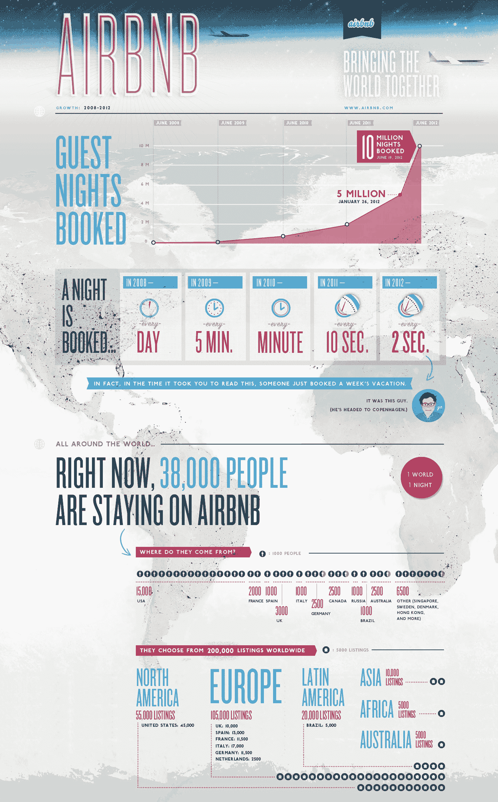

# Airbnb 实现快速增长:预订了 1000 万晚，20 万处活跃房产 

> 原文：<https://web.archive.org/web/https://techcrunch.com/2012/06/19/airbnb-10-million-bookings-global/>

# Airbnb 实现了快速增长:预订了 1000 万晚，20 万处活跃房产

Airbnb 是一个在线市场，提供短期住宿的列表和预订，看起来它已经正式加速脱离创业模式，成为一个全面的大企业。

这家总部位于旧金山的公司今天将宣布，它已经达到了一个重要的里程碑:**自 2008 年 8 月成立以来，全球已有 1000 万人次通过该网站预订了**客房。

这个数字本身就非常令人印象深刻，但它达到这个数字的轨迹更值得注意——去年这个时候，Airbnb 的预订量还没有达到 200 万晚。该公司表示，过去五个月，其在[的预订夜数翻了一番，如今，每两秒钟就有一个新的旅行之夜在 Airbnb 上预订。从图表来看，Airbnb 似乎正达到商业人士所称赞的令人垂涎的“曲棍球杆”增长加速点。](https://web.archive.org/web/20221129223643/https://beta.techcrunch.com/2012/01/26/airbnb-5-million-nights-booked-opening-6-new-international-offices-in-q1-2012/)

国际化是这种繁荣的主要部分。美国市场现在占 Airbnb 历史上总预订量的不到一半——440 万。该网站现在有 200，000 个活跃和可预订的房产列表，其中 95，000 个仅在欧洲。Airbnb 表示，目前它活跃在 192 个国家的 19，000 多个城市。

全球范围的推动并不奇怪。Airbnb 利用 M&A 通过收购来扩大其国际影响力，比如今年春天早些时候收购了总部位于英国的 Crashpadder [和去年夏天收购了总部位于德国的 Acceolo](https://web.archive.org/web/20221129223643/https://beta.techcrunch.com/2012/03/20/airbnb-acquires-uk-based-crashpadder-as-part-of-international-growth-push/) 。

当然，Airbnb 并非孤军奋战:该公司已经获得了约 1 . 2 亿美元的风险投资。但很明显，它拥有支持投资者资金的客户——而且它才刚刚开始在南美和亚洲等地开展业务。看看它在接下来的日子里还会有多少增长会很有趣。

为了好玩，这里有一张 Airbnb 信息图的相关部分，用来说明它的最新统计数据(点击放大):
