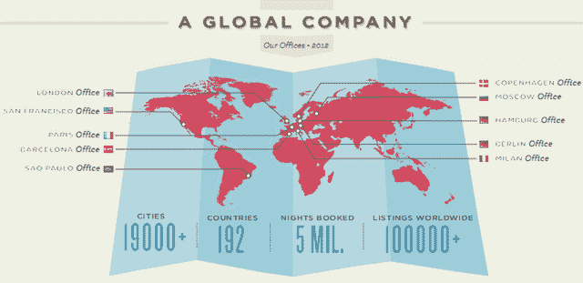

# Airbnb:预订 500 万晚，在 Q1 开设 6 个新的国际办公室 2012 

> 原文：<https://web.archive.org/web/https://techcrunch.com/2012/01/26/airbnb-5-million-nights-booked-opening-6-new-international-offices-in-q1-2012/>

# Airbnb:预订 500 万晚，2012 年在 Q1 开设 6 个新的国际办公室

Airbnb 的[像野草一样生长](https://web.archive.org/web/20230210175700/https://techcrunch.com/2012/01/17/with-focus-on-international-expansion-airbnb-comes-to-android-and-revamps-mobile-web-offerings/)。

这家年轻的公司今天[发布了一大堆关于其业务的统计数据](https://web.archive.org/web/20230210175700/http://www.airbnb.com/global-growth)，以展示其[增长](https://web.archive.org/web/20230210175700/https://techcrunch.com/2011/01/06/airbnb-2010/)，当然，伴随着一张精美的[信息图](https://web.archive.org/web/20230210175700/http://www.airbnb.com/global-growth)。

最值得注意的是，Airbnb 表示，它已经在世界各地的空间预订了 500 万间客房，其中 400 万间是在过去 12 个月预订的(他们在 2011 年 2 月宣布了第 100 万间客房的预订)。我自己也是粉丝。

在这些预订中，75%是国际预订(客人、主人或两者都位于美国境外)，这很自然地导致 Airbnb 在全球更多国家扩展其业务，[在商业孵化器 Springstar](https://web.archive.org/web/20230210175700/https://techcrunch.com/2011/10/17/airbnb-checks-in-with-springstar-for-international-expansion/) 的帮助下。

本季度(2012 年 Q1)，Airbnb 将在欧洲城市开设五个新办事处，即巴塞罗纳、米兰、哥本哈根、莫斯科和巴黎，同时在巴西圣保罗开设一个办事处。Airbnb 已经在旧金山、汉堡、柏林和伦敦设立了办事处。

成立于 2008 年 8 月的 Airbnb 表示，其网站上的房源数量在 2011 年增加了 166 %,目前大约 70%的 Airbnb 房源都在美国境外。如今，Airbnb 上列出了 192 个国家的 100，000 多处房产。

国际扩张也意味着需要更多全面的个性化客户服务。为此，Airbnb 现在通过电子邮件、实时聊天和七个全球免费电话号码提供 16 种语言的 24 小时客户支持。

迄今为止，该公司已经从红杉资本(Sequoia Capital)、安德森·霍洛维茨(Andreessen Horowitz)、格雷洛克资本(Greylock Capital)、DST 和 crunch fund(TechCrunch 创始人迈克尔·阿灵顿和专栏作家 MG Siegler 是其合作伙伴)等投资者那里筹集了大约 1 . 2 亿美元。

另请参阅:

[2012 年 DLD——布莱恩·切斯基:“纽约市 Airbnb 房东的平均年收入为 21000 美元”](https://web.archive.org/web/20230210175700/https://techcrunch.com/2012/01/23/dld-2012-brian-chesky-average-airbnb-host-in-nyc-pockets-21000-a-year/)

[Airbnb 的布莱恩·切斯基谈扩张努力:我们利用我们的社区来决定下一步该做什么](https://web.archive.org/web/20230210175700/https://techcrunch.com/2011/11/10/airbnbs-brian-chesky-on-expansion-efforts-we-use-our-community-to-figure-out-whats-next/)