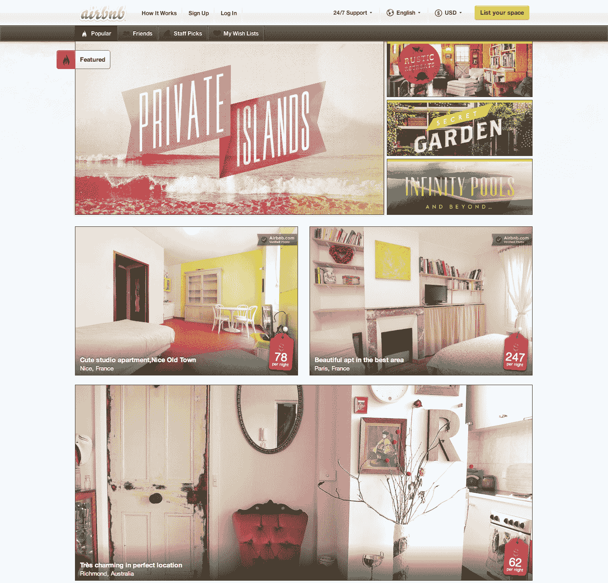

# Airbnb 重新设计并引入了愿望清单，让管理和发现新目的地变得轻而易举 TechCrunch

> 原文：<https://web.archive.org/web/https://techcrunch.com/2012/06/27/airbnb-wish-lists-redesign/>

Airbnb 自 2008 年成立以来，作为在线发布和预订短期住房的首选网站，已经取得了巨大的增长。就在上周，该公司宣布其在 T2 的客房预订总量达到了 1000 万间，网站上有 20 万个活跃的房产列表。

但现在 Airbnb 已经达到了临界质量，它希望让发现新空间变得更容易，更社交化，让用户更开心。为了做到这一点，它推出了一个全新的网站设计和一个新的 iPhone 应用程序，这两个应用程序都旨在让用户导航热门目的地列表、编辑策划的内容和他们朋友喜欢的空间。它还引入了愿望清单，使其访问者能够创建类似 Pinterest 的住宿空间集合。

据首席设计师肖恩·莫迪(Shaun Modi)称，Airbnb 的新愿望清单功能取代了很少用户利用的收藏夹功能。即使用户知道收藏夹，这个功能也有点单薄，很少使用。愿望清单被设计得更加强大，允许用户将他们最喜欢的 Airbnb 目的地“收集”或“管理”到主题组中。

例如，经常去纽约旅行的用户可以创建一个愿望列表，列出他们在那个城市最喜欢的空间。或者，他们可以创建一个愿望清单，列出他们想和另一半一起去的度假地点。或者用户可以创建一组他们已经呆过的地点，与网站和脸书上的朋友分享。

是的，脸书上有分享。Airbnb 团队正在宣传与脸书开放图表的深度整合，这将使 Airbnb 用户的朋友和家人可以查看愿望清单的更新——只要他们将两者连接起来并选择分享。一旦用户选择分享，愿望清单项目将出现在他们的脸书时间表。当他们的朋友点击这些列表时，他们会被带到一个特殊的页面，展示网站上共享的房产。当然，这意味着激发一批新用户来查看网站，并可能停留在他们从来不知道存在的地方——或者至少创建他们自己的(社会共享的)愿望清单。

愿望清单的增加，以及新的脸书整合，是一个更大的重新设计的一部分，旨在使发现新的目的地更容易和更有吸引力。Airbnb 已经委托了 100 多万张其房产的专业照片，它正在利用这一点，提供美丽的大尺寸照片。它还增加了无限滚动，让用户不必点击多个页面就可以浏览空间。

新的设计引入了一系列流行和特色的属性供浏览。旧的 Airbnb 网站完全是关于搜索的，但重新设计利用了用户创建的所有新列表，以及 Airbnb 员工和阿什顿·库彻、杰克·多西和伊夫·贝哈尔等时尚人士的精选列表。它还有一个列出热门酒店的页面，用更大的照片和地图突出显示，展示用户可能没有想到的目的地。

虽然 Airbnb 将大量精力放在了打造全新的网络体验上，但它也发布了一款广受欢迎的 iPhone 应用程序的更新。新的应用程序增加了向愿望列表添加空间的功能，以及查看新目的地的相同“热门”和“特色”选项。

总之，新的设计、新的应用程序和新的愿望清单功能都是为了激励新老用户变得更有抱负，并走出以前统治网站的搜索模式。也就是说，不只是在你需要一个住的地方时出现，比如下周，而是在你没有任何计划的时候去看看新的地方，甚至可能根据你找到的一个很酷的地方计划一次旅行。重新设计会奏效吗？现在还很难说，但至少看起来很华丽。