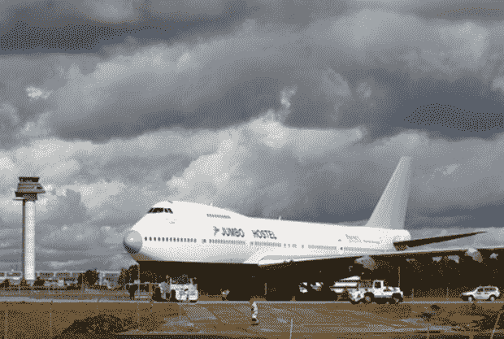
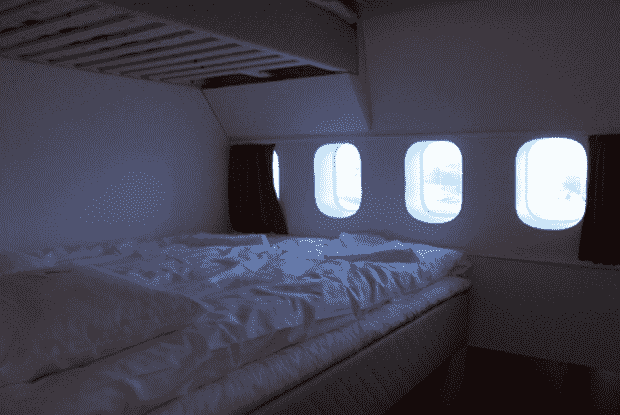
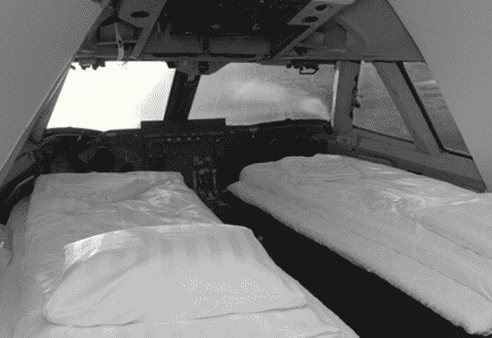
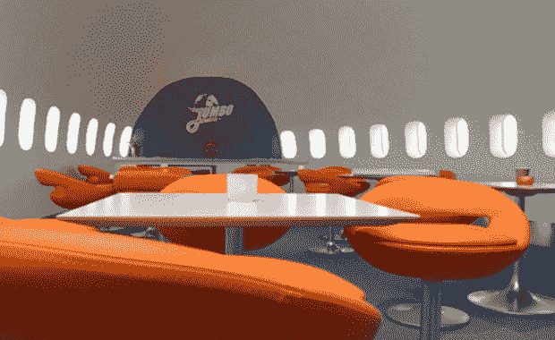

# 斯德哥尔摩机场的飞机被改造成旅馆

> 原文：<https://web.archive.org/web/https://techcrunch.com/2009/03/01/airplane-converted-to-hostel-at-stockholm-airport/>

# 斯德哥尔摩机场的飞机被改造成旅馆

去瑞典斯德哥尔摩阿兰达机场的游客不必走太远就能找到睡觉的地方。一架改装的波音 747-200 飞机现在被称为 Jumbo Hostel，有 25 个房间，85 个床位，从机场内步行 10 分钟即可到达。

四床男女宿舍式房间的床起价不到 40 美元，或者你可以选择每晚 135 美元左右的带两张双层床的私人房间，每晚 150 美元左右的带双人床和单人床的私人房间，或者大约 365 美元的驾驶舱套房，其中包括飞机驾驶舱的两张床和带淋浴的私人浴室。

这家旅馆于 1 月 15 日开业，所有房间都配有平板电视和免费无线互联网接入。我认为它会很吵，因为它就在机场旁边，所以如果你是一个浅睡者，这可能不适合你。哦，如果你不想和三个陌生人共用一个房间，和不知多少人共用一个卫生间。

除此之外，在紧要关头，它可能会成为一个有趣的地方。

[珍宝旅馆](https://web.archive.org/web/20230322160158/http://www.jumbohostel.com/)【via[like cool](https://web.archive.org/web/20230322160158/http://www.likecool.com/Jumbo_Jet_Hostel--Other--Home.html)