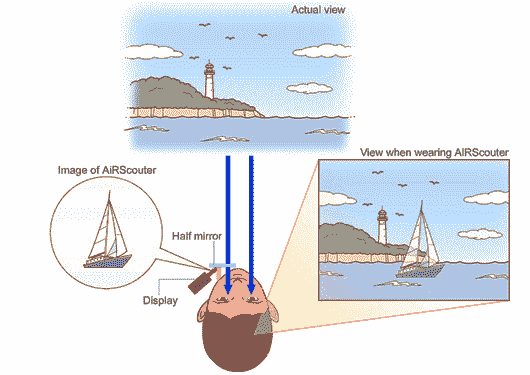

# AiRScouter:兄弟准备将其透明头戴式显示器商业化(视频)

> 原文：<https://web.archive.org/web/http://techcrunch.com/2011/08/26/airscouter-brother-ready-to-commercialize-its-see-through-head-mounted-display-video/>

# AiRScouter:兄弟准备将其透明头戴式显示器商业化(视频)

有时候，看起来未来的小玩意原型确实会商业化:Brother 已经[宣布](https://web.archive.org/web/20230205045819/http://www.brother.com/en/news/2011/airscouter/index.htm)准备向市场推出所谓的 AiRScouter，这是一种头戴式透明透射液晶显示器，早在 2008 年就首次展示过。佩戴时，该设备给人的感觉是一个 16 英寸的屏幕，距离用户的眼睛大约一米远。

Brother 说，他们与 NEC 签署了一项协议，NEC 将在秋季开始将该技术用于他们的可穿戴计算机[远程侦察器](https://web.archive.org/web/20230205045819/http://www.telegraph.co.uk/technology/news/6493869/NEC-unveils-Tele-Scouter-translation-glasses.html)。该公司预计 Air Scouter 将用于设备组装、零件挑选和选择，以及工厂的远程操作。

该显示器的分辨率为 800×600，亮度为 600cd/m2，重量为 106g。点击这里和[这里](https://web.archive.org/web/20230205045819/https://techcrunch.com/2010/07/21/airscouter-brothers-futuristic-head-mounted-display/)阅读更多关于设备[的信息。](https://web.archive.org/web/20230205045819/https://techcrunch.com/2010/09/15/video-airscouter-brother%E2%80%99s-futuristic-head-mounted-display/)

下面是演示视频:
【YouTube = http://www . YouTube . com/watch？v =-ipnkk 2 lexo&w = 560&h = 345】