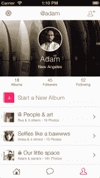

# Albumatic 重新推出照片应用程序，专注于相册(而不是位置)，分享其 420 万美元资金的细节 

> 原文：<https://web.archive.org/web/https://techcrunch.com/2013/08/01/albumatic-relaunch/>

# Albumatic 重新推出照片应用程序，专注于相册(而不是位置)，分享其 420 万美元资金的细节

今天，Albumatic 发布了新版本的图片分享应用，联合创始人亚当·路丁称该应用是“重新设计和重新想象的”

当 [Albumatic 在二月份](https://web.archive.org/web/20221203103751/https://beta.techcrunch.com/2013/02/21/albumatic-launch/)首次推出时，它专注于捕捉与朋友在一起的事件的想法。这个想法在我最初的发布报道中包含的宣传视频中得到了传达，有人开始在他们的车库中拍摄音乐会，这吸引了一群其他朋友过来拍照，其他人可以从远处跟踪活动。

Ludwin 说，这种方法确实吸引了一些用户——头两周就吸引了近 10 万人。那时，Ludwin 和其他 Albumatic 团队成员前往西南偏南，认为这是该应用程序的绝对完美事件。但通过他们在 SXSW 与用户的互动，以及只看应用程序的使用情况，他们意识到他们的想法有点偏离。

Ludwin 说，大多数人使用 Albumatic less 来收集大型活动的照片，更多的是作为“他们生活中正在进行的 Pinterest 一种组织他们所有照片的方式，然后与朋友分享。最终，Ludwin 和他的团队决定，他们开发的应用更像是“一个不相关的中等应用”，是他们想要开发的重磅炸弹。

“我们将继续努力，直到找到真正适合数千万用户的产品市场，”他说。“相册本身就是一个对象……我们仍然觉得有机会在你的手机上拥有它，我们想再试一次。”

 因此，新版应用去掉了所有的定位服务，以及只与附近的人建立相册的想法。相反，你创建相册，跟随朋友查看他们的相册，并邀请他们就某些相册进行合作。相册可以是公开的，也可以是私人共享的，可以在应用程序或网络上查看。

这里有一个奇特的比喻:Ludwin 将你拍摄的所有照片比作白光，Albumatic 比作一个棱镜，将光分成它的组成颜色。在某些方面，Ludwin 说他只是试图为团队已经从用户那里看到的用例构建最好的应用程序，一个“你的相机胶卷的 Pinterest”他希望大多数现有用户喜欢新的应用程序，尽管他承认那些完全依赖旧版本的用户不会高兴。

Ludwin 还分享了 420 万美元 A 轮融资背后的细节，这些细节在三月份提交给 SEC 的文件中披露。他说，当时他不想谈论资金问题，因为 Albumatic 正处于上述重新构想的过程中。

然而，现在他愿意分享这笔资金是由 [RRE 风险投资](https://web.archive.org/web/20221203103751/http://www.crunchbase.com/financial-organization/rre-ventures)(其中[路丁仍然是合伙人](https://web.archive.org/web/20221203103751/http://www.rre.com/team/adam-ludwin))牵头，参与方包括 Thrive Capital、SV Angel、Highline Venture Partners、crunch fund(TechCrunch 创始人迈克尔·阿灵顿是合伙人)、Box Group 和 betaworks。