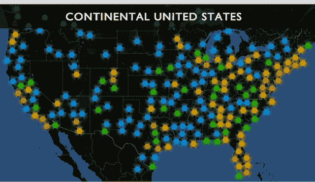

# iOS 管家 Alfred 将意外收获端上银盘 TechCrunch

> 原文：<https://web.archive.org/web/http://techcrunch.com/2011/10/10/alfred-the-ios-butler-serves-up-serendipity-on-a-silver-platter/>

# iOS 管家阿尔弗雷德端上了银盘上的意外收获

回到七月[，我写了](https://web.archive.org/web/20230203153730/https://techcrunch.com/2011/07/18/cleversense-launches-alfred-personalized-local-recommendations-with-a-single-tap/)关于一个叫做 *[阿尔弗雷德](https://web.archive.org/web/20230203153730/http://itunes.apple.com/us/app/alfred/id447020280?mt=8)* 的漂亮的 iPhone 应用。这有点像 Yelp 遇到潘多拉:你告诉它你喜欢什么样的餐馆，然后它试图给出一些可靠的推荐。

今天，阿尔弗雷德背后的公司“聪明的感觉”分享了一些早期的统计数据——它们看起来不错。到目前为止，在不到三个月的时间里，该应用程序已经向用户提供了 700 万条推荐。用户已经在应用程序中“喜欢”了 200 万个场馆(你可以使用潘多拉风格的拇指向上或向下来进一步训练应用程序的建议)。显然这些建议听起来也是真的:该应用在 iTunes 上有 550 个评级和 4 星平均分。

然而，最重要的统计数据涉及到人们实际使用应用程序的方式。也就是说，事实上，通过 Alfred 的请求中有 94%是基于“意外发现”,而只有 6%是显式搜索。

这意味着什么呢？Alfred 区别于竞争对手(如 Yelp)的一个关键特征是，它专注于要求用户很少甚至没有输入。在你完成了一次初始训练后，你告诉应用你喜欢什么，它会尽最大努力推荐喝咖啡、吃午餐、喝饮料的地方，或者当你打开应用时它认为你正在寻找的任何东西(它会注意像当前时间这样的事情来进行初步猜测)。通常只需轻点一两下就能得到快速推荐——因为该应用程序正在为每个用户建立口味档案，这些推荐应该会随着时间的推移而变得越来越好。

这些点击次数少的查询就是阿尔弗雷德所说的意外收获，它们的流行表明，当人们可以避免手动输入时，他们真的不想处理手动输入的事情(这对 Siri 来说也是一个好迹象，它同样可以让人们避免输入)。

为了纪念他们的进步，Clever Sense 制作了一个信息图，展示了几个统计数据，以及旧金山和纽约的使用密度。要查看完整的信息图，请点击下图。

