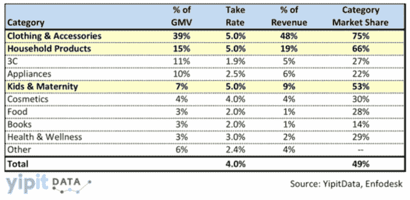
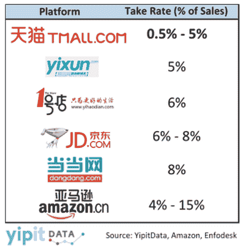

# YipitData TechCrunch 表示，阿里巴巴 1500 亿美元的估值仍有很大的提升空间

> 原文：<https://web.archive.org/web/http://techcrunch.com/2014/03/25/alibaba-tmall-yipitdata/>

[阿里巴巴](https://web.archive.org/web/20230131000739/http://www.alibaba.com/about)即将上市[预计将成为有史以来最大的 IPO 之一](https://web.archive.org/web/20230131000739/http://online.wsj.com/news/articles/SB10001424052702303563304579447271784600840?mg=reno64-wsj&url=http%3A%2F%2Fonline.wsj.com%2Farticle%2FSB10001424052702303563304579447271784600840.html)，但有人担心，随着商家支出放缓和竞争加剧，中国电子商务巨头的快速增长正在放缓。

但是根据研究公司 [YipitData](https://web.archive.org/web/20230131000739/http://yipitdata.com/) 的[的一份新报告](https://web.archive.org/web/20230131000739/http://yipitdata.com/2014/03/25/alibaba-tmall-data-initiatives/)，阿里巴巴仍然值得其 1500 亿美元的估值，并且可能价值更高。

阿里巴巴 2013 年第三季度收入增长 51%，而去年同期为 61%。尽管阿里巴巴的增长速度超过了包括 JD.com 在内的几个主要竞争对手，但增长放缓引发了人们对阿里巴巴收入潜力的担忧。

但 YipitData 表示，阿里巴巴最大的市场之一天猫 可以通过提高某些类别的销售佣金来使其收入翻一番，以与包括 JD.com 在内的其他电子商务公司保持一致，后者最近与阿里巴巴的主要竞争对手之一 腾讯 结成了重要的战略合作伙伴。

天猫让包括苹果、耐克和宝洁在内的公司直接向消费者销售产品，是阿里巴巴最有价值的资产之一。2012 年，天猫和淘宝(阿里巴巴的 C2C 市场)的总交易额超过了 1 万亿元(1620 亿美元)，超过了 2012 年亚马逊和易贝的总和。

天猫目前拥有超过 90，000 家店铺，通过销售佣金赚钱，称为“提取率”，根据产品类别的不同，提取率从 0.5%到 5%不等。

该市场收取的销售佣金比竞争对手低得多，根据 YipitData 的研究，阿里巴巴最近推出了一些增长举措，这些举措似乎专注于最有空间提高接受率的类别。

如下图所示，天猫目前在其占据较大市场份额(超过 30%)的类别中收取 5%的佣金。

YipitData 表示，如果天猫成功增加其市场份额较低的类别，那么它可能能够将这些类别的提取率从 2%提高到 5%，从而提高天猫的平均销售佣金。

最具增长潜力的类别包括 3C(相机、电脑和手机)和家用电器。阿里巴巴为目前占有 27%市场份额的 3C 推出的举措包括“电器城”，这是一套购物保障措施，旨在使其与该领域的市场领导者 JD.com 相比更具竞争力。如果“电器城”成功吸引更多顾客，天猫有机会将目前 3C 购物的 2%佣金提高到 6%，这是 JD.com 收取的销售佣金。

在家电领域，天猫也落后于 JD.com，后者在该领域拥有 63%的市场份额，这在很大程度上要归功于其物流网络和送货保证。为了与 JD.com 竞争，天猫去年 12 月投资 3.6 亿美元，与消费电子和家电公司海尔成立了一家合资企业。与京东的 1453 个配送站相比，这笔交易让天猫可以使用海尔在中国的 17000 个服务点。此外，阿里巴巴还与家电制造商美的(Midea)签署了一项为期三年的合作伙伴关系，用于上周推出的一系列智能家电，并将在天猫上独家销售。

阿里巴巴重点发展的其他天猫品类包括食品和天猫全球，前者目前收取 2%的佣金，后者是国际品牌的专用市场。后一类的贷款利率从 2%到 4%不等，有很大的上升空间。

天猫的拿货率实际上低于竞争对手，如右图所示，因此提价不太可能吓跑供应商，尤其是如果阿里巴巴的增长举措带来更多销售的话。