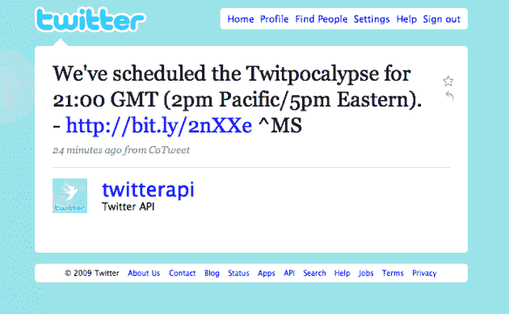

# 推特提升了推特启示录的地位。今天一切都会失控。

> 原文：<https://web.archive.org/web/https://techcrunch.com/2009/06/12/all-hell-may-break-loose-on-twitter-in-2-hours/>

# 推特提升了推特启示录的地位。今天一切都会失控。

推特用户们，推特末日即将来临。

推特启示录是一个即将被曝光的漏洞的名字。显然，它在本质上类似于 Y2K bug，并且源于这样一个事实，即发出的每条 tweet 都有一个唯一的数字标识符。这个标识符即将达到 2，147，483，647。这个数字是[有符号整数](https://web.archive.org/web/20230406085052/http://en.wikipedia.org/wiki/Integer_(computer_science))限制，显然当一些第三方 Twitter 客户端开始达到这个限制时，标识符将开始变为负数，这些应用很可能因此崩溃。

根据倒计时，这次事故应该发生在明天的某个时候，但是看起来[推特已经将推特启示录](https://web.archive.org/web/20230406085052/http://twitter.com/twitterapi/status/2134819653)时间提前到格林威治时间 21:00，即太平洋时间下午 2 点/东部时间今天下午 5 点。是的，几个小时后。

他们现在正在迫使故障，以便所有人都在甲板上工作，而不是在半夜发生故障。

由一些在 Twitter 工作的开发人员运行的这个[谷歌群组线程](https://web.archive.org/web/20230406085052/http://groups.google.com/group/twitter-development-talk/tree/browse_frm/thread/1e97063bbf0f71a1/dbab1649df4e53be?rnum=1&_done=%2Fgroup%2Ftwitter-development-talk%2Fbrowse_frm%2Fthread%2F1e97063bbf0f71a1%3F&pli=1)解释了更多。工程师马特·桑福德最初解释说:

> 状态 id 的 32 位有符号整数值(也称为“twitpocalyse”[1])即将溢出。目前的估计是格林威治时间明天上午 11 点左右，对于 Twitter 来说是太平洋时间凌晨 3 点。内部有一些关于加速事情的讨论，所以我们将在办公室里，能够应付。没有人在凌晨 3:00 是最新鲜的，更不用说如果一个人的开发团队没有注意到，整个周末都没有应用程序崩溃会很好。还没有做出决定，但是我想告诉你们一些事情，这样你们就知道如果我们决定这么做的话会发生什么。

但是现在有人说:

> 对@twitterapi 的回复和所有内部讨论都表明，人们倾向于不要等到半夜。目前的计划是在 21:00 GMT(太平洋时间下午 2:00/美国东部时间下午 5:00)强制发布该问题。这将让我们确保万一我们这边出了问题，我们所有的员工都有空。当不遵守 twitter-dev-talk 列表的人开始报告错误时，我们也可以提供帮助。虽然我们确实警告过开发者关于 Twitpocalypse 的事情，但是很抱歉我们之前没有考虑过设置一个截止日期。我们将继续努力改进此类警告。晚安，祝你好运。

所以，是的，做好准备，一些 Twitter 应用程序将在两个小时后失效。希望 Twitter 能够迅速解决这个问题。

**更新**:这可能是巧合，但是推特[今天刚刚迎来了两名新成员](https://web.archive.org/web/20230406085052/http://apiblog.twitter.com/post/122524714/welcome-to-the-team-rsarver-noradio)加入其 API 团队。Twitter 准备好战斗了吗？

**更新 2** :现在已经过了下午 2 点，还没有大规模故障的报告。也许这真的就像千年虫一样。

更新 3 :这是推特开发者道格·威廉姆斯的更新:

> 只是一个更新，要完成这样的事情需要很多的协调。我们需要运营团队来监控服务器和应用程序。服务团队将与运营团队紧密合作，以确保我们这边的任何问题都得到正确跟踪和解决。马特四处奔走协调整个工作。
> 
> 也就是说，当我们努力确保我们已经覆盖了我们的基础，并且工程团队已经准备好应对不可预见的问题时，截止日期可能会稍微推迟。
> 
> 尽我们所能保持微博畅通。

**更新 4** :危机看起来*大部分*避免了。[更多在此](https://web.archive.org/web/20230406085052/https://techcrunch.com/2009/06/12/twitpocalypse-not-now-crisis-averted/)。

