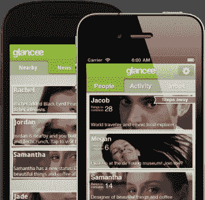
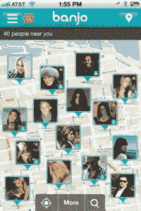
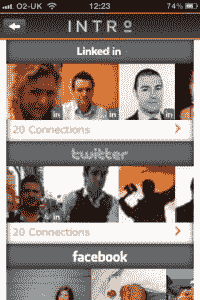
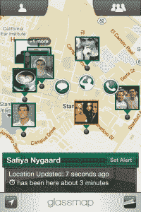
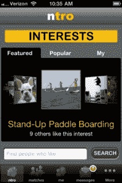
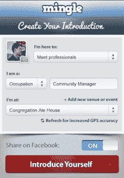
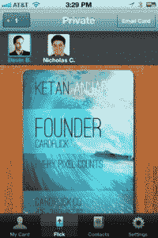
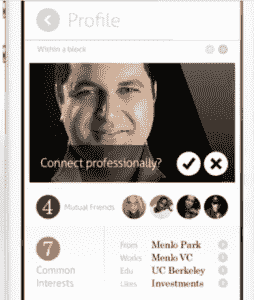

# 你必须在 SXSW Royal Rumble | TechCrunch 上使用的所有定位应用程序

> 原文：<https://web.archive.org/web/https://techcrunch.com/2012/03/06/all-the-location-apps-you-have-to-use-at-the-sxsw-royal-rumble/>

这将成为 SXSW 上的一场皇家盛宴——希望在大会上出现的基于位置的网络应用数量之多，几乎是势不可挡的。更糟糕的是，它们在本质上非常相似，所以很难辨别出一个比另一个更好的地方。他们不可能都是赢家。

该应用程序是用于商务社交还是结交新朋友？它是使用脸书和 Foursquare 等其他网络的签到数据，还是仅仅把你和你的朋友联系起来？应用程序如何知道谁在附近？它会耗尽你的电池吗？

下面，我们收集了最近热门的基于位置的网络空间中所有最热门的应用程序，因此您可以为 SXSW……以及其他应用程序填充您的手机。

需要说明的是，基于位置的社交网络的想法并不新鲜。去年秋天，[我们投身于这一仍在兴起的趋势](https://web.archive.org/web/20230405171209/https://techcrunch.com/2011/09/16/the-new-social-network-whos-nearby-not-who-you-know/)，突出了新的应用程序，如[声纳](https://web.archive.org/web/20230405171209/http://www.sonar.me/)和[班卓琴](https://web.archive.org/web/20230405171209/http://ban.jo/)，加上去年的 SXSW darling，群聊应用程序 [Yobongo](https://web.archive.org/web/20230405171209/http://yobongo.com/) ，以及微型网络应用程序 [LoKast](https://web.archive.org/web/20230405171209/http://www.lokast.com/) ，专注于商业的 [Mingle](https://web.archive.org/web/20230405171209/http://minglesocialapp.com/) ，以及现已关闭的 [Holler](https://web.archive.org/web/20230405171209/http://itunes.apple.com/us/app/holler/id461565363) 。

虽然一些相同的应用程序仍然存在，希望赢得 SXSW 与会者的喜爱，但现在有一大批具有相同目标的其他应用程序加入了他们的行列。

急需一份即将到来的应用大战的备忘单？我们也是。虽然这篇文章的目的是介绍移动应用程序，但也有其他服务可以帮助 SXSW 与会者联系。例如，你可能还想看看[meet or](https://web.archive.org/web/20230405171209/http://meeteor.com/sxsw)，它刚刚为 SXSW 与会者推出了一个在线网站。或者，您可以使用[散列](https://web.archive.org/web/20230405171209/http://hashable.com/beta)来跟踪您的会议。当然，还有 Twitter 和 Foursquare 以及 T21。

但是现在，新的应用程序竞争者出现了:

[")](https://web.archive.org/web/20230405171209/https://techcrunch.com/wp-content/uploads/2012/03/highlight22122-1.png) 让我们从最热门的开始:亮点[一直备受关注](https://web.archive.org/web/20230405171209/https://techcrunch.com/2012/02/02/highlightserendipity/)前 SXSW，尤其是来自[成员](https://web.archive.org/web/20230405171209/https://plus.google.com/111091089527727420853/posts/A4a7qJuV7XE)T9[科技](https://web.archive.org/web/20230405171209/http://allthingsd.com/20120301/edgy-location-sharing-app-maker-highlight-raises-seed-funding/) [场景](https://web.archive.org/web/20230405171209/https://techcrunch.com/2012/03/03/myhighlight/)。该应用程序使用你的脸书个人资料，为你和附近与你志趣相投的朋友牵线搭桥。Highlight 有一个非常酷和简单的设计，但它似乎也在[向](https://web.archive.org/web/20230405171209/https://techcrunch.com/2012/03/03/myhighlight/)转变，成为一个个人化的社交 CRM 系统，帮助你记住人们的名字和你何时见过他们，以及只是建议你可能喜欢的附近的人。

**优点**:对脸书用户有好处，做社交；[该团队承认](https://web.archive.org/web/20230405171209/https://techcrunch.com/2012/03/03/highlight-needs-to-let-you-switch-off-friend-of-friend-notifications-before-austin/)女性对这些应用程序存在安全/隐私问题，并正在努力解决这一问题；伟大的设计。

**缺点**:可能会耗尽你的电池，直到情况有所改善；那些“朋友的朋友”的通知会在 SXSW 打爆你的手机；依赖脸书数据可能会限制一些人的有用性

**适用于** : iPhone

 另一个[新竞争者](https://web.archive.org/web/20230405171209/https://techcrunch.com/2012/02/09/glanceelocationapp/)，Glancee 最喜欢 Highlight，因为它还使用你的脸书个人资料和兴趣来帮助你发现附近的用户。但与 Highlight 不同的是，它不会在地图上显示人们的确切位置，只会给出一个大概的距离(例如“离你 5 英里”)。人是按距离和共同兴趣来排名的。在应用程序的主屏幕上，它总结了你们有多少共同点——我想可能是对话的开始。然后，你可以使用该应用程序内置的聊天功能联系那些建议的人。明天它会有新的[更新](https://web.archive.org/web/20230405171209/https://techcrunch.com/2012/03/06/glancee-to-release-big-sxsw-update-with-past-encounters-more-location-and-more-android/)。

**优点**:对脸书用户有好处，做社交；轻松推送通知，有助于延长电池寿命；适用于 iPhone & Android

**缺点**:不要太在意通知——你可能会错过某个人！；依赖脸书数据可能会限制一些人的有用性

**适用于** : iPhone、Android、脸书

 班卓琴[已经出现了一段时间](https://web.archive.org/web/20230405171209/https://techcrunch.com/2011/12/27/half-a-million-downloads-later-social-discovery-app-banjo-hits-the-web/)，但最近的更新赋予了该应用足够的新光泽，可以看到它在 iTunes 应用商店中获得“特色”地位。关于 Banjo 最好的部分是它没有荒凉的首次启动体验——也就是说，即使你的朋友都不使用这个应用程序，Banjo 可能仍然会被证明是有用的。除了依赖脸书，班卓还利用 Twitter、Foursquare、Instagram 等网站的数据，根据人们的签到或地理标记的推文，向你展示他们在哪里，他们在说什么/做什么。该应用程序还能让你知道你真正的朋友何时在附近，即使他们没有弹班卓琴。

**优点**:适合查找附近的朋友，或者只是看看周围的人在说什么、做什么；找到更多的人，因为它使用了多个社交网络；跨平台工作

**缺点**:附近的人是按距离排名的，而不是共同的兴趣或共同的人脉；通知是漫无目的的——有时到达得太晚，无法与相关人员见面；依赖于检入/地理标记数据，而不是环境连接

**适用于** : iPhone、Android、Web

 今天刚刚推出，介绍是为了商业，而不是社交，网络。该应用建立在 LinkedIn 的基础上，包括消息传递、隐私功能和一个高级的“传送”选项，让你可以与世界上任何地方的其他人建立虚拟网络。为了不仅限于介绍用户，该应用程序还使用脸书、Twitter 和 Foursquare 数据来显示附近的其他用户。

优点:非常适合商务社交/在 LinkedIn 上建立新的联系；隐私角度——你必须接受一个连接请求，人们才能给你发信息；也向你展示社会关系；不会消耗太多电池电量；

**缺点**:上市时仅在 iPhone 上；必须为将来的某些功能付费；

**在**上工作:iPhone(一个月后安卓)

及时为 SXSW 更新的 Sonar 不再关注特定场馆登记的人，现在更关注附近的推荐人。该应用程序将你附近的朋友与附近“相关”的人区分开来，这些人根据你有多少共同的朋友进行排名。像 Banjo 一样，该应用程序根据用户在脸书、Twitter 和 Foursquare 上的签到(或地理标签)来找到附近的用户，但在用户档案中填写的数据也包括 LinkedIn 信息。此外，像太空中的大多数其他设备一样，当朋友在附近时，声纳可以提醒你。

**优点**:非常强调排名技术，帮助你更容易找到你想认识的人；个人资料包括大量的用户数据和地图位置；刚刚登陆安卓测试版

**缺点**:依赖于签到/地理标记数据，而不是环境连接；iPhone 更新仍然在 SXSW 中发布

**适用于** : iPhone 和 Android(仅[测试版](https://web.archive.org/web/20230405171209/http://bit.ly/sonarandroidbeta))

这个应用程序将会对那些实际参加 SXSW 的人有所帮助，他们不仅仅是参加聚会，而是参加小组讨论和演讲。为什么？因为 EchoEcho 也可以在室内为你的朋友绘制地图。

这款应用在室外使用 GPS，然后当你进入室内时切换到 Wi-Fi，使用初创公司 [WifiSlam](https://web.archive.org/web/20230405171209/http://www.wifislam.com/) 的特殊技术来绘制建筑物的内部

**优点**:室内位置，明显；还有隐私方面——这款应用可以让你根据朋友来调整你的可见性；不会耗尽电池；跨平台支持

**缺点**:仅适用于其他 EchoEcho 用户；

**适用于** : iPhone、Android、诺基亚(Symbian)、黑莓、Windows Phone

Kismet 在 SXSW 发布之际，使用 Highlight 和 Glancee 等环境定位数据找到附近的人，同时也使用声纳等主动签到数据找到他们。该应用程序还允许您创建“弹出事件”，然后附近的其他应用程序用户可以发现这些事件(想想“欢乐时光饮料”、“社交应用程序上的 SXSW 面板”等)。).附近的人根据分离程度排名，这超出了共同的朋友。Kismet 也是少数几个允许你同时登录 Foursquare 和脸书的网站之一，为你节省了额外的步骤。

**优点**:使用主动签到和周边位置最大化连接列表；根据您的联系方式对用户进行排名；让您在 Foursquare 上登记入住脸书

**缺点** : [iPhone](https://web.archive.org/web/20230405171209/http://itunes.apple.com/us/app/kismet/id490929215?ls=1&mt=8) 仅在发布时

**适用于** : iPhone

 Glassmap 更像是一种“查找我的朋友”类型的服务，除了一种跨平台的服务(iPhone & Android)。Glassmap 建立在脸书的基础上，它可以找到你在 Glassmap 上的脸书朋友，并在地图上实时标出他们的位置。你可以选择性地启用或禁用可以看到你当前位置的人，该应用程序智能地使用服务器技术来延长电池寿命。

**优点**:为脸书用户提供的一个很棒的(免费)朋友和家人定位服务；保持电池寿命；跨平台的

**缺点**:只使用脸书查找你的朋友，不帮你查找你不认识的人

**适用于** : iPhone 和 Android

 不要和专注于商业的应用 INTRO 混淆，NTRO 是为了结识和你有共同兴趣的人。您可以手动输入这些兴趣，也可以从脸书导入。与 ntro 的区别(令人惊讶的是，它几乎就像社交版的 INTRO！)，在于你可以通过兴趣过滤搜索结果，非常狭隘地设定自己的“顶级”兴趣。(例如，不仅仅是“音乐”，而是乐队的名称)。Ntro 还允许您向与您有共同兴趣的用户发送消息。

**优点**:非常适合脸书用户，建立社交关系；跨平台的

**缺点**:城市支持有限**。** Ntro 在洛杉矶的旧金山工作，并计划推广到纽约、芝加哥特区和波士顿。刚刚增加了对奥斯汀的支持。

**适用于** : iPhone 和 Android

 Mingle 和 INTRO 最相似，它的重点是商务社交。你可以使用你的 LinkedIn 账户或脸书账户加入 Mingle，也可以直接注册。然后，它会显示谁在附近，可以使用手机的 GPS 进行联网。像“介绍”一样，你可以指定你职业和你想见的人，但是如果你愿意，你也可以把“介绍”贴在脸书的网站上。然而，Mingle 和 INTRO 之间的关键区别在于，Mingle 只根据用户的接近程度对用户进行排名，并不表明你可能有共同的朋友或朋友的朋友。

**优点**:多种登录方式；非常适合商业网络；跨平台的

缺点:不跟踪在 Twitter 和 Foursquare 等其他服务上的签到；不会向你展示你是如何与他人联系在一起的

**适用于** : iPhone 和 Android

card flick 的本意不仅仅是取代名片，它还与脸书、LinkedIn 和 Twitter 相连，用于登录，或者你可以创建自己的账户。然后你可以用你的个人信息和顶级设计师的主题来定制你的卡片。当你进入“轻击”屏幕时，基于位置的元素开始发挥作用——该区域向你显示你可以“轻击”你的卡的附近用户。如果他们不在 CardFlick 上，你可以通过电子邮件向他们发送你的名片。与此同时，CardFlick 在云中跟踪你所有的联系人。

**优点**:非常适合商务社交(当你没有名片的时候也可以用！);使用方便；不会耗尽电池

**缺点**:并不是真的用来寻找附近的人进行社交，只是方便社交后的名片分享；安卓应用处于私人测试阶段

**适用于** : iPhone、Android(仅限邀请 [beta](https://web.archive.org/web/20230405171209/http://cardflick.co/android) 和 [Web](https://web.archive.org/web/20230405171209/http://cardflick.co/login)

## **还有更！**

还有一些其他应用值得一提，但可能不会在 SXSW 上争夺主屏幕空间，这取决于他们的发布时间框架。

 一个是很有意思的[发现圈](https://web.archive.org/web/20230405171209/http://discovercircle.com/)，来自 YC 回来的创业公司 [LikeALittle](https://web.archive.org/web/20230405171209/https://techcrunch.com/2011/08/01/likealittle-people-uses-your-interests-to-connect-with-the-people-around-you/) (LAL)。这款只接受邀请的应用程序将在几周后推出，看起来很漂亮，但它将专注于将你与一群人联系起来(比如学校的朋友、某个特定电视节目的粉丝等)。).这与大多数定位应用不同，这将有助于它脱颖而出。

Cult 计划在本周推出，它将允许用户在 SXSW 和其他地方张贴照片和文字。Cult 为地点提供自己的 feed——该地点的文本和照片流。这个数据库已经包含了世界各地 1000 万个地方和 100 个“邪教”。例如，SXSW 的聚会可能有一个“邪教”,但星巴克这样的商店也会有。当你在一个地方发布到 Starbucks cult 上时，你就连接到了世界各地的其他 Starbucks。当你加入邪教，这些都保存在你的个人资料，供以后查看。

*补充阅读:*

如果你对这个领域感兴趣，你必须读一读罗伯特·斯考伯最近写的博客。他一直在跟踪这个领域，发表了深入的帖子，解释为什么他认为 Highlight 和 Glancee 将成为 SXSW 上最热门的两个应用程序，尤其是为什么 Highlight 可能值得投资。

【上图来源于[MickFoley.com](https://web.archive.org/web/20230405171209/http://www.realmickfoley.com/2012/01/29/mick-foley-enters-2012-royal-rumble/)。]