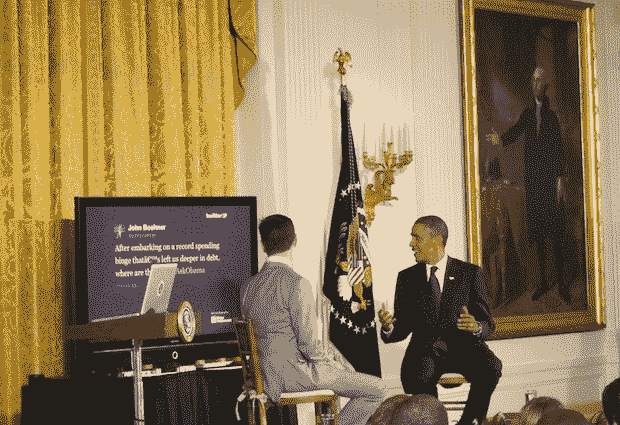

# 还记得推特是个笑话吗？没有人再笑了。

> 原文：<https://web.archive.org/web/http://techcrunch.com/2011/07/06/all-the-presidents-tweets/>

我回想起几年前 Twitter 被嘲笑的时候。这是博客圈的出气筒。这是一个愚蠢的小服务，没有一个头脑正常的人会使用。这是给那些想分享他们生活中平凡琐事的人看的，没有人想看。是为自大狂准备的。或者失败者。它永远不会流行起来。

然后就发生了。

今天，当我站在白宫的东厅时，我正在思考这个问题。为什么我会在那里？Twitter 的联合创始人杰克·多西主持了与奥巴马总统的问答环节。是的，美国总统正在回答完全来自 Twitter 的问题，记得吗？Twitter 以前是一个愚蠢的服务，是一个笑话。

今天的活动最吸引人的是它的效果。一周前，白宫向[发出了一份新闻稿](https://web.archive.org/web/20230205010855/http://www.whitehouse.gov/the-press-office/2011/06/30/white-house-host-twitter-townhall)，让人们了解这一事件，并要求通过 Twitter 使用标签“#askobama”提交问题。Twitter 随后与 [Mass Relevance](https://web.archive.org/web/20230205010855/http://www.massrelevance.com/) 合作，使用他们自己的算法，并指派具有政治专业知识的策展人来选择将要提出的问题。

据我们所知，总共有 169395 条带有#askobama 标签的推文。

就像我们在选举周期中看到的辩论一样，多尔西和总统都不知道提前选择了什么问题。随之而来的是一场深入而又相当坦诚的对话，涉及人们实际关心的一系列话题。根据 Mass Relevance 汇编的统计数据，26%的推文问题与就业有关，19%与预算有关，16%与税收有关，10%与教育有关，6%与住房有关。所有的问题本质上都是严肃的。

在活动期间，问题也接踵而至。有几次，多尔西会选择一个刚出生 10 分钟的孩子去问总统。通常，这些问题是关于总统在活动早期给出的答案。然后，总统将进一步澄清他的立场。[实时](https://web.archive.org/web/20230205010855/https://techcrunch.com/2009/11/27/twitter-realtime-news-cronkite/)。

一些推特问题也选自知名的政治实体，如众议院议长约翰·博纳(共和党人)和纽约时报专栏作家尼克·克里斯托夫。有些人可能对此有意见，因为这些人基本上可以随时向总统提问——但通过 Twitter 进行提问的透明度令人耳目一新。

当总统回答博纳关于债务和就业增长的[问题](https://web.archive.org/web/20230205010855/https://twitter.com/#!/johnboehner/status/88618213008621568)时，他很快指出，在他看来，他的对手的立场“略有倾斜”，但他仍然回答了这个问题——然后取笑博纳糟糕的打字技巧(显然[不是他的错](https://web.archive.org/web/20230205010855/https://twitter.com/sg/status/88677088579682304))。

https://twitter.com/#!/John Boehner/status/88618213008621568

当然，市政厅和现代政治本身一样古老。科技扰乱政治也不是什么新鲜事。例如，许多人仍然确信肯尼迪赢得 1960 年大选仅仅是因为他在电视上比尼克松更好看。但不知何故，Twitter 和政治话语感觉很好。

我记得在 2008 年的政治初选中有过这样的对话。同样，当时人们在这个问题上存在很大分歧——因为许多人在 Twitter 上仍然存在分歧，这一事实对当年无数的宕机问题没有帮助。但随着规模问题的远离，像今天这样的事件似乎让 Twitter/政治的共生关系比以往任何时候都更加清晰。我怀疑在 2012 年的选举周期中，事情会变得真正疯狂(希望是好的方面)。

当你将今天的活动与今年早些时候脸书与总统(在脸书总部)举行的类似市政厅式的活动进行比较时，我认为毫无疑问这次更好。对我来说，脸书事件更像是一个老派的 MTV 市政厅，甚至是一个“摇滚投票”事件。脸书相当于今天的 MTV。这是政客们在大量观众面前获得“信任”的地方。但是这些事件本身往往没有什么实质内容。

相比之下，Twitter 的规模仍然只是脸书的一小部分。总统不必利用这样的活动来推动一些大的议程，或者过于努力地吸引某一特定人群(当然，仍然有一些人是这样)，他可以严肃地对待和回答严肃的问题。如果你在四年前说，与总统一起参加推特活动会显得很有尊严，每个人都会笑。见鬼，仅仅是在同一个句子中使用“推特”和“总统”这两个词就会引起无法控制的笑声。但今天它工作得天衣无缝。

尽管如此，一些人认为今天的活动似乎更像是一场“[无意义的营销噱头](https://web.archive.org/web/20230205010855/http://blogs.hbr.org/haque/2011/07/askobama_is_a_meaningless_mark.html)”(当然，那篇帖子的作者 Umair Haque 正是两年前在 SXSW 与当时的 Twitter 首席执行官伊万·威廉姆斯一起举办了现代科技界最糟糕的 Q &之一的[。对我来说，今天似乎是市政厅形式的逻辑演变。忘记观众的问题吧，这些问题往往从平庸到贫乏，还涉及政客们不必要地迎合大众——“非常感谢你的问题，我也是在农场长大的”。提出一个问题——世界上最好的问题——回答它，继续下一个问题。](https://web.archive.org/web/20230205010855/https://techcrunch.com/2010/03/15/sxsw-keynote-ev-williams-umair-haque/)

几周前，当我读到总统终于可以用自己的账户发推文时，我也有点怀疑。为什么是现在？哦，因为有一个连任竞选活动开始了，当然。但说实话，我更担心的是，通过 Twitter 这样的服务太容易接近总统可能会在某种程度上贬低这个职位——也许这不是一个受欢迎的说法，但我怀疑许多人都这么想。我不想要一个整天发微博的总统。

这也是为什么我认为今天的活动是完美的妥协。总统会时不时地发推文(无疑经常是为了帮助他的竞选)，但他应该忍住不做大多数回应，直到他能在更有尊严的场合做出回应——比如在市政厅活动期间在白宫。是的，甚至是一个技术上的“Tweetup”(上帝，这个词听起来还是那么蹩脚)。虽然问题可能很简短，但重要话题的答案通常需要超过 140 个字符。这种格式行得通。

Twitter 是一个渠道，通过它每个人都可以被听到。是的，你仍然需要注册一个账户，但那是免费的——参与这些问答环节的门槛从未如此之低。这是一件伟大的事情。那真的很强大。白宫尊重它是正确的。

在今天的事件之后，我回顾了一些关于 Twitter 的旧帖子，试图回忆起这项服务在几年前是多么不受尊重。[这里有一个很好的例子](https://web.archive.org/web/20230205010855/http://venturebeat.com/2008/04/28/much-atwitter-about-nothing/):一些人怀疑 Twitter 是否会倒闭，因为在一个随机的婚礼上没有人知道这件事。没错。(我想知道如果 iPhone 有一个内置的 Twitter 按钮，会发生什么，这部分给了我加分……)

今天，我和总统一起站在白宫的东厅。在他的左边挂着兰斯多恩的画像，这是白宫的旧物，画于 1797 年(从 1814 年的大火中抢救出来)，描绘的是乔治·华盛顿。在他的右边挂着玛莎·华盛顿在 1878 年画的肖像。但是前面和中间是一个大屏幕电视，显示针对总统的推文。

时代变了。

Twitter，这个以前不能提供的小服务，现在已经得到了总统的认可。

