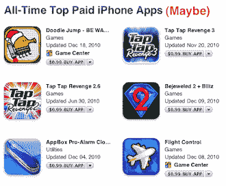

# 想登上苹果有史以来付费应用排行榜的榜首吗？销售大量应用——或者这样做 

> 原文：<https://web.archive.org/web/http://techcrunch.com/2011/01/19/all-time-top-paid-iphone-apps-maybe/>

# 想登上苹果有史以来付费应用排行榜的榜首吗？销售大量应用程序——或者这样做

昨晚，[我们指出](https://web.archive.org/web/20230203001916/https://techcrunch.com/2011/01/19/iphone-ipad-top-app-downloads/)作为 100 亿应用下载倒计时的一部分，苹果实际上公布了付费 iPhone 应用、免费 iPhone 应用、付费 iPad 应用和免费 iPad 应用的最高下载量。最上面的结果看起来很简单，只是有些奇怪。这种奇怪现象可能有一个很好的原因。这个系统看起来很容易玩。

嗯，从技术上讲，这可能不是真正的“游戏”系统。至少现在还没有。只是看起来苹果在填充他们的列表时有点马虎。在与一些顶级应用程序开发者交谈后，苹果似乎正在合计总下载量，而不管一个应用程序是否在免费和付费之间切换。

换句话说，要提升自己在付费应用排行榜上的排名，你只需在除了一天之外的所有日子免费，然后转向付费，所有这些下载都将作为付费应用计入你的总下载量。

显然，免费应用程序比付费应用程序更容易被下载。因此，如果你有一个流行的应用程序，免费，然后回到付费，这可能是一个伟大的方式杰克你的统计数据。

几个应用程序不时地进行这种转换(虽然我们不是说他们这样做是为了提高他们的统计数据——他们可能不知道苹果会这样排名——相反，这只是向客户提供的一个好提议)。像 Traffic Rush 和一些 Tap Tap 复仇游戏这样的顶级应用程序就是很好的例子。

我们采访的一位开发者，来自 [TapTapTap](https://web.archive.org/web/20230203001916/http://taptaptap.com/) 的约翰·卡萨桑塔说，他发现这些数字可疑，因为他们做了多个应用程序，而苹果的排名与他们实际的独立数字不符。但是如果你考虑到一个应用的免费和付费下载，事情就开始变得一致了。

我们已经就这个问题联系了苹果公司，如果有回音，我们会及时更新。与此同时，要对该榜单上一些付费应用保持警惕——考虑到它们的地位，它们赚的钱可能没有看上去那么多。