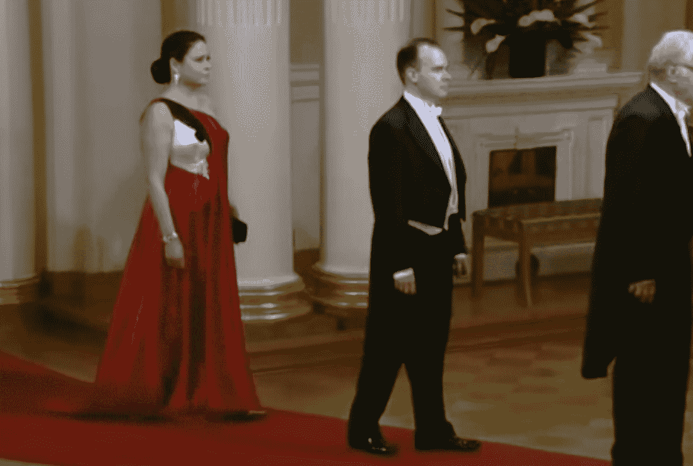
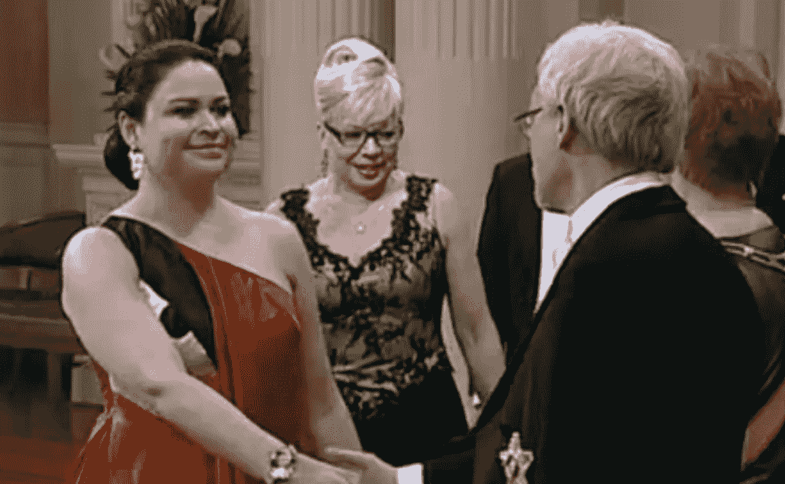

# 《愤怒的小鸟》已经在其他所有内容上移植了 Rovio Exec 的妻子的裙子 TechCrunch

> 原文：<https://web.archive.org/web/https://techcrunch.com/2011/12/06/already-on-everything-else-angry-birds-ported-to-rovio-execs-wifes-dress/>

# 《愤怒的小鸟》已经在其他所有内容上移植到了 Rovio Exec 的妻子的礼服上

去参加一个盛大的州晚会？嫁给了 Rovio 的高管？愤怒的小鸟的裙子在这一季很流行。

如果你见过罗维奥·CMO·彼得·维斯特巴卡，你可能已经了解了两件事:1)彼得是个好人，2)他真的，*真的*喜欢他的愤怒的小鸟运动衫。很少看到他*不*穿。我确信他旅行的时候会带着满满一行李箱的苹果，在穿上之后会把每一个都烧掉，作为对应用商店神的某种牺牲。

维斯特巴卡被邀请参加在芬兰总统府举行的一个活动，在那里，唉，着装要求少一点运动衫，多一点领带和燕尾服。幸运的是，彼得的妻子 Teija 找到了一种方法来代表这只鸟:她的整个礼服。

对于任何不熟悉这个游戏的人来说，衣服的图案可能看起来只不过是形状的奇怪排列。不过，如果你花了哪怕一两分钟的时间扔鸟，这个客串就很清楚了:那是一只红色的鸟，从你不应该盯着的地方发出耀眼的光芒。

一些人(包括 Neogaf 的一些论坛参与者，他们似乎是第一个注意到这一点的说英语的人)很快批评了她的着装选择；我认为这是天才。彼得·维斯特巴卡(见上图，在他妻子面前)在芬兰算是个名人，而《愤怒的小鸟》是他们引以为豪的东西(因此被邀请参加派对)——这只是为了庆祝这一点。干得好，Teija。

[更新:你可以找到更多裙子的照片，由[玛蒂·马蒂凯宁](https://web.archive.org/web/20221006011212/http://www.mattimatikainen.net/)、[在这里](https://web.archive.org/web/20221006011212/http://www.iltalehti.fi/linnanjuhlat/2011120614894685_lj.shtml)拍摄