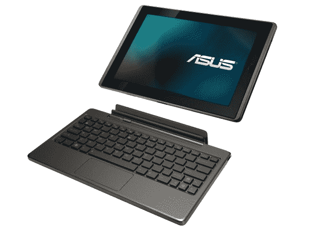
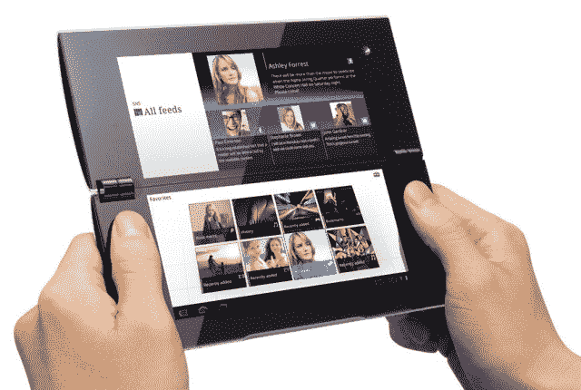
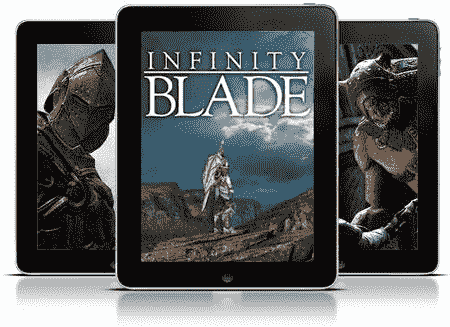
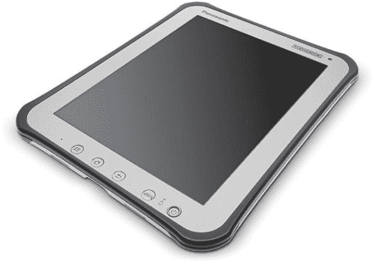
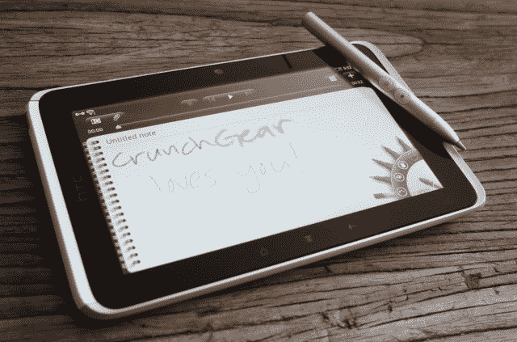

# 替代平板电脑:下一件大事还是一问世就夭折？

> 原文：<https://web.archive.org/web/https://techcrunch.com/2011/07/13/alternative-tablets-the-next-big-thing-or-dead-on-arrival/>

对于一个平板电脑来说很难做到。不仅仅是因为消费者还不确定他们是否想买，而是因为货架上太拥挤了，很难脱颖而出。在今年的 CES 上，拥有一台 Android 平板电脑似乎是预订展位的先决条件；很少有大公司*没有*宣布某种计划。

我想他们都认为自己是在淘金。但各种产品的雷同让许多消费者在百思买的过道里目光呆滞。难怪他们最终会选择 iPad，因为其他选择可怜巴巴地试图让消费者关心硬件上的细微差异，并对未来的改进做出模糊承诺，而他们对此并没有真正的控制权。

与此同时，一些公司已经足够大胆地背离这种模式，以至于你不用眯着眼睛就能分辨出他们的产品。但是这些非传统的设计会刺激一个冷漠的市场吗？还是说它们太多了，太早了？

**可转换平板电脑**

我刚刚读了一篇相当合理的文章，认为这些敞篷车，比如华硕的 Transformer，将会大受欢迎。对于那些太忙而没时间看的人来说，要点是:它们变得足够纤薄，值得一看，软件正在成熟，不会让人感到草率，越来越多的人无法在平板电脑和笔记本电脑之间做出决定。他们自然会选择混合动力车。

虽然这有些道理，但我不认为这意味着普遍采用。如果你看看像 iPad 这样的东西的使用模式，你会看到大量的浏览、视频观看和休闲游戏。电子邮件也是，但因为在触摸键盘上打字很痛苦，所以主要是检查，没什么大不了的。关键是，即使是早期用户(别搞错，即使是售出的 2000 万台 iPads 也是卖给早期用户的)也对消费感兴趣，而不是创造。平板电脑是内容的窗口，但它是单向玻璃。

没错，可变形平板电脑让打字变得更容易。但与任何 500 美元的笔记本电脑相比，平板电脑无法执行那么多需要键盘的任务。你将能够更好地处理电子邮件，更快地输入网址，但有企业软件、财务管理软件、严肃的文字处理和编辑软件可以在上面使用吗？还没有，我想一段时间内也不会。

Windows 8 是敞篷车箭囊中最大的一支箭。这在很大程度上取决于微软能否将这个极具前景的开端变成人们真正想要使用的东西。一个丰富的界面，加上平板电脑的易用性和全功能 PC 的功能并不是一件容易的事情，但微软意识到他们需要这个产品来获得成功，否则他们将永远退出平板电脑游戏。如果敞篷车变得流行，那不会是因为上面提出的原因，而是因为微软让它们流行起来。因为苹果、谷歌、华硕、宏碁和其他公司肯定不会这么做。

**双屏平板电脑**

信使，信使，你在哪里，[信使](https://web.archive.org/web/20230203103631/https://techcrunch.com/tag/courier/)？o 最有前途的前 iPad 设备。如果你正在读这篇文章，你可能还记得微软的明星交叉信使项目，它很早就从孵化器中破壳而出，并在几个月内成为博客世界的宠儿。它展示了想象力、良好的设计和承担风险的意愿。因此，当它被鲍尔默断然埋葬时，也就不足为奇了。从那以后，我们就再也没有真正让我们兴奋的双屏平板电脑了——但这并不意味着外形从根本上来说是贫瘠的。

Kno 让我想起了一个部分正确的例子。Kno 是一款笨重、昂贵的平板电脑，旨在取代笨重、昂贵的教科书。但是我说得不公平:这确实是一件非常聪明的作品，尽管它的规模和成本最终[杀死了它](https://web.archive.org/web/20230203103631/https://techcrunch.com/2011/04/08/kno-bails-hardware-30-million/)，但它表明一种全新的方法和独特的品牌可以为产品的知名度创造奇迹。TechCrunch Disrupt 的舞台演示也有所帮助。但如果有什么不同的话，那就是这种设备的销量总是以万计，而不是以千万计。

最近，我们看到了一些相当奇怪的设计，如 [Iconia Touchbook](https://web.archive.org/web/20230203103631/https://techcrunch.com/2011/03/29/acer-releases-dual-screen-iconia-touchbook/) ，它们最终更像是两个世界中最糟糕的。索尼的 S2，我们今天刚刚与它进行了一次[接触](https://web.archive.org/web/20230203103631/https://techcrunch.com/2011/07/13/hands-on-with-the-sony-s1-and-s2/) n，似乎更有前景，但我们将在下面的游戏平板电脑部分更仔细地观察它。

这里的问题似乎是一个技术问题，而不是设计问题。两个独立显示屏的边框宽度、重量和成本意味着平板电脑在外形或价格上无法竞争。此外，缺乏针对两个屏幕的优化应用程序意味着好处极其有限。当技术问题得到解决，轻薄、可折叠的设备不再做出不可接受的妥协时，软件就会随之而来。在那之前，没有机会。

**游戏平板**

各公司一直在竭尽全力赞美他们特定品牌的游戏实力。不要介意他们都只是 Nvidia 的 Tegra 团队的先令(苹果除外，其 [A5](https://web.archive.org/web/20230203103631/https://techcrunch.com/2011/04/14/analysis-of-apples-a5-its-not-what-we-know-its-what-we-dont-know/) 似乎是一个真正的背离规范)。说实话，在过去一年左右的时间里，手机和平板电脑中的这些低功耗芯片已经从贫血的弱者变成了真正的现代 3D 强者。这方面的典型代表是虚幻引擎和*无限刀锋*。

但是，平板电脑能够真正专注于游戏体验吗？索尼正在用 Playstation 品牌的 S1 和 S2 平板电脑打这个赌，这些平板电脑将独家访问索尼的某些内容，尽管这些内容的质量远不能保证(首先想想 PS1 的作品)。这款平板电脑可能面向的是严肃的游戏玩家，他们不会轻易放弃自己选择的平台。而 [Vita](https://web.archive.org/web/20230203103631/https://techcrunch.com/2011/06/07/actually-sony-won-e3-with-the-vita/) 和 [3DS](https://web.archive.org/web/20230203103631/https://techcrunch.com/tag/3ds/) 更是他们心中所想。

控制的问题立即出现了。虽然平板电脑对某些类型的游戏来说很棒，但对其他游戏来说却很糟糕。目前世界上最流行的“真正的”游戏是射击游戏，不管粉丝们会告诉你什么，他们在平板电脑上控制得很糟糕。像 Fling 操纵杆这样的附件有所帮助，但没有标准的控制覆盖，不同游戏之间的设置差异很大。

问题是，任何专属于平板电脑的游戏体验都不太可能专属于游戏平板电脑。就像《植物大战僵尸》或《愤怒的小鸟》:最好在平板电脑上玩，但不局限于某种特殊的游戏设置。随着游戏离开平板电脑上的休闲领域，这种情况在未来可能会发生变化，我们开始看到主流游戏玩家手中有更多的平板电脑，但与此同时，所谓的游戏平板电脑的好处是虚幻的。

**加固型/野外平板电脑**

我们已经写过几次关于 iPad 是如何在医疗和教育机构以及其他机构中获得追随者的。这主要得益于率先上市，以及专业应用的吸引力。但加固设备的市场一直存在，松下的 Toughbook 系列可能是最熟悉的。军方最近一直在制造噪音，说需要一款好的标准智能手机或平板电脑，你最好相信他们需要的不仅仅是拉丝铝和大猩猩玻璃。我的 Otterbox 不错，但不是防弹衣。

一旦事情变得稍微平稳，我预计 iOS 将在这些情况下失去青睐——谷歌正为此目的在 Android 上推动可扩展性，当然 Windows 8 包括微软著名/臭名昭著的向后兼容性。笑吧，但是当你的医院有追溯到 Windows 3.1 天的记录，而你只是想让事情正常运转，而不是雇佣一个团队来使你的整个操作现代化时，Windows 开始看起来更有吸引力。

不幸的是，坚固性是有代价的，尽管消费者可能喜欢像 Defy 这样的防水手机，但他们不可能为他们的家用平板电脑的军用标准加固支付额外费用。

**手写笔驱动的平板电脑**

史蒂夫·乔布斯对手写笔的蔑视是明智的，因为它导致了一个非常专注于手指优化的手机操作系统，但不明智的是，它简单地否定了笔输入的好处。没错，你会失去它们，拿着它们有点奇怪，它们会让你与界面断开连接。但也确实，它们提供了更高的精确度，允许快速复杂的手势，多种“点击”类型，以及许多其他东西——这些东西被公认为完全不适用于 iPhone。

我最近看了一下 HTC 的宣传单。剧透:我不喜欢。或者更确切地说，我觉得这是一个有趣的进化步骤，也许应该留在实验室里。我感受到了潜力，但我也感受到了设计一个触摸和笔都可用的界面的极端困难。然而,《信使》(至少在其演示视频中)似乎表明，如果你足够努力，你就能让它发挥作用。

如果平板电脑被创意和企业级用户(相对于消费级用户)使用，他们可能需要手写笔支持。指尖非常适合触摸图标，但不太适合圈出单个单词、编辑照片和视频等。有大量复杂的解释来确定你的拇指点触摸屏幕的位置，手写笔改变了整个界面隐喻。

在消费者爆发之前，我预计会有一个做得很好的利基产品——一个以创作为导向的平板电脑，也许是 Wacom 和索尼这样的两大品牌之间的合作，甚至是 Adobe。它可以兼作另一台计算机的手写笔表面(像竹子一样)，但也可以独立工作，并提供一些强大的工具来与标准的 MIDI、视频、网络共享和绘画程序接口。

Windows 8 在这里再次显示:如果界面做得好，手写笔是鼠标的一个可以忍受的替代品。Windows 7 集成了一些触摸控制，但它们比真正的工具更让步。不过，微软的手写识别非常出色，如果他们能够成功地将 Surface、Metro 和 Windows IP 结合起来，你可以看到一款真正多功能的硬件将在 2012 年年中问世。

**时机尚未成熟**

[")](https://web.archive.org/web/20230203103631/http://www.flickr.com/photos/laserbread/3171292362 "Click for original (Flickr)")

这里的结论似乎是，大规模的市场渗透和硬件限制是变体平板电脑获得牵引力的最严重障碍。需求不足以让你做出成功的利基产品。这里有一个“先有鸡还是先有蛋”的问题，因为如果没有利基市场，你就无法制造利基产品，但利基市场不会存在，除非你为它制造产品——但解决这个问题需要一点时间。随着平板电脑市场从 2000-3000 万台增长到 1 亿台，你将开始看到用户群的自然分化，而不仅仅是谁想要 3G 或 64g。

这种差异就像你在电脑和笔记本电脑中看到的差异一样:人们只想要一台笔记本电脑，而人们想要一台 X 功能而不一定是 y 功能的笔记本电脑。市场的分层是众所周知的，价格已经固化在 500 美元、750 美元、1000 美元和 1600-2000 美元左右。平板电脑的价格不会有这么大的差距，但在一两年内，250 美元可以买一台基本的 Android 平板电脑，500 美元可以买一台豪华平板电脑或 iPad，750 美元可以买一台专业设备，如手写笔、双屏、高分辨率屏幕等。专业人士会乐意花大价钱购买全高清屏幕、真正的手写笔接口和足够大的功率，用作照片或视频的现场编辑设备。

时机谁也说不准，它取决于很多因素。亚马逊会将 Android 推向电子阅读器的巅峰吗？苹果会发布超高分辨率的 iPad Pro 吗？还是三星会？原始设备制造商会变得更有尊严，不再生产规格相同的廉价平板电脑吗？还是苹果会多元化增殖？无论情况如何，在人们弄清楚平板电脑的用途以及它如何融入现有生态系统之前，你不会看到这些有趣但不成熟的外形做任何事情，只会坐在货架上，激发科技作家的无聊赞美。你可以期待一些没有出路的发布，但你也可以期待(如果你是慈善的)像 HTC 和索尼这样的公司可能会从他们那里学到一些东西，并在适当的时候重用这些想法。

**注意**:我们知道，由于一些与重新设计相关的技术困难，这篇文章中的许多链接目前都已失效。它们应该很快就能运行了。