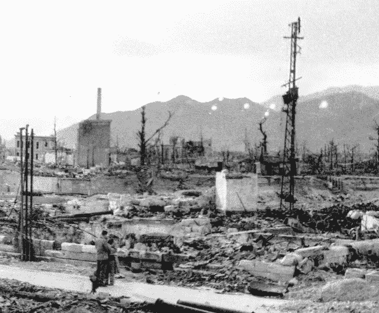
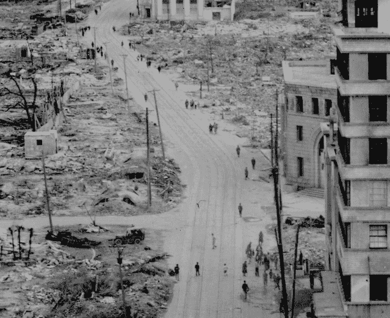
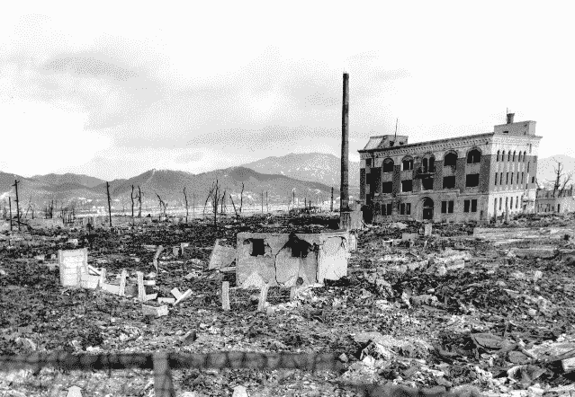

# 原子弹爆炸后广岛令人惊叹的全景照片 

> 原文：<https://web.archive.org/web/http://techcrunch.com/2011/08/10/amazing-panoramic-photos-of-hiroshima-after-the-atomic-bomb-blast/>

# 原子弹爆炸后广岛惊人的全景照片

每隔一段时间，我们会中断对来自世界各地的互联网公司突发新闻的常规直播报道，以突出令人惊叹的摄影作品。2009 年，我们展示了世界上最大的球形照片，今年早些时候，我们展示了世界上最大的室内照片[。](https://web.archive.org/web/20230203043502/https://techcrunch.com/2011/03/29/largest-photo-ever-taken-indoor-40-gigapixels-world-record/)

今天，[360 cities](https://web.archive.org/web/20230203043502/http://blog.360cities.net/hiroshima-after-the-atomic-bomb/)发布了广岛的一系列[历史 360 照片](https://web.archive.org/web/20230203043502/http://www.360cities.net/image/hiroshima-after-atomic-bomb-nuclear-3)，拍摄于波音 B-29 超级堡垒*埃诺拉·盖伊*向日本城市投掷代号为“小男孩”的原子弹(1945 年 8 月 6 日)六个月后。这是原子弹第一次被用作武器。

根据[维基百科](https://web.archive.org/web/20230203043502/http://en.wikipedia.org/wiki/Atomic_bombings_of_Hiroshima_and_Nagasaki)，“小男孩”直接导致估计 8 万人死亡，到年底，伤害和辐射导致总伤亡人数达到 9 万–16.6 万。大约 69%的城市建筑被完全摧毁，大约 7%严重受损。

你可以在 5 张全景照片([一张](https://web.archive.org/web/20230203043502/http://www.360cities.net/image/hiroshima-after-atomic-bomb-nuclear-1#27.00,4.10,32.2)、[两张](https://web.archive.org/web/20230203043502/http://www.360cities.net/image/hiroshima-after-atomic-bomb-nuclear-2#292.00,8.70,34.1)、[三张](https://web.archive.org/web/20230203043502/http://www.360cities.net/image/hiroshima-after-atomic-bomb-nuclear-3)、[四张](https://web.archive.org/web/20230203043502/http://www.360cities.net/image/hiroshima-after-atomic-bomb-nuclear-4)、[五张](https://web.archive.org/web/20230203043502/http://www.360cities.net/image/hiroshima-after-atomic-bomb-nuclear-5-ground-zero))中看到轰炸带来的令人毛骨悚然的毁灭性影响，由[广岛和平博物馆](https://web.archive.org/web/20230203043502/http://www.pcf.city.hiroshima.jp/index_e2.html)提供。这些照片是由三位不同的美国摄影师和一位日本摄影师拍摄的。

额外链接: [2011《和平宣言》](https://web.archive.org/web/20230203043502/http://www.pcf.city.hiroshima.jp/declaration/English/2011/index.html)，广岛市长松井一美执笔

(感谢来自 360 个城市的杰弗里·马丁的提醒)

