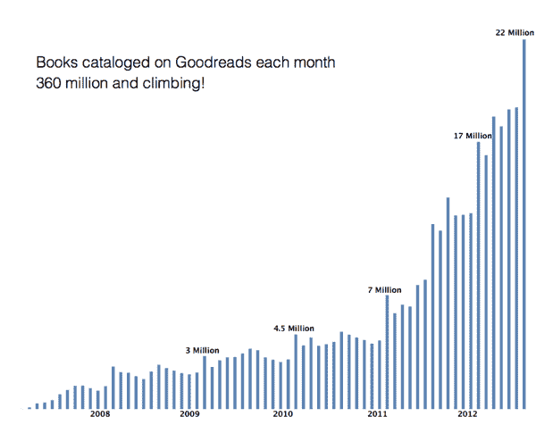
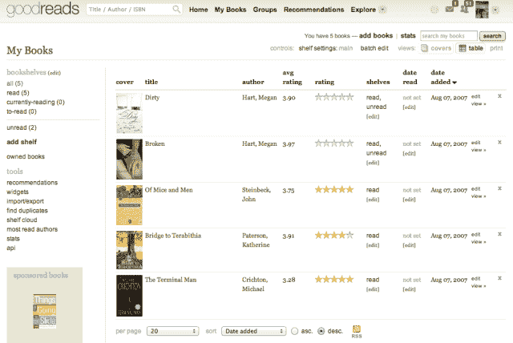

# 亚马逊收购了社交阅读网站 Goodreads，这让该公司比苹果 更具社会优势

> 原文：<https://web.archive.org/web/https://techcrunch.com/2013/03/28/amazon-acquires-social-reading-site-goodreads/>

今天，亚马逊宣布收购社交阅读服务 good reads(T1)。交易的具体条款没有披露，应该会在 Q2 结束前完成。

自 2007 年 1 月推出以来，Goodreads 已经从诸如 True Ventures 这样的公司筹集了 275 万美元的资金。[当我们去年 8 月与他们交谈时](https://web.archive.org/web/20230404225712/https://techcrunch.com/2012/08/13/goodreads-10-million-members/)，该网站有超过 1000 万的会员，已经编目了超过 3.6 亿本书，每个月增加 2200 万本。现在，该网站拥有超过 1600 万用户。

这种类型的社会整合可能会让亚马逊比苹果这样的电子卖家更有优势，因为苹果的产品没有任何社会成分。人们实际上在讨论和分享他们喜欢的书，拥有亚马逊的直接连接是完全有意义的。该网站可以为古德里德用户提供特别优惠，古德里德实际上现在是亚马逊的图书阅读社交网络。

下面是去年 8 月以来图表中每月新增图书的激增情况。有了与 Kindle 的连接，这些数字将飙升:

亚马逊 Kindle 内容副总裁 Russ Grandinetti 讨论了这种整合对其电子书部门的重要性:

> 亚马逊和古德里德分享了重塑阅读的激情。Goodreads 帮助改变了我们发现和讨论书籍的方式，通过 Kindle，亚马逊帮助扩大了全世界的阅读量。此外，亚马逊和古德里德都帮助成千上万的作者接触了更广泛的受众，并通过他们的手艺过上了更好的生活。我们打算一起建立许多新的方式来取悦读者和作者。

Goodreads 的首席执行官兼联合创始人奥蒂斯·钱德勒讨论了此次收购，以及该网站为亚马逊的图书销售战略注入一些社交元素的机会:

> 书籍——以及书中的故事和思想——是我们社会结构的一部分。人们喜欢谈论想法，分享他们对所读故事的热情。我对有机会与亚马逊和 Kindle 合作感到非常兴奋。我们现在能够更快地将 Goodreads 体验带给全球数百万读者。我们期待激发更大的文学讨论，并帮助更多的读者找到好书，无论他们是阅读印刷版还是电子版。

Goodreads 也在其博客上发布了自己的评论，更深入地探讨了为什么这项交易有意义，并明确表示 Kindle 集成是重中之重，因为这是用户一直要求的。钱德勒说:

【T2

> 我对此感到兴奋有三个原因:
> 
> 1.凭借亚马逊的影响力和资源，Goodreads 可以向我们充满活力的图书爱好者社区介绍更多的读者，并为我们的成员创造更好的体验。
> 
> 2.长期以来，我们的会员一直要求我们将 Goodreads 体验引入电子阅读器。现在，我们期待将 Goodreads 带到世界上最受欢迎的电子阅读器 Kindle 上，并进一步重塑阅读。
> 
> 3.亚马逊支持我们作为一个独立的实体，在 Goodreads 品牌和我们独特的文化下继续发展我们的愿景。

除了给亚马逊带来更多的社交，Goodreads 多年来还开发了一些推荐技术，这是亚马逊一直津津乐道的。

【T2

苹果最接近数字产品销售社会化的是 Ping，它的音乐“社交网络”从未起飞，去年 10 月[死亡](https://web.archive.org/web/20230404225712/https://techcrunch.com/2012/10/01/so-long-to-apples-music-social-network-ping-we-hardly-knew-ye/)。如果亚马逊收购像 Goodreads 这样的大型垂直网站，该公司真的可以增加评论、建议，当然还有销售。光是 Goodreads 拥有的用户数据量就足以让这笔收购成为定局。人们喜欢谈论书籍，人们在 Goodreads 上创建小组来讨论他们阅读的书籍，这意味着每个人都必须购买书籍才能参与进来。

苹果[最近开始推广自助出版的作者](https://web.archive.org/web/20230404225712/https://techcrunch.com/2013/02/05/apple-highlights-self-published-authors-frames-ibooks-as-a-viable-kindle-direct-publishing-alternative/)，这是社交网站能够真正提升亚马逊销售额的另一个领域。

该公司还分享了一个有趣的统计数据，这可能会敲定亚马逊的交易:

> 在过去的 90 天里，Goodreads 的成员们以每秒 4 本书的速度增加了 Goodreads 上“想要阅读”的书架。

拥有超过 1600 万用户？你算算。