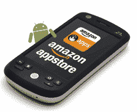

# 卡片:为什么亚马逊*必须*现在就生产安卓设备 TechCrunch

> 原文：<https://web.archive.org/web/http://techcrunch.com/2011/03/23/amazon-android-device/>

当我第一次听说亚马逊将为 Android 开发一个应用商店时([我们在去年九月](https://web.archive.org/web/20230203074624/https://techcrunch.com/2010/09/27/amazon-android-app-store/)宣布了这个消息)，我笑了。正是 Android 所需要的， *[另一个](https://web.archive.org/web/20230203074624/https://techcrunch.com/2010/09/13/verizon-app-store/)* 应用商店，我想。此外，我看不出亚马逊可以通过这样一个商店带来什么谷歌自己不能带来的东西。那是愚蠢的。我错了。

现在亚马逊的安卓应用商店已经[上市](https://web.archive.org/web/20230203074624/https://techcrunch.com/2011/03/22/amazon-android-app-store-3/)，我也有机会玩了，我看到了这一策略的高明之处。在许多方面，亚马逊突然冒出来，在他们自己的游戏中击败了谷歌——在他们自己的设备上。与此同时，亚马逊的 Appstore 中涉及的一些流程是可笑的。他们指出了一个非常明显的事实:亚马逊*需要*来构建他们自己的 Android 设备。很快。

今天有很多关于亚马逊 *[如何以及为什么能够](https://web.archive.org/web/20230203074624/http://www.businessinsider.com/amazon-tablet-2011-3?op=1)* 成为平板电脑领域的大玩家的讨论。上周的一份 NYT 报告指出，亚马逊特别希望在这一领域拓展他们在 Android 上的工作。(我们还在 9 月份听说了亚马逊 Android 平板电脑[的消息，该消息来源也知道他们的应用商店。)但是真的应该没有问题。在看过他们的 Android 应用商店后，很明显他们不仅需要进入这个游戏，而且他们将会这样做。](https://web.archive.org/web/20230203074624/https://techcrunch.com/2010/09/27/amazon-android-tablet/)

目前，要安装亚马逊的 Appstore，你需要跳过一堆循环。这个费力的过程被拆开了——“8 个简单的步骤”——理所当然地被拆开了。这不像安装任何其他 Android 应用程序。你必须改变系统设置并给自己发送文件。如果你有点怪，这并不难。公平地说，亚马逊尽了最大努力在他们的网站上引导你完成这个过程。但是普通人是不可能这么做的。

亚马逊必须知道这一点。在这方面，这次推出更像是一次自然的测试。

亚马逊应用商店的关键是将它预装在设备上。早些时候，我的同事杰森建议亚马逊应该与运营商达成协议，让他们的商店预装在 Android 设备上。我也毫不怀疑这些讨论已经展开。问题是至少一些运营商(和原始设备制造商)也在[做他们自己的应用商店](https://web.archive.org/web/20230203074624/https://techcrunch.com/2010/09/13/verizon-app-store/)——他们真的想要更多的竞争吗？

不管怎样，对亚马逊来说，更好的方法是自己解决问题。

早些时候， [John Gruber 提出了一个场景，你从亚马逊购买一个 Android 设备，他们会把预装了你的亚马逊凭证的设备运送给你，就像他们运送 Kindle 一样。没错。但更进一步，如果亚马逊也改变了 Android 的体验，让你可以真正一键购买和安装他们的应用程序，会怎么样？](https://web.archive.org/web/20230203074624/http://daringfireball.net/linked/2011/03/22/8-steps)

虽然 Appstore 本身的安装过程很长，但从亚马逊的 Appstore 购买应用程序后的过程几乎一样糟糕。一旦购买和下载完成，您仍然需要通过点击几个按钮来手动安装。再说一遍，这并不难，但是非常麻烦——尤其是与通过 Appstore 购买应用程序的简单程度相比。

现在，亚马逊的 Appstore 就像一颗钻石，四周都被煤炭包围着。安装商店很痛苦，安装商店里买的应用也很别扭。但是商店本身非常棒，购买过程也非常完美。亚马逊需要它来统一整个体验。

一切都是为了钻石。实际上，一切都是为了牌。比如信用卡。仅仅因为这个原因，亚马逊创建的商店就非常出色。它直接将用户绑定到他们的亚马逊账户，该账户已经有他们的信用卡记录。这实现了真正的一键购物。它可以与苹果的应用商店相媲美，远远超过了安卓市场的噩梦。谷歌结账，谁？运营商计费，什么？

事实上，亚马逊的应用购买过程有点太简单了。当我开始运行时，我的账户启用了一键购买，我不小心用拇指按了其中一个按钮。哎呦，app 买了。不像苹果的应用程序商店，你可以在按钮上看到价格(或“免费”)，你必须再次点击才能实际购买，而亚马逊，它真的是一键操作。(退货似乎有点麻烦，我不得不给亚马逊发邮件——我怀疑他们会收到很多这样的邮件。)

但这是很容易解决的事情(如果他们愿意的话)。真正的关键是购买过程本身，以及它对大多数消费者来说有多完美。亚马逊从一开始就建立了 Android 应该有的应用商店。(免费应用每日一次的策略是天才之举。)

谷歌下一步的行动将会很有趣。他们接受亚马逊的做法吗？还是他们恐惧地回避它？毫无疑问，我们会听到公关友好的宣传，证明[的开放程度有多高。但最终，这很可能是亚马逊在吃谷歌的午餐——从他们自己的盘子里。](https://web.archive.org/web/20230203074624/https://techcrunch.com/2010/09/09/android-open/)