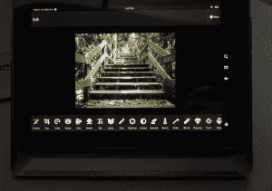
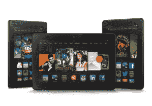

# 亚马逊宣布推出配备高分辨率屏幕、2GHz 处理器的 Kindle HDX 7 英寸和 8.9 英寸平板电脑 TechCrunch

> 原文：<https://web.archive.org/web/https://techcrunch.com/2013/09/24/amazon-announces-the-kindle-hdx-7-and-8-9-inch-tablets-with-high-res-screens-2ghz-processors/>

亚马逊提高了 Fire 平板电脑的赌注，推出了两款 7 英寸和 8.9 英寸的新 HDX，配有全新的高分辨率屏幕，运行更新的 Snapdragon 800 四核处理器。这两款机型都有自适应屏幕，可以根据环境光线改变亮度，还有一种特殊的阅读模式，可以让平板电脑保持 17 小时不间断阅读。

新型号比原来的 [Fire](https://web.archive.org/web/20221205161651/https://beta.techcrunch.com/tag/Fire) 型号要薄得多。例如，8.9 英寸的型号比最初的 8.9 英寸轻 34%，而且薄得多。除了这些新机型，亚马逊还推出了一款名为 Fire OS 的更新版操作系统，该系统对电子邮件和安全浏览的企业兼容性有所提高。

这些设备比它们的前辈快得多，在平板电脑上玩游戏很流畅，图形也非常细致。这款 8.9 英寸的机型还有一个 800 万像素的后置摄像头，配有一个小型照片编辑应用程序，允许你调整亮度和对比度，修饰照片的部分，甚至添加类似 meme 的顶部和底部标题以及“异想天开”的贴纸。

贴纸！

新的操作系统支持一些令人惊讶的酷的第二屏幕工具，允许你购买你在电影的音频配乐中听到的音乐，甚至看到电影中的演员和角色。亚马逊已经与一家歌词提供商合作，为下载的音乐显示歌词，允许你快进到歌曲中的某些行，或者跟着旋律一起歌词。新的操作系统将允许你下载亚马逊 Prime 视频进行离线观看。

亚马逊还增加了五月天，这是一个 24/7 的客户支持解决方案，允许你 ping 亚马逊支持人员。服务很巧妙。远程支持人员出现在一个小视频窗口中，他们可以用箭头在你的屏幕上做注释，甚至触摸 UI 项目。你可以让他们静音，这样他们就听不到你的讨论，如果有什么…不顺心的事情出现，你可以阻止他们看到你的屏幕。这是针对家庭技术支持问题的免费解决方案，只要你在线，你就可以随时访问这项服务。一言以蔽之，太神奇了。

7 英寸型号的 16GB 型号起价为 229 美元，支持 LTE 的 WWAN 版本起价为 329 美元。仅支持 Wi-Fi 的型号将于 10 月 15 日发货，LTE 版本将于 11 月 14 日发货。现在可以预订[。](https://web.archive.org/web/20221205161651/http://amazon.com/hdx-7)

你可以[预购](https://web.archive.org/web/20221205161651/http://amazon.com/hdx)售价 379 美元的 8.9 英寸版本(11 月 7 日发货)，售价 479 美元的 4G 版本将于 12 月上市。

Kindle Fire HD 的处理器也略微提升到 1.5GHz，售价 139 美元。

亚马逊在这次迭代中完全重新设计了 Kindle 系列，在 HDX 机型上增加了一个光滑的背条，并精简了高清机型。由于反应式亮度设置，屏幕本身非常清晰明亮，在阳光直射下也可以阅读。

亚马逊还提供了一款名为 Origami 的改进外壳，可以折叠以保持设备直立或处于横向模式。8.9 英寸的型号有一个独特的滑动系统，可以露出后置摄像头，并在启动时激活相机应用程序。

对于商业群体来说，更有趣的是 Fire OS 中的原生企业支持，提供硬件加密、基于 VPN 的浏览和企业电子邮件支持。鉴于 Kindle Fire 在价格和尺寸上已经是一款受欢迎的“工作”平板电脑，很明显亚马逊看到了该平台的一个坚实的新利基。

新型号值得更新的成本吗？如果你家里有一个用户在使用他们的设备时遇到了麻烦，那么五一节可能就是一个天赐良机。除此之外，硬件更新得很好，设计得也很好。与最初笨重的 Kindle Fire 相比，这些型号表现出一定的设计成熟度和更好的硬件。

总的来说，这些都是对一个已经很强大的平台的可靠、渐进的更新，应该会受到读者和那些寻找知名制造商的廉价但功能强大的平板电脑的人的欢迎。

【T2

[幻灯片]