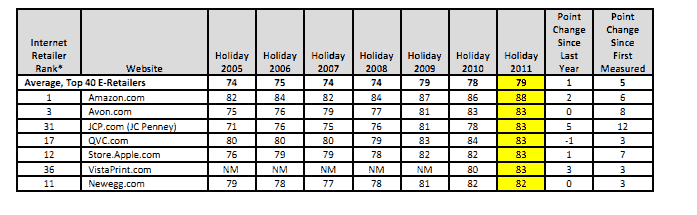
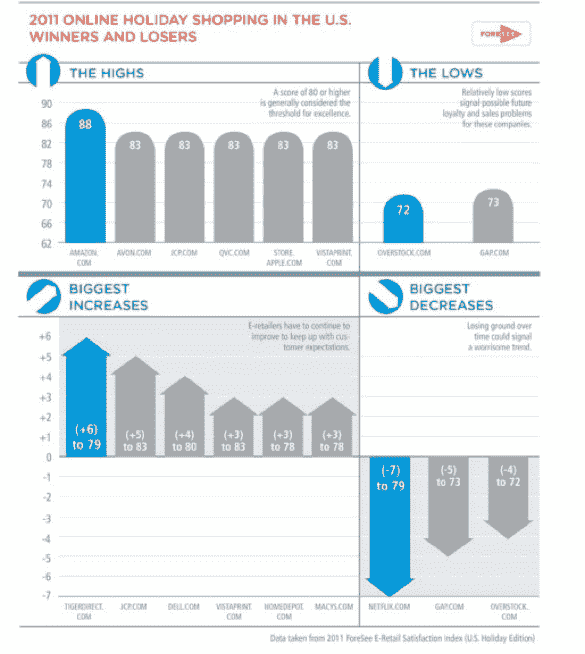

# 亚马逊、苹果 2011 年顾客满意度飙升；网飞暴跌 TechCrunch

> 原文：<https://web.archive.org/web/https://techcrunch.com/2011/12/27/amazon-apple-soar-in-customer-satisfaction-in-2011-netflix-plummets/>

# 亚马逊、苹果 2011 年顾客满意度飙升；网飞暴跌

据客户体验分析公司[foresight](https://web.archive.org/web/20221207212622/http://www.crunchbase.com/company/foresee-results)称，电子商务巨头亚马逊继 2010 年坐上头把交椅后，再次在网上零售[的消费者满意度上拔得头筹。然而，经历了惨淡的一年，网飞的顾客满意度直线下降。在过去的七年里，网飞和亚马逊一直在争夺 Foresee 指数的第一名，但这是电子零售商之一的人气大幅下降的第一年。](https://web.archive.org/web/20221207212622/https://beta.techcrunch.com/2010/12/30/amazon-netflix-top-customer-satisfaction-this-holiday-season/)

亚马逊上升了两分，在该研究的 100 分制中获得 88 分，这是连续 14 次研究中任何零售商的最高分。网飞广为人知的失误，包括去年夏天的提价和剥离 DVD 租赁业务的失败尝试，导致其客户满意度下降 7 个百分点，至 79。

网飞发现，网站的每一项预测指标的得分都有所下降，包括网站内容、网站功能、商品和价格。仅次于网飞，盖普(下降 6%至 73)和 Overstock.com(下降 5%至 72)的满意度下降幅度最大，排名垫底。

除了亚马逊，满意度上升最多的是 TigerDirect.com(上升 8%至 79)和 JC Penney(上升 6%至 83)，这两家公司今年聘请了苹果零售业务前负责人 Ron Johnson 担任首席执行官。表现最好的电子零售商包括亚马逊、雅芳、JC Penney、QVC 和苹果。

该报告还发现，美国消费者在 2011 年假日购物季对价格的敏感度低于去年，因为价格对满意度的影响小于去年。相反，调查受访者表示，对于许多电子零售商来说，改善商品和内容的投资回报会比价格更高。

报告的另一个重要发现与重复购买有关。高度满意的购物者表示，他们下次购买类似产品时考虑该公司的可能性增加了 64%，从零售商在线购买的可能性增加了 68%，从零售商线下购买的可能性增加了 48%，向其他人推荐零售商的可能性增加了 67%。对美国顶级电子零售商的分析表明，平均而言，网站满意度的一个百分点的变化可以预测网络收入的 14%的变化。

