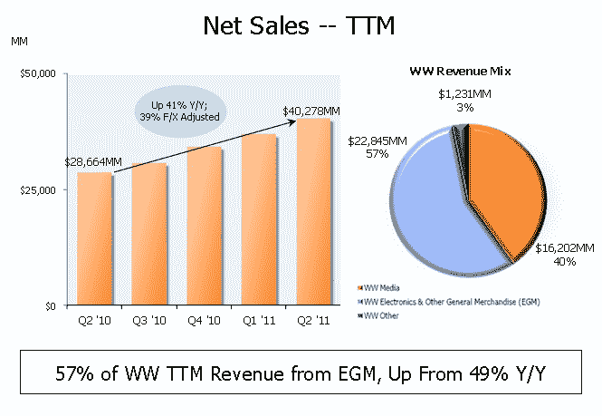

# 亚马逊打街；销售额增长 51%至 99 亿美元，净收入下降 8% TechCrunch

> 原文：<https://web.archive.org/web/http://techcrunch.com/2011/07/26/amazon-beats-the-street-sales-up-51-percent-to-9-9b-net-income-down-8-percent/>

# 亚马逊打街；销售额增长 51%，至 99 亿美元，净收入下降 8%

电子商务巨头亚马逊[刚刚公布了](https://web.archive.org/web/20230204222406/http://www.businesswire.com/news/home/20110726007053/en/Amazon.com-Announces-Quarter-Sales-51-9.91-Billion)第二季度的业绩，公布销售额为 99 亿美元，比 2010 年同季度增长 51%。与 2010 年第二季度的净收入 2.07 亿美元或摊薄后每股 0.45 美元相比，第二季度的净收入下降了 8%，至 1.91 亿美元，或摊薄后每股 0.41 美元。分析师[预计](https://web.archive.org/web/20230204222406/http://www.marketwatch.com/story/amazon-expected-to-show-earnings-drop-2011-07-26)销售额将达到 93.7 亿美元，但净利润预计将降至每股 0.35 美元。

亚马逊表示，带广告的 Kindle 3G 现在是该公司最畅销的 Kindle。亚马逊创始人兼首席执行官杰夫·贝索斯在一份声明中表示:“低价、扩大的选择、快速的交付和创新正在推动我们十多年来看到的最快增长……带特价的 Kindle 3G 很快成为我们最畅销的 Kindle，仅售 139 美元。顾客喜欢 3G 阅读器的便利——不需要寻找或支付 Wi-Fi 热点。亚马逊为 3G 无线网络买单，所以你没有月付或年度合约。”

亚马逊表示，2011 年第二季度的净收入实际上受到了 1500 万美元权益法投资活动的积极影响，其中包括出售权益头寸的 4900 万美元收益，该收益被权益法投资的 3400 万美元损失所抵消。

不出所料，亚马逊表示，与 2011 年第一季度相比，2011 年第二季度 Kindle 设备的销售增长加快，但拒绝透露该季度销售了多少 Kindle。

第二季度营业收入为 2.01 亿美元，而 2010 年第二季度为 2.7 亿美元。本季度外汇汇率的同比变化对营业收入的有利影响为 2800 万美元。

具体来说，北美市场销售额为 54.1 亿美元，比 2010 年第二季度增长 51%。
代表公司英国、德国、日本、法国、中国和意大利网站的国际分部销售额为 45.1 亿美元，比 2010 年第二季度增长 51%。全球电子产品和其他日用商品销售额增长 69%，至 58.9 亿美元。

根据第三季度的指导，销售额预计在 103 亿美元到 111 亿美元之间，或比 2010 年第三季度增长 36%到 47%。营业收入预计在 2000 万美元至 1.7 亿美元之间，与 2010 年第三季度相比，分别下降 93%和 37%。

我们将听取收益电话会议，并向您提供更多信息。

