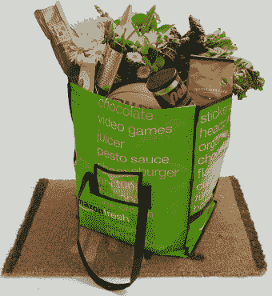

# 亚马逊押注网络杂货，将 AmazonFresh 扩展到洛杉矶

> 原文：<https://web.archive.org/web/https://techcrunch.com/2013/06/10/amazon-bets-on-web-groceries-expands-amazonfresh-to-l-a/>

证实本月早些时候的报道，亚马逊今天将其在线杂货服务 [AmazonFresh](https://web.archive.org/web/20221210060547/https://fresh.amazon.com/) 扩展到其第一个非西雅图市场:洛杉机。该公司主页今天上午悄悄地更新了扩展的消息，iOS 和 Android 的 AmazonFresh 移动应用程序也进行了更新，宣布了新的可用性。该公司表示，洛杉矶的客户现在将可以获得亚马逊新鲜的 50 多万种产品。

6 月早些时候，[路透社的一篇报道](https://web.archive.org/web/20221210060547/http://preview.reuters.com/2013/6/4/amazon-plans-major-move-into-grocery-business-1)称，亚马逊今年将把 AmazonFresh 带到洛杉矶和三藩市，2014 年还将有 20 个市场，包括美国以外的一些市场。现在，这些扩张的第一步是在选定的洛杉矶邮政编码区上线。

 亚马逊 Prime 会员可以在 90 天的免费试用期内测试这项服务，然后下一年将收取 299 美元，此后每年，[亚马逊新鲜网站解释说](https://web.archive.org/web/20221210060547/https://fresh.amazon.com/SignIn?benefitsPage=true&checkPrime=true&&&&&refId=134-7062901-0179236)。这个费用虽然看起来很高，但实际上也包括 79 美元的亚马逊 Prime 会员资格，该会员资格提供其他会员折扣，如免费两天送货，亚马逊 Prime 即时视频访问，Kindle 借阅图书馆访问等。尽管如此，亚马逊 Prime Fresh 的价格目前仍会阻止便宜货购物者，而是瞄准那些比其他人更重视便利的人。这也应该会阻止用户群以过快的速度扩张，可能会超过亚马逊目前可以处理的订单数量。

经过这么多年，价值 5680 亿美元的杂货市场仍然适合被亚马逊等在线零售商颠覆，特别是因为它和其他公司现在开始考虑物流和当天送货的机会。[谷歌](https://web.archive.org/web/20221210060547/https://beta.techcrunch.com/2013/03/28/google-starts-testing-google-shopping-express-today-in-sf-free-delivery-at-target-walgreens-staples-and-more/)、[易贝](https://web.archive.org/web/20221210060547/https://beta.techcrunch.com/2013/03/28/game-on-google-ebay-now-same-day-delivery-service-expands-to-chicago-and-dallas/)、[沃尔玛](https://web.archive.org/web/20221210060547/https://beta.techcrunch.com/2012/10/09/walmart-begins-testing-same-day-delivery-in-select-markets/)，甚至[初创公司](https://web.archive.org/web/20221210060547/https://beta.techcrunch.com/2013/03/28/deliv/)都在尝试类似的当天送达服务，都希望通过轻点一个按钮来挖掘消费者对随叫随到便利的渴望。

但对于杂货来说，有许多障碍需要克服——易腐杂货库存必须冷藏储存和运输，这很昂贵。获得正确的利润是关键，这是亚马逊多年来一直在努力的事情。你可能还记得早在 2007 年，该公司在西雅图宣布 AmazonFresh 是一项只接受邀请的服务，而网络公司熄火 [Webvan](https://web.archive.org/web/20221210060547/http://en.wikipedia.org/wiki/Webvan) 的记忆还在最近。

亚马逊有五年的时间来尝试、测试和迭代，这让它拥有了优势。但它也可能面临来自沃尔玛的激烈竞争，尽管沃尔玛现在是世界上最大的实体商店，但它已经被亚马逊在线所取代。上周，沃尔玛首席执行官迈克·杜克(Mike Duke)宣布，该公司今年的电子商务销售额将达到 100 亿美元，但该零售商最近也表示，除了在加州进行测试之外，目前没有立即扩大美国杂货配送业务的计划，因为它不相信目前有显著的消费者需求。

这并没有阻止其他公司阅读茶叶，并推出押注在线杂货趋势的服务，最近的一个例子是 mySupermarket.com，就在今天[宣布扩展其“网上杂货 Kayak”服务](https://web.archive.org/web/20221210060547/https://beta.techcrunch.com/2013/06/10/grocery-comparison-site-mysupermarket-launches-u-s-megastore-for-finding-best-prices-across-amazon-walmart-target-more/)，该服务现已在美国推出

AmazonFresh 在这里接受来自洛杉矶用户[的注册。](https://web.archive.org/web/20221210060547/http://fresh.amazon.com/)