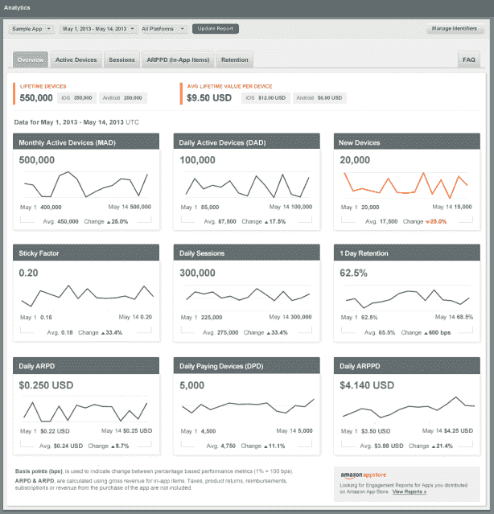

# 亚马逊推出跨平台应用分析服务，在 TechCrunch 中捆绑了 A/B 测试

> 原文：<https://web.archive.org/web/https://techcrunch.com/2013/11/05/amazon-debuts-a-cross-platform-app-analytics-service-with-ab-testing-bundled-in/>

今天，亚马逊正在改善其为移动应用程序开发人员提供的服务套件，包括那些除了 Android 和亚马逊基于 Android 的 Fire OS 之外，还为苹果 iOS 平台开发应用程序的人，推出了新的移动应用程序 SDK[,现在包括分析和 A/B 测试服务。这是亚马逊之前向移动开发者提供的服务的扩展，该服务也允许他们在亚马逊的 Fire OS 上跟踪和测试他们的应用程序。](https://web.archive.org/web/20221208170602/https://developer.amazon.com/sdk/analytics.html)

亚马逊在过去[提供了分析和报告工具](https://web.archive.org/web/20221208170602/https://beta.techcrunch.com/2013/05/24/amazon-launches-app-engagement-reports-allowing-appstore-developers-to-track-app-usage-revenue/)，今年夏天[扩展了这些工具](https://web.archive.org/web/20221208170602/https://beta.techcrunch.com/2013/08/07/amazon-appstore-now-open-to-web-apps-with-one-click-in-app-purchases-in-tow/)以包括对 HTML5 网络应用的支持，亚马逊现在将代表开发者打包这些工具，以便在亚马逊应用商店市场销售。

但该公司今天将分析定位为一种“新”服务，因为它被设计为跨平台工作，包括 iOS、Android 和 Fire OS，并在其 SDK 中包括一个可选的 A/B 测试组件。

像其竞争对手一样，Analytics 允许开发者跟踪应用程序的性能和趋势，以便采取措施提高参与度和盈利能力。在亚马逊的情况下，它在分析仪表板上提供了九种不同的指标，包括每日和每月活跃设备、新设备、会话和保留数据、“粘性因子”以及跟踪每台设备平均收入的各种方法。数据也可以按平台过滤，并以 CSV 格式导出。

请注意，亚马逊已经决定通过设备而不是用户来跟踪参与度和保留率，因为开发人员可能更习惯于其他地方。这意味着一个客户在两个不同的设备上启动一个应用程序被计算两次将被计算两次，而两个客户在一个设备上启动一个应用程序将被计算一次。

拥有一个分析仪表板是所有主要应用程序商店都提供的东西，但许多严肃的开发人员选择使用第三方工具来跟踪他们的移动应用程序的性能、用户保留率、收入、广告性能等，使用 Flurry、App Annie、Distimo 等免费或付费工具——特别是如果他们在自己的应用程序中销售广告，并且需要更好地了解用户人口统计数据和行为。因此，尽管亚马逊现在为跨平台开发人员提供自己的免费选项很有用，但它不太可能很快成为最佳服务。

与此同时，新的分析 SDK 现在还包括亚马逊的应用程序 A/B 测试服务，这是近一年前首次为 Android 开发者在宣布的[。这项服务允许开发人员上传具有不同变量的应用程序，以便试验功能和变化，然后在了解这些变化如何影响对他们来说重要的指标后进行迭代，如收入、保留、在应用程序中花费的时间等。](https://web.archive.org/web/20221208170602/https://beta.techcrunch.com/2012/12/06/amazon-adds-ab-testing-for-android-developers-says-app-download-grew-500-percent-in-2012/)

随着 Analytics SDK 的发布，A/B 测试服务支持所有 Android(不仅仅是 Fire OS)和 iOS 设备，包括 iPhone 和 iPad。开发者可以免费运行尽可能多的测试，也可以针对不同的用户群运行报告。A/B 测试服务一次最多支持五种变化，而不是“A/B”名称可能暗示的两种，这些变化可以测试，然后为所有用户提供，而不必将应用程序重新提交到 app store。

在过去一年左右的时间里，亚马逊一直在定期更新和扩展其为移动开发者提供的服务，包括推送通知、[应用内购买](https://web.archive.org/web/20221208170602/https://beta.techcrunch.com/2012/04/10/amazons-takes-in-app-purchases-out-of-beta-heres-how-theyre-getting-around-that-pricing-issue/)、移动广告、亚马逊协会 API、 [GameCircle](https://web.archive.org/web/20221208170602/https://beta.techcrunch.com/2012/07/11/amazon-pumps-up-kindle-fire-gaming-with-gamecircle-opens-apis-to-developers/) 、[登录亚马逊](https://web.archive.org/web/20221208170602/https://beta.techcrunch.com/2013/10/08/amazons-pay-with-amazon-service-challenges-paypal-for-the-webs-payment-business/)、[激励计划](https://web.archive.org/web/20221208170602/https://beta.techcrunch.com/2013/10/08/new-amazon-appstore-incentive-program-encourages-developers-to-build-for-amazon-will-give-consumers-cash-back-on-apps/)等等。

据报道，这些改进发生在该公司正在开发自己的智能手机的时候，这将使其成为谷歌 Android 平台、苹果 iOS、Windows Phone 和其他平台的更大竞争对手。在这种情况下，拥有一套强大的面向开发者的工具将是一个竞争优势，尽管今天它支持亚马逊在平板电脑上的努力，以及它的 Google Play 替代品亚马逊应用商店。