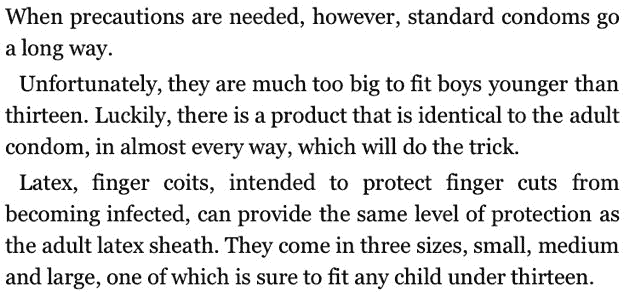

# 亚马逊为恋童癖者指南 TechCrunch 辩护

> 原文：<https://web.archive.org/web/https://techcrunch.com/2010/11/10/amazon-defends-pedophile-how-to-guide/>

# 亚马逊捍卫恋童癖销售指南

今天早些时候，我们报道了[亚马逊正在销售一本书](https://web.archive.org/web/20230216141417/https://techcrunch.com/2010/11/10/kindle-pedophile-book/)，书名为《恋童癖者的爱与快乐指南》。这本书本身就是一种耻辱——恋童癖者的指南。它包括，除了别的以外，关于如何逃脱惩罚以及如何通过为太小而不能使用真正避孕套的儿童购买类似避孕套的产品来避免性传播疾病的提示。

无论如何，亚马逊不会将这本书从其商店中移除，并告诉我们*“亚马逊认为不出售某些书籍是审查制度，仅仅因为我们或其他人认为他们的信息令人反感。亚马逊不支持或宣扬仇恨或犯罪行为，但是，我们支持每个人做出自己购买决定的权利。”*它仍然可以出售和下载。

样本文本(对人类不安全):

并且:

这还只是前几页。这里没有人能再忍受阅读了。

亚马逊自己的[政策](https://web.archive.org/web/20230216141417/http://forums.digitaltextplatform.com/dtpforums/entry.jspa?externalID=122&categoryID=27)禁止包含“攻击性材料”的内容，以及“可能导致生产非法商品或非法活动”的内容我想任何有理智的人都会认为这两个测试都失败了。

我们非常支持言论自由。但就像脸书对否认大屠杀的痴迷一样，这并不意味着亚马逊必须宽恕如此明显令人厌恶的事情，并从中获利。

拿我来说，在这本书和任何类似的书从他们的商店移除之前，我不会从亚马逊买任何东西。如果同意，在下面评论。