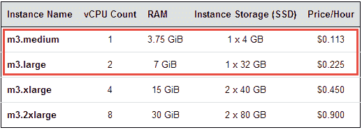
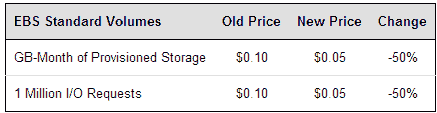

# 亚马逊推出 2 款新的通用实例，降低存储价格

> 原文：<https://web.archive.org/web/https://techcrunch.com/2014/01/21/amazon-drops-s3-prices-by-up-to-22-ebs-by-up-to-50-launches-new-ec2-instance-types/>

# 亚马逊降低 S3 价格高达 22%，EBS 高达 50%，推出新的 EC2 实例类型

几乎一个月过去了，亚马逊网络服务(AWS)都没有降低其功能系列中某些东西的价格，本周，是 S3 和 T2 的 EBS 和 T4 的时间变得更便宜了。此外，亚马逊正在推出两种新的基于 SSD 的通用 M3 实例类型。

新的 M3 中型和大型实例起价为每小时 0.113 美元，旨在取代该公司已经提供了一段时间的旧的和较慢的 M1 实例。AWS 去年推出了 M3 实例类型，该公司认为这些实例在运行各种应用程序所需的 CPU 能力、RAM 和网络容量之间提供了正确的平衡。默认情况下，新的中型实例类型提供 4GB 的 SSD 存储、3.75 GiB 的 RAM 和一个虚拟 CPU，因此您肯定不会在这些设备上运行任何 CPU 或内存密集型应用程序。大品种配备了 32 GB 的固态硬盘存储，GiB 的内存和两个虚拟 CPU。

除了 [AWS GovCloud](https://web.archive.org/web/20221206101110/http://aws.amazon.com/govcloud-us/) 之外，新的实例类型现在在所有 AWS 地区都可用。

对于需要大量 S3 存储的用户，亚马逊正在大幅降低其云存储服务的价格。对于超过 5,000TB 的存储，AWS 将降价 22%。对于其他所有人来说，减少的幅度并不太大，但即使这样，需要 1tb 以下的用户也将节省 11 %,在 S3 上拥有 1tb 到 50TB 的用户将节省 6 %,所有其他高达 5,000TB 的层将节省约 15%。这些裁员将于 2 月 1 日开始。

[弹性数据块存储](https://web.archive.org/web/20221206101110/http://aws.amazon.com/ebs/)也将看到每 GB/月调配存储和 I/O 请求的大幅降价，在某些地区高达 50%。这些也将于 2 月 1 日生效。

