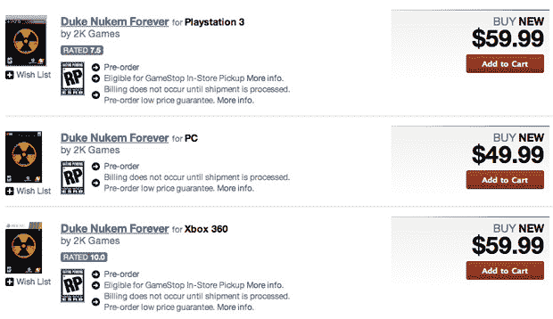

# 亚马逊和 GameStop 在 5 月 31 日将 Duke Nukem 永远放在 

> 原文：<https://web.archive.org/web/https://techcrunch.com/2010/12/31/amazon-gamestop-put-duke-nukem-forever-at-may-31/>

# 亚马逊& GameStop 在 5 月 31 日永久放置了公爵核弹

[永远的毁灭公爵](https://web.archive.org/web/20221218165855/http://www.crunchgear.com/tag/duke-nukem-forever/)已经出现在[亚马逊](https://web.archive.org/web/20221218165855/http://www.amazon.com/gp/search?rh=n%3A468642%2Ck%3A%22Duke+Nukem+Forever%22&keywords=%22Duke+Nukem+Forever%22&ie=UTF8&qid=1286830290&scn=468642&h=7d3b0046219ad25e13afcb43128603f934f81aae)和 [GameStop](https://web.archive.org/web/20221218165855/http://www.gamestop.com/browse/search.aspx?dsNav=Ntk:TitleKeyword%7cduke+nukem+forever%7c3%7c) 上，发布日期为 2011 年 5 月 31 日。考虑到这两个预购页面都是从官方的 Duke Nukem Forever 网站链接而来的，这款游戏很有可能在那一天(或之前)在你的 360/PS3 上运行。

就其本身而言，它几乎足以让你瞠目结舌:不仅我们已经在媒体上看到了几个月的预览(我想我应该在几个月前看到它，但出于某种原因我不能做到这一点)，而且现在[我们得到了一个可靠的发布日期](https://web.archive.org/web/20221218165855/http://www.slashgear.com/duke-nukem-forever-pre-orders-taken-for-may-31-2011-release-31122178/)。

还要记住，游戏是由 Gearbox 开发的，也就是 Borderlands 后面的那些人，所以我们知道它会相当不错(敲敲木头！).

我甚至不知道会有 PC 版，但这是个好消息。一旦你在电脑上玩了很长时间，就很难在游戏机上玩 FPS 了，这一点[那台别致电脑的幸运赢家](https://web.archive.org/web/20221218165855/http://www.crunchgear.com/2010/12/25/the-12-days-of-christmas-digital-storm-computer-giveaway-winner/)很快就会发现。

"哦，这就是到处都是锯齿的游戏的样子！"