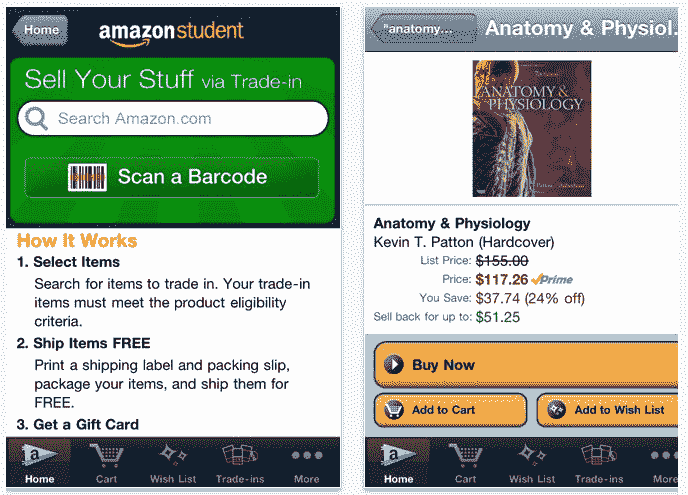

# 亚马逊为大学生推出新的 iPhone 应用程序 

> 原文：<https://web.archive.org/web/http://techcrunch.com/2011/08/15/amazon-launches-new-iphone-app-for-college-students/>

# 亚马逊为大学生推出新的 iPhone 应用程序

正好赶上返校季，亚马逊推出了针对学生的新 iPhone 应用。通过“[亚马逊学生](https://web.archive.org/web/20230203133742/http://itunes.apple.com/us/app/amazon-student/id454603718?mt=8)”应用程序，大学生可以对教科书和其他物品进行即时价格检查，保留他们想要购买的物品的列表，并发布用过的教科书、游戏、电影或小工具以旧换新。

该应用程序包括条形码扫描功能，就像亚马逊的主要移动应用程序一样。亚马逊表示，这使得学生可以用他们的智能手机查询书籍、音乐、DVD、电子产品、服装和“几乎任何其他东西”的价格。学生想买的东西可以添加到“愿望清单”中，或者可以立即购买。亚马逊还为学生提供为期 6 个月的免费 2 天送货服务，享受[亚马逊 Prime](https://web.archive.org/web/20230203133742/http://www.amazon.com/prime) 的所有运费优惠。

然而，该应用程序最有趣的功能是新的“以旧换新”选项，让学生可以轻松检查他们物品的折价价值，并选择将他们不再需要的物品出售给其他学生，包括教科书、视频游戏、DVD 或其他电子产品。但是学生们将收到 Amazon.com 礼品卡，而不是现金。对于所列的任何以旧换新项目，运费也是免费的。

以旧换新功能似乎是亚马逊“教科书回购”计划的延伸，可在 www.amazon.com/sellbooks 购买。亚马逊表示，现在有近 100 万本书符合回购条件，学生通过这项服务进行交易时，可以获得高达 70%的退款。