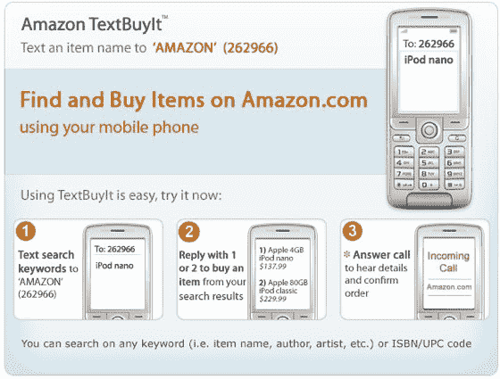

# 亚马逊推出短信购买服务 TechCrunch

> 原文：<https://web.archive.org/web/http://techcrunch.com/2008/04/02/amazon-launches-sms-buying-service/>

# 亚马逊推出短信购买服务

亚马逊推出了 [Amazon TextBuyIt](https://web.archive.org/web/20230204234750/https://payments.amazon.com/sdui/sdui/productsServices?sn=mobileShopping/whatIsIt) ，这是一项允许亚马逊客户通过手机短信购买商品的服务。

要使用这项服务，顾客可以将产品名称、描述或 UPC 或 ISBN 号发送给亚马逊(262966)。如果 Amazon 库存该商品，用户将获得发送给他们的前两个结果。要购买 am 商品，用户回复 1 或 2，系统会提示他们输入电子邮件地址和邮政编码。然后，该服务会呼叫用户，并使用自动语音系统完成结账过程。像普通的亚马逊订单一样，用户以后可以从 Amazon.com 追踪商品。

这项服务是免费使用的，但是通过亚马逊 TextBuyIt 购买时，作为“当日交易”或具有“金盒折扣”的商品将不会打折。

该服务最明显的应用是实体店内的价格比较；例如，Borders 的顾客可以用短信发送书名，看看亚马逊是否以更低的价格出售。预计在未来几个月，人们会从你附近的商店给亚马逊发短信。