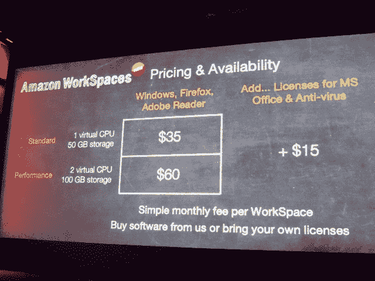
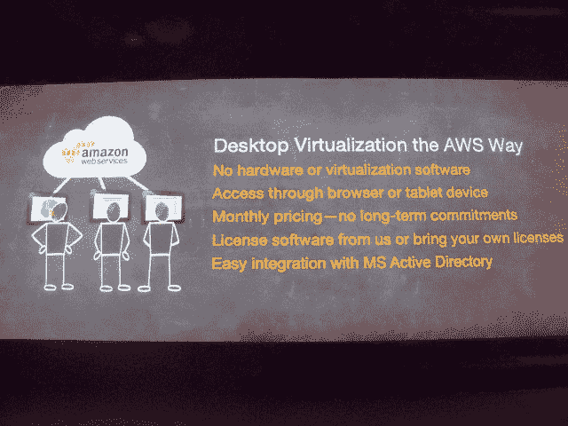
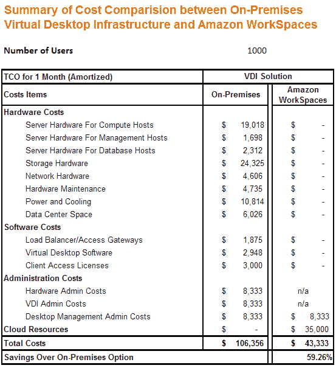

# 亚马逊在 AWS TechCrunch 上推出虚拟桌面服务 WorkSpaces

> 原文：<https://web.archive.org/web/https://techcrunch.com/2013/11/13/amazon-launches-workspaces-a-virtual-desktop-service-on-aws/>

# 亚马逊在 AWS 上推出虚拟桌面服务 WorkSpaces

AWS 推出了亚马逊工作空间，该公司称这是一个虚拟工作空间，价格是传统产品的一半。

今天在 AWS re:Invent 上宣布，这项服务今天可以使用，允许从任何设备访问，无论是笔记本电脑、智能手机还是平板电脑。它是同步的，因此客户可以获得持续的会话，这样客户可以在笔记本电脑上结束一个会话，并在智能手机上开始另一个会话。虚拟桌面本身本质上是 Windows Server 的一个重新换肤版本，看起来像 Windows 7。

据高级副总裁 Andy Jassy 称，Amazon WorkSpaces 的价格是传统提供商提供的内部 VDI 解决方案的一半。

【T2

定价有两种不同的版本。一个标准包带有一个虚拟 CPU 和 50gb 的存储空间。一个性能包有两个虚拟 CPU 和 100 GB 存储。标准套餐每个用户每月花费 35 美元，而性能套餐每个用户每月花费 60 美元。对于希望将现有许可证迁移到 VDI 环境中的客户，还需要支付 15 美元的许可费。

这一消息有助于该公司通过以较低的成本提供以客户为中心的安全服务，为拥有大量业务的公司提供足够的安全服务，从而从企业提供商那里获得更多业务。以下是他们的总结:

在主题演讲的早些时候，Jassy 在活动中向企业观众介绍了云计算的基础知识。但在此之前，这些服务主要是为使用其不同产品的应用程序开发和管理提供基础设施。新的虚拟桌面服务是一种超越的努力，通过它成为世界上数百万移动办公但仍需要连接工作的办公室工作人员的提供商。