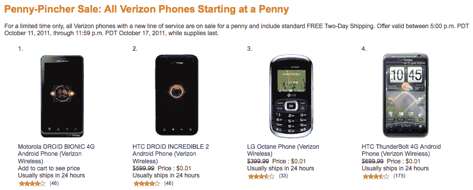

# 亚马逊以一便士的价格列出了所有威瑞森手机的新合同 TechCrunch

> 原文：<https://web.archive.org/web/http://techcrunch.com/2011/10/14/amazon-lists-all-its-verizon-phones-for-one-penny-with-a-new-contract/>

# 亚马逊在一份新合同中列出了所有威瑞森手机的一便士价格

如果你是一个非威瑞森的客户，并且正在考虑加入红色网络，那么现在绝对是时候了。在亚马逊的一笔交易可以让你花一分钱买到 300 美元的手机。事实上，如果你是新签约客户，亚马逊无线正在以一美分的价格出售其所有的威瑞森设备(不幸的是，不包括新的 iPhone 4S)。这还包括 2 天免费送货。

这项交易没有扩展到平板电脑，但仍然有 30 款手机可供选择，从超级强大的[、300 美元的 Droid Bionic](https://web.archive.org/web/20230205015152/https://techcrunch.com/2011/09/07/hands-on-with-the-motorola-droid-bionic-for-verizon-2/) 到各种功能手机。最残忍的手机包括 HTC Droid Incredible 2、HTC ThunderBolt、三星 Droid Charge 和摩托罗拉 Droid 3。如果你觉得这是一笔划算的买卖，那就去[亚马逊无线](https://web.archive.org/web/20230205015152/http://wireless.amazon.com/f/pennypincher/)开始购物吧。拍卖只持续到 10 月 17 日。

