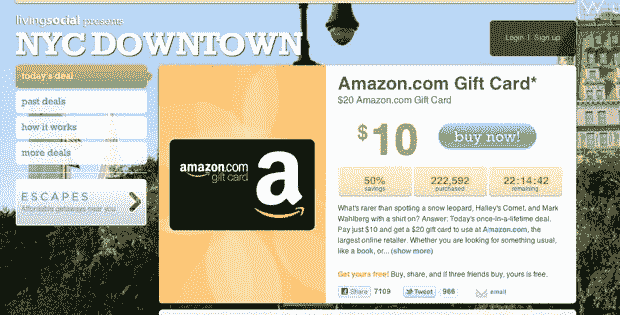

# 亚马逊给 LivingSocial 一个大优惠 10 美元 TechCrunch

> 原文：<https://web.archive.org/web/http://techcrunch.com/2011/01/19/amazon-livingsocial-10-discount/>

# 亚马逊给 LivingSocial 一个 10 美元的折扣

今天将是每日交易网站 [LivingSocial](https://web.archive.org/web/20230202232654/http://livingsocial.com/) 的大日子。它是[，在 Amazon.com 上购买任何 20 美元的商品都可以优惠](https://web.archive.org/web/20230202232654/http://livingsocial.com/deals/21336-20-amazon-com-gift-card)10 美元，而且在交易的前两个小时内，它已经售出了价值超过 200 万美元的优惠券。大约还有 22 个小时。一些人已经注意到，这一 50%的交易将“吹走” [Groupon 的 Gap 交易](https://web.archive.org/web/20230202232654/https://techcrunch.com/2010/08/19/groupon-gap-deals-discounts-andrew-mason/)，该交易导致价值 1100 万美元的优惠券售出。(这比 50 美元的购买价格低了 25 美元)。

但问题是。亚马逊不仅仅是最新一家尝试每日交易概念的零售商。它也是 LivingSocial 的投资者。去年 12 月，它向 LivingSocial 投资了 1 . 75 亿美元，以获得该公司的股份。现在，它正在帮助提高交易量，毫无疑问，它将为 LivingSocial 引入成千上万的新消费者，而且只需 10 美元的折扣。这最终可能会让亚马逊损失几百万美元。

但是说真的，有多少人会去寻找标价正好是 20 美元的东西呢？我敢打赌，今天人们最终会买很多书和 CD，但最终仍会花费超过 20 美元。亚马逊将不止弥补 10 美元的折扣，或者至少用额外的销售来弥补大部分折扣，否则就不会出现。亚马逊并没有对任何购买提供 50%或 25%的折扣。

但如果促销奏效，你也可以将此视为第一步，亚马逊将回到日常交易，作为在淡季推动销售的一种方式。问题是，这次促销最终会有多大？给出你最大的猜测，在 24 小时内会卖出多少优惠券。我们已经超过了 222，000

http://twitter.com/#!/dangilmartin/status/27729553757569024