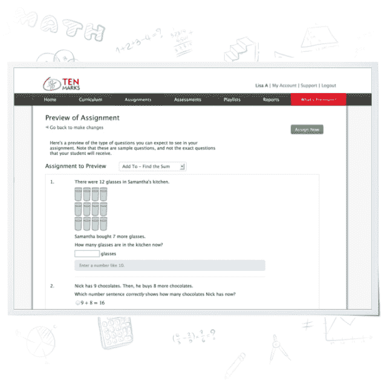

# 亚马逊收购在线数学教学公司 TenMarks，帮助其开发教育应用 TechCrunch

> 原文：<https://web.archive.org/web/https://techcrunch.com/2013/10/10/amazon-snaps-up-online-math-instruction-company-tenmarks-to-help-it-make-education-apps/>

# 亚马逊收购了在线数学教学公司 TenMarks，帮助其开发教育应用

亚马逊[宣布计划](https://web.archive.org/web/20230119160439/http://phx.corporate-ir.net/phoenix.zhtml?c=176060&p=irol-newsArticle&ID=1863590&highlight=)收购在线教育公司 [TenMarks](https://web.archive.org/web/20230119160439/https://www.tenmarks.com/index.html) 。该公司目前提供在线数学课程，亚马逊 Kindle 副总裁 Dave Limp 表示，“亚马逊和 TenMarks 打算在多个平台上开发丰富的教育内容和应用程序，我们认为教师、家长和学生都会喜欢。”

TenMarks 成立于 2008 年，在过去的几年里已经多次筹集债务资金。它最近一次融资是在 2011 年 9 月，当时它从 Catamount Ventures 和 Birchmere 那里获得了 300 万美元。

TenMarks 是一项服务，让教师指定要涵盖的数学技能水平或概念，然后开发个性化的课程，它称之为“播放列表”。TenMarks Math 是一款面向教师的免费产品，据说已经在数万所学校使用。

“亚马逊和 TenMarks 共同致力于为学校和家庭开发易于实施的解决方案，”TenMarks 联合创始人 Rohit Agarwal 今天在一份声明中说。“我们目前为教师、学生和家长提供有效的资源，以培养数学公共核心课程的愿景，包括可扩展的职业发展和与家长联系的工具。我们用我们的商业模式来支持这一信念，在这种模式下，教师可以免费注册和访问我们的产品，同时如果需要，还可以选择加入高级功能。展望未来，我们相信亚马逊和 TenMarks 将在 K-12 领域创造重大创新。”

无论 TenMarks 的商业模式是什么，都不再重要，因为它已经进入了亚马逊的怀抱。收购将于 2013 年第四季度完成，具体条款尚未披露。

这一举动在几个层面上很有趣，因为亚马逊明确表示，它将为“多平台”开发自己的教育应用。我不怀疑这些平台将从 Kindle Fire 甚至 Kindle 开始。亚马逊过去几乎没有表现出不愿意在其他平台上发布应用，目前在 iOS 和“库存 Android”上提供 Kindle。

此外，如果在平板电脑领域有苹果的竞争对手，能够真正占领教育教科书市场，你很难不提到亚马逊。苹果公司通过 iPad 在教育市场做出了重大贡献——在教科书和一对一学校部署方面都是如此——亚马逊公司可能会通过 Kindle 和一些“内部”材料从中分一杯羹。目前的项目，如亚马逊的 Kindle 教科书租赁，可以与定制应用程序合作，创建一个有吸引力的包。

亚马逊一直在努力让其商店中的应用数量接近谷歌或苹果，但这对教育市场来说不一定重要。它需要的是一个可以卖给学校的核心课程，以及与教育技术供应商的合作，这可以帮助它对学校采购部门更具吸引力。