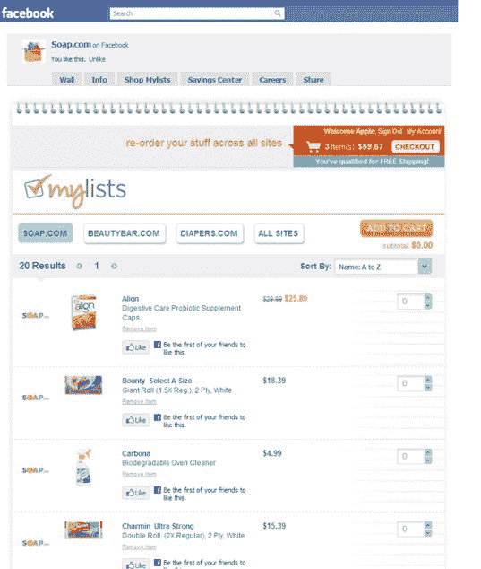

# 亚马逊的 Diapers.com 和 Soap.com 将电子商务引入脸书页面 

> 原文：<https://web.archive.org/web/http://techcrunch.com/2011/01/14/amazons-diapers-com-and-soap-com-bring-e-commerce-to-facebook-pages/>

# 亚马逊的 Diapers.com 和 Soap.com 将电子商务带到了脸书页面

随着小零售商和大品牌都在社交网络上开设网店，脸书的电子商务一直在稳步发展。凭借脸书近 6 亿的会员，零售商将电子商务和购物体验引入社交网络是有意义的。今天，亚马逊[去年秋天以 5 . 4 亿美元](https://web.archive.org/web/20230202230726/https://techcrunch.com/2010/11/06/amazon-buys-diapers-com-540-million/)收购的 Quidsi 在 Soap.com[和 Diapers.com](https://web.archive.org/web/20230202230726/http://www.facebook.com/soap.com)[推出了脸书购物体验](https://web.archive.org/web/20230202230726/http://www.facebook.com/diapersdotcom)

在 Quidsi-owner properties Soap.com、BeautyBar.com 和 Diapers.com 的脸书页面上，购物网站的现有用户将能够在名为“购物我的清单”的标签下直接从社交网络购买产品会员可以通过使用他们的 Quidsi 凭证登录来访问他们的 Diapers.com 和 Soap.com 购物清单，然后无需离开脸书就可以完成所有或部分产品的购买。顾客可以通过一个标签在所有三个网站上购物(因此用户可以在尿布页面上订购肥皂产品)和喜欢的单个产品。

Quidsi 电子商务副总裁 Josh Himwich 表示，这种体验的独特之处在于，你不必离开脸书就能完成购买。许多零售商店在其脸书页面上列出了可供购买的产品，但用户必须在一个单独的网站上完成交易。

这种体验的一个缺点是，只有在这些网站上创建了购物清单的现有 Diapers.com 和 Soap.com 用户才能在脸书上使用电子商务应用程序。Himwich 表示，Quidsi 有目的地瞄准现有用户，因为那些可能是脸书上 Diapers.com 或 Soap.com 粉丝的人可能是 sit 的忠实消费者(Quidsi 脸书页面总共有大约 6 万名粉丝/喜欢者)。

至于亚马逊因素，交易尚未完成，因此这是 Quidsi 赞助的产品(交易预计将在今年第一季度完成)。但 Himwich 补充说，亚马逊对 Quidsi 将社交元素加入电子商务的方向特别感兴趣。如今，亚马逊对社交商务并不陌生，并且一直在加强与脸书的整合，最近,[推出了一项功能](https://web.archive.org/web/20230202230726/https://techcrunch.com/2010/07/27/amazon-now-taps-into-facebook-for-social-product-recommendations/),利用社交网络进行推荐。当然，这家电子商务巨头刚刚对团购网站 LivingSocial 进行了高达 1.75 亿美元的投资[。【Himwich 表示，亚马逊正在寻求投资更多专注于脸书的电子商务初创公司。](https://web.archive.org/web/20230202230726/https://techcrunch.com/2010/12/02/livingsocial-confirms-175-million-amazon-investment/)

虽然 Himwich 说“还没有人破解脸书电子商务的难题”，但脸书的整合是 Quidsi 涉足社交电子商务领域的一种方式，以看看一个完整的店面是否有意义。

看看亚马逊是否会追随 Quidsi 的脚步，在脸书为其市场建立零售店面，应该会很有趣。这肯定有助于将脸书变成一个虚拟购物中心。

