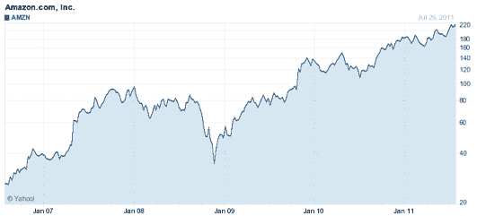

# 亚马逊市值突破 1000 亿美元 TechCrunch

> 原文：<https://web.archive.org/web/http://techcrunch.com/2011/07/27/amazons-market-cap-passes-100-billion/>

# 亚马逊的市值超过 1000 亿美元

在昨天报告了[强于预期的](https://web.archive.org/web/20230203135641/https://techcrunch.com/2011/07/26/amazon-beats-the-street-sales-up-51-percent-to-9-9b-net-income-down-8-percent/)第二季度收益后，亚马逊今天上午的市值超过了 1000 亿美元。该公司股票目前的交易价格约为每股 225 美元，使这家电子商务巨头的市值达到 1018.1 亿美元。

亚马逊本季度的销售额接近 100 亿美元，比 2010 年同期增长了 51%。与 2010 年第二季度的净收入 2.07 亿美元或摊薄后每股 0.45 美元相比，第二季度的净收入下降了 8%，至 1.91 亿美元，或摊薄后每股 0.41 美元。但是尽管净收入下降，亚马逊还是超出了分析师的预期。

由于看涨的投资者，该公司的股票今天早上在[上涨](https://web.archive.org/web/20230203135641/http://blogs.forbes.com/josephhargett/2011/07/27/amazon-coms-second-quarter-earnings-inspire-bullish-bets/)。

今天股价高达 227.20 美元，是该公司的历史新高。从 1000 亿美元的市值来看，亚马逊已经超过了惠普的估值，目前为 760 亿美元。易贝的市值是 430 亿美元。