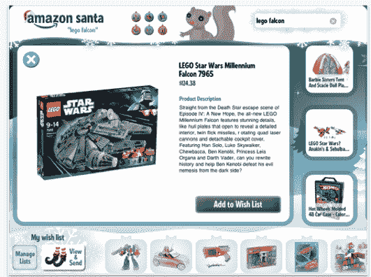

# 亚马逊的新应用允许孩子们在 iPad 和 Kindle Fire 上为圣诞老人创建礼物清单 

> 原文：<https://web.archive.org/web/https://techcrunch.com/2011/11/30/amazons-new-app-allows-kids-to-create-gift-wish-lists-for-santa-claus-on-the-ipad-and-kindle-fire/>

# 亚马逊的新应用允许孩子们在 iPad 和 Kindle Fire 上为圣诞老人创建礼物清单

亚马逊推出了另一款假日购物应用程序，但该产品面向儿童。亚马逊圣诞老人是一款适用于 Kindle Fire 和 iPad 的免费应用程序，允许孩子和他们的父母创建节日愿望清单，与朋友、家人，当然还有圣诞老人分享。

基本上，亚马逊圣诞老人在一个儿童友好的应用程序中带来了电子商务巨头的愿望清单功能。孩子们可以浏览和搜索超过 500，000 种玩具、游戏、书籍、衣服和其他儿童用品。然后，孩子们可以列出节日愿望清单，与所爱的人分享。当然，特定年龄以下的孩子在创建愿望清单时需要父母的一点帮助。

亚马逊还确保了愿望清单的安全性——孩子们通过该应用程序创建的清单将只能被收到愿望清单链接的授权查看者看到。父母可以根据需要查看和编辑愿望列表，该列表显示收件人想要的物品，包括已经购买的物品，类似于礼物注册表。

在为孩子购物时，它实际上是一个有用的应用程序。很难知道“圣诞老人”应该给孩子们带来什么圣诞礼物，这为孩子们提供了一个有趣的方式来创建他们的清单，也为祖父母、阿姨、叔叔等找到合适的礼物提供了一个简单的方法。

