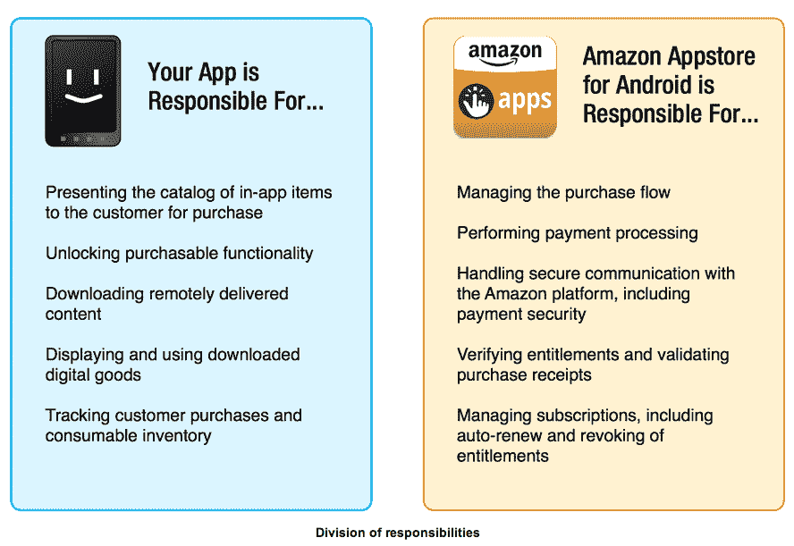
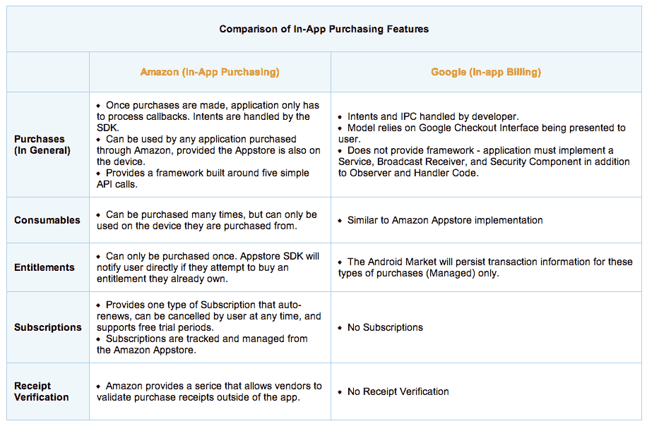

# 亚马逊取消应用内购买测试版:以下是他们如何在收入分成上妥协的

> 原文：<https://web.archive.org/web/https://techcrunch.com/2012/04/10/amazons-takes-in-app-purchases-out-of-beta-heres-how-theyre-getting-around-that-pricing-issue/>

亚马逊今天推出了一项新的应用内购买服务，努力使其应用商店与苹果和谷歌提供给开发者的服务相竞争。这应该会让亚马逊 appstore 的开发者利用过去一年中出现的最赚钱的应用货币化方式:保持免费，但在应用内提供虚拟货币或其他商品供购买。

经过几个月的测试，新的应用内购买服务现已面向所有人开放。它基于亚马逊的一键式购买体验，适用于数字内容，如游戏内货币、扩展包、内部应用程序和游戏的升级和订阅。

但正如我上周指出的那样，这个故事有趣的地方不在于亚马逊是否在做应用内购买。很明显公司会这么做。

问题是它是如何设定价格的？你看，亚马逊在历史上一直努力争取图书和其他商品的定价权。当它去年推出 appstore 时，它有能力随意给应用打折。开发者要么赚到他们想要收费的 20 %,要么赚到亚马逊最终收费的 70%——无论哪个更高。[这自然惹恼了开发者。](https://web.archive.org/web/20221112035731/https://beta.techcrunch.com/2011/08/02/amazons-appstore-youll-make-0-when-we-give-your-app-away-and-youll-like-it/)

对于应用内购买，事实证明亚马逊仍然有能力对应用内商品打折。但据亚马逊 appstore 的主管 Aaron Rubenson 称，开发者将永远赚取标价的 70%或他们想要的价格。

“我们只是在遵循 70 比 30 的模式，”他说。“这与我们从付费应用销售中获得的收入份额略有不同。我们分别研究了每一个购买案例。”

这是一个有趣的小妥协，让亚马逊保留其定价权，同时确保开发者不会因此遭受损失。

我还认为，亚马逊并没有强制要求开发者只能使用该公司的应用内购买服务。这就是说，根据鲁本森的说法，谷歌的应用内购买技术不会在 Kindle Fire 上运行。对于这款设备，开发者必须使用亚马逊的系统。但在其他平板电脑和手机上，开发者可以使用任意数量的应用内购买系统。这与其他应用商店不同:苹果禁止开发者使用其他应用内购买系统购买数字内容。谷歌在技术上也有同样的规则，尽管它直到最近才真正实施。

如果你想自己看的话，这是细则。新闻媒体产品似乎有一个特殊的例外:

> 4.版税；标价。对于每一笔应用内产品的销售，我们将向您支付相当于购买时标价 70%的版税。但是，以下产品无需支付版税:(a)标价为 0.00 美元的应用内产品；(b)我们在新闻或杂志类别(或类似或后续类别)中列出的订阅应用内产品，这些产品是我们免费提供给最终用户的，作为最长 30 天(或您批准的任何更长时间)的免费试用订阅或其他促销优惠的一部分；或(c)我们免费提供给最终用户的其他订阅应用内产品，作为免费试用订阅或您批准的其他促销优惠的一部分。对于向续订用户销售订阅应用内产品，您的版税将根据(I)当时的标价和(ii)适用最终用户首次订阅时的有效标价中的较低者进行计算。版税仅适用于我们从最终用户或代表最终用户收到最终付款的销售。如果应用内产品是使用信用卡或银行账户扣款机制购买的，则当相应的信用卡公司或银行已完全支付相应的购买款项时，最终付款将被视为已经发生。就应用内产品而言,“价目表价格”的含义与本协议中针对应用规定的含义相同。您将根据需要更新每个应用内产品的标价，以确保其符合标价要求。

应用内支付是亚马逊非常适合做的事情，因为该公司已经有十年时间来积累在线交易的专业知识。巧合的是，这是谷歌在历史上提供的一个薄弱领域。开发人员注意到了这一点。拥有大约 34，000 个应用程序和非常有吸引力的付费客户群，亚马逊的应用程序商店正在成为移动开发者关注的对象之一。

Flurry [报道称，亚马逊商店每位用户的平均收入约为苹果 iOS 平台收入的 89%](https://web.archive.org/web/20221112035731/http://blog.flurry.com/bid/83604/For-Generating-App-Revenue-Amazon-Shows-Google-How-to-Play)。谷歌落后了，每用户收入只有 iOS 的 23%。请记住，尽管亚马逊的用户群仍然比 Google Play 所能触及的受众少得多。因此，Google Play 或许能够通过规模来弥补其在货币化方面的弱点。

下面是一个视频，解释了亚马逊应用内购买，以及一些摘录的文档，显示了亚马逊和谷歌系统之间的差异:

[YouTube http://www.youtube.com/watch?v=1hsbY85Dt3Q&w=560&h=315]

