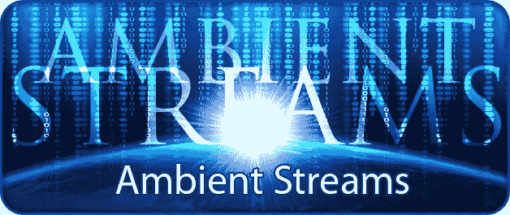

# 超越实时搜索:环境流的曙光 

> 原文：<https://web.archive.org/web/https://techcrunch.com/2009/12/20/ambient-streams-realtime/>

*以下客座博文由 **[江户西格尔](https://web.archive.org/web/20221209002858/http://www.crunchbase.com/person/edo-segal)**([@江户西格尔](https://web.archive.org/web/20221209002858/http://www.twitter.com/edosegal))撰写。*

那是 1993 年，我刚刚决定从大学退学。我在一所很棒的艺术学校主修平面设计，但是我决定开始我的第二家公司。知道这将标志着我在那里的研究的结束，我开始创作我的最后一个项目。我会写一篇短篇小说，设计并出版。我出版了 300 本，送给我的朋友和像作家威廉·吉布森这样激励我的人。

切到 2009 年 11 月，当我坐在第二次[实时运算](https://web.archive.org/web/20221209002858/http://www.beta.techcrunch.com/2009/11/20/realtime-crunchup-stream-roundtable/)的面板上回来的时候。我曾敦促观众和参与者，当考虑实时网络时，我们不应该透过消费者今天的行为来考虑挑战。我认为实时网络的未来潜力不在于“实时搜索”这个用词不当的地方，因为这种信号的消费将主要在我称之为环境流的地方。这些是实时涌现的信息流，它们寻找我们，包围我们，并通知我们。它们就像一个壁炉，让我们沐浴在周围的信息热之中。我相信用户不会去一个页面，在搜索框里输入搜索。相反，这些信息将在一系列设备上通过不同的体验以环境的方式呈现给他们。

做完仰卧起坐回来几天后，我在整理一些旧文件时，无意中发现了我 16 年前写的一篇赛博朋克短篇小说*[<](https://web.archive.org/web/20221209002858/http://www.iwasjustdead.com/)*。一个关于增强现实世界的故事。在这个世界里，一个芯片在出生时就被植入人们的大脑，创造了一个现实，在这个现实中，他们不再分辨什么是“真实的”，什么是他们周围的增强内容(听有声读物或下载下面的免费电子书)。在数字世界近 20 年的经历中，听到以前的自己大声疾呼增强现实的重要性是很奇怪的，其中一半时间都花在解决如何过滤大规模实时流的问题上。

当试图理解潜在的变革时，知道该问什么问题是挑战的一半以上。我们仍处于这些变化的早期阶段，还没有必要的隐喻来跨越到未来。正是出于这个目的，我想提出我认为是我们如何使用技术的下一次重大进化的基石。四个主要构件是:

1.  **实时网络**(推特、新闻流、世界大事以及其他与世界变化相关的信息)
2.  **发布信息** n(网站、博客、维基百科等。)
3.  **地理位置数据**(您的位置和与之相关的信息层，包括您和您朋友过去的位置，以及地理标记媒体)
4.  **社交沟通**(社交图表更新、即时消息、电子邮件、短信以及来自朋友的其他形式的信号)。

在这些构建模块可以创建一个不占优势的环境流之前，所有这些数据都需要通过一个过滤器。圣杯是一个过滤器，它只提供基于你是谁、你的社交图、你或你的朋友现在在做什么、你或你的朋友以前做过什么以及你正在消费的其他信息的上下文相关的信息。无论你身在何处，你都需要通过任何能够传递环境流的设备或显示器来传递信息:手机、笔记本电脑、电视、汽车上的平视显示器或你的眼镜。以下简单的图表展示了环境水流进入我们世界的未来:

将所有这些构件放在一起将是一项全行业的任务。有相对少的一部分人已经设法用一生的时间来思考这个问题。孕育了多个学科门类和众多[科幻小说](https://web.archive.org/web/20221209002858/http://books.google.com/books?id=SrLwPdBJodMC&lpg=PP1&dq=rainbow's%20end&pg=PP1#v=onepage&q=&f=false)和电影。这些相关领域包括普适计算、 [everyware](https://web.archive.org/web/20221209002858/http://books.google.com/books?id=noMNgMcZvL0C&printsec=frontcover&dq=everyware&ei=TgAjS4vJHIviyATXl_TkBg&cd=1#v=onepage&q=&f=false) 和时下的流行词[增强现实](https://web.archive.org/web/20221209002858/http://en.wikipedia.org/wiki/Augmented_reality) (AR)。所有这些技术都会产生环境水流。特别是增强现实，(它主要关注如何可视化地呈现信息的方法)正在[抓住](https://web.archive.org/web/20221209002858/http://search.beta.techcrunch.com/query.php?s=augmented+reality)全球[创新者的想象力](https://web.archive.org/web/20221209002858/http://blog.futurefacts.net/2009/12/11/augmented-citizen-%E2%80%93-next-augmented-reality-ecosystem/)。允许设备将数据与物理位置结合的基础技术继续快速发展，随着其他学科的加入，奇迹终于开始发生。

人们只需要看一看今天的青少年，他们一边做作业、看电视、玩游戏、聊天，一边观看他们的脸书溪流，就能感受到人类对周围溪流不断扩大的吸引力。他们年轻的心灵在不断调整和适应这个高要求的时代。一个非常有用的比喻是，人类正在[构建](https://web.archive.org/web/20221209002858/http://www.youtube.com/watch?v=YrtANPtnhyg)自己的[综合第六感](https://web.archive.org/web/20221209002858/http://www.ted.com/talks/pattie_maes_demos_the_sixth_sense.html) e。这是一种感知你的活动背景，并用相关信息和经历增强你的现实的环境感觉。我们将越来越多地用第六感感知世界，这将改变我们集体体验世界的方式。回到之前的观点，分水岭事件是我们将在没有检索模式的情况下体验这种“[环境感知](https://web.archive.org/web/20221209002858/http://www.ambientsense.com/)”(即，不是当我们去计算机或移动设备查找信息时，而是作为我们在有线世界中可用的事件和信息的上下文中的活动、位置和简档的产物)。

在未来的几年里，我们将看到这场即将到来的海啸的第一波浪潮，但对我们的孩子来说，环境意识将发挥越来越大的作用，因为它会慢慢演变并编织到他们的意识中，就像谷歌搜索编织到他们的记忆功能中一样。我们在取得真正进展方面所面临的挑战源于这样一个事实，即总体目标是一个需要跨无数数据集的多学科方法的目标。虽然在每个象限都有许多公司在执行，但很少有公司能够访问全部范围的数据，因此创建过滤器圣杯的能力有限。这就是围墙花园的世界和[与](https://web.archive.org/web/20221209002858/http://www.beta.techcrunch.com/2009/10/21/microsoft-to-announce-bing-deals-with-facebook-and-twitter/)[主要搜索提供商](https://web.archive.org/web/20221209002858/http://www.beta.techcrunch.com/2009/12/07/google-realtime/)的交易对进步提出挑战的地方。在我们找到正确的方法来整理和过滤所有这些不同的数据流到环境感知之前，需要进行许多迭代和错误。如果只有一两家公司能够迭代，那么进展将会非常缓慢，成功的概率也会降低。为了取得成功，有必要创造一种环境感，这种感觉将设法平衡中断与洞察力的水平，并达到任何[足够先进的技术](https://web.archive.org/web/20221209002858/http://www.iwise.com/SFuON)的真正目标，即透明并理所当然地成为人类体验的一部分。这听起来可能像科幻小说，但已经有工程师和企业家在努力实现它。

在脸书、推特、谷歌和苹果的时代，一家初创公司有可能跨越整个堆栈进行创新，从而产生这种第六感吗？在#ambientstreams 处插话

我刚刚被埃多·西格尔杀死了

[http://iwasjustdead.com/IWasDead.swf](https://web.archive.org/web/20221209002858/http://iwasjustdead.com/IWasDead.swf)

*客座作者**Edo Segal**([@ Edo Segal](https://web.archive.org/web/20221209002858/http://www.twitter.com/edosegal))已经推出并出售了几家公司。2000 年，他创立了 eNow，并于 2006 年将其出售给 AOL(后更名为 Relegence)。如今，他经营着自己的孵化器/投资工具 Futurity Ventures，该公司最近推出了一个新的智慧搜索引擎。*