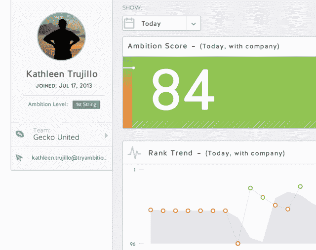

# Y Combinator 支持的雄心提供了一种梦幻足球式的方法来激励销售团队 

> 原文：<https://web.archive.org/web/https://techcrunch.com/2014/02/21/ambition-launch/>

据称，该公司正在跟踪和激励销售团队，而不仅仅是白板和锣。

联合创始人特拉维斯·特鲁特(Travis Truett)表示，这家初创公司是孵化器 Y Combinator 当前类别的一部分，去年 8 月推出了产品，但直到现在一直在媒体的“雷达下飞行”。他将雄心的方法比作梦幻足球——他希望雄心的用户会兴奋地每天登录，看看他们的球队在做什么。

然而，与虚拟足球不同的是，野心并不追踪职业运动员在虚拟比赛中的相互竞争。(至少，这是我记忆中的梦幻足球——很久没有人强迫我参加了。相反，它关注公司内不同销售团队的表现，允许他们在有限的“季节”内竞争，获胜者将获得奖励。

每个团队成员都有一个“抱负”分数。用于计算分数的具体指标可以根据每个公司和每个职位进行定制，因此 Truett 建议这是一种比较不同职位的人的方法。

他补充说，雄心与电话和客户关系管理系统集成在一起，因此它可以跟踪相关指标，而不需要销售人员做任何额外的工作(尽管它可能会激励他们更新 CRM)。

特鲁特承认，将工作场所“游戏化”的想法并不新鲜，但他表示，大多数公司都在“为游戏化而游戏化”或“游戏化 1.0”。更具体地说，他认为许多现有工具过于关注排行榜。

“这是相对被动的，不可持续的，”他说。“你真的只有前 10%的人有动力，因为我可能会说，‘你知道吗？安东尼每次都赢，所以我在乎什么？"

特鲁特说，这就是为什么以团队为中心的系统可能是一个重要的激励因素——参与者觉得他们与团队的成功有利害关系，即使他们不是第一名，这也使这个过程“由同事激励，而不是由经理激励”。与此同时，经理可以查看个人和整个团队的数据。

虽然雄心的最初重点是销售，但特鲁特认为它最终可以服务于“任何衡量员工的人”。

这家初创公司成立于田纳西州的查塔努加，已经从 Lamp Post Group、Y Combinator 和 [YC 风投](https://web.archive.org/web/20221007030007/https://beta.techcrunch.com/2013/12/16/kv-yc-vc/)获得了种子资金。