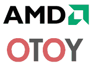

# AMD 和 OTOY 合作开发“有史以来最快的超级计算机”

> 原文：<https://web.archive.org/web/https://techcrunch.com/2009/01/08/amd-and-otoy-working-together-on-fastest-supercomputer-ever/>

# AMD 和 OTOY 合作开发“有史以来最快的超级计算机”

今天，在拉斯维加斯 CES 上的行业内幕系列主题演讲中，AMD 首席执行官[迪克·梅耶](https://web.archive.org/web/20221206161914/http://www.crunchbase.com/person/dirk-meyer)和 OTOY 首席执行官[朱尔斯·厄巴奇](https://web.archive.org/web/20221206161914/http://www.crunchbase.com/person/jules-urbach)宣布，AMD 一直在开发它所谓的世界上“有史以来最快的超级计算机”，旨在“打破千万亿次浮点运算的障碍，在 1000 多个图形处理器上处理 100 万个计算线程”。

这台被称为“融合渲染云”的超级计算机将运行 OTOY 的图形渲染软件，我们去年 7 月曾报道过该软件，旨在通过云交付高端 3D 图形，方法是在服务器上对其进行预处理，然后通过网络将其交付给瘦设备。

Urbach 认为这台超级计算机是实现 OTOY 承诺的一大步，OTOY 的承诺需要大规模的计算能力来满足许多依赖中央计算而不是自己设备中的显卡的最终用户的处理需求。他说，10%的计算机已经建成，AMD 计划在 2009 年中期进行 beta 测试。虽然他预计将需要更多的超级计算机来在全球范围内扩展 OTOY 的技术(这台超级计算机“只是你所需的百分之一”)，但 AMD 已经承诺随着时间的推移，用其最新的硬件来改进这台超级计算机。它旨在支持多达 100 万用户。

AMD 说它已经负责了世界上 10 台最快的计算机中的 7 台，包括第一和第二快的。这台正在加州伯班克建造的超级计算机可能会让 AMD 占据前三名的位置。

即使今天宣布，AMD 的硬件是否能让 OTOY 的服务器端渲染有效地扩展仍有待观察，更不用说在大多数最终用户可用的宽带连接上工作了。我们还没有听到更多关于由 OTOY 支持的 Liveplace 虚拟世界的消息。