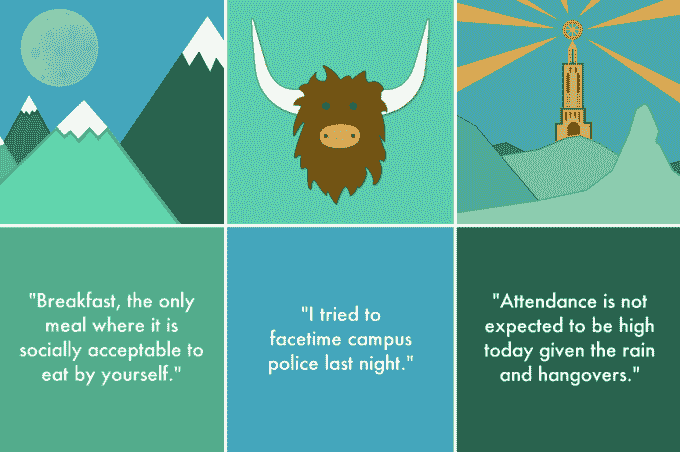
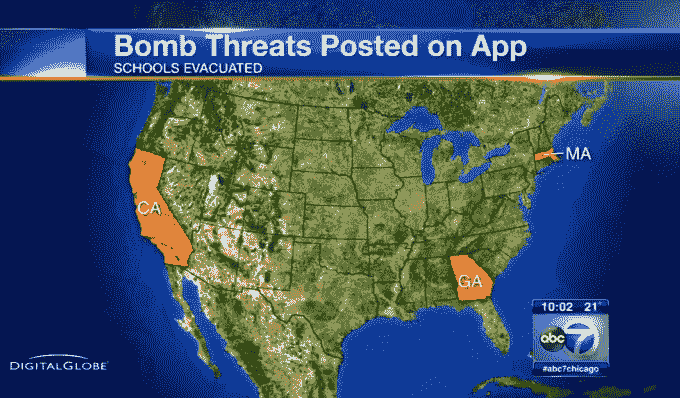
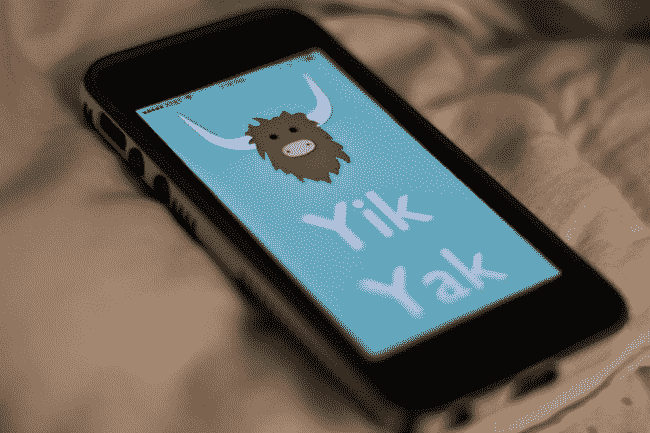
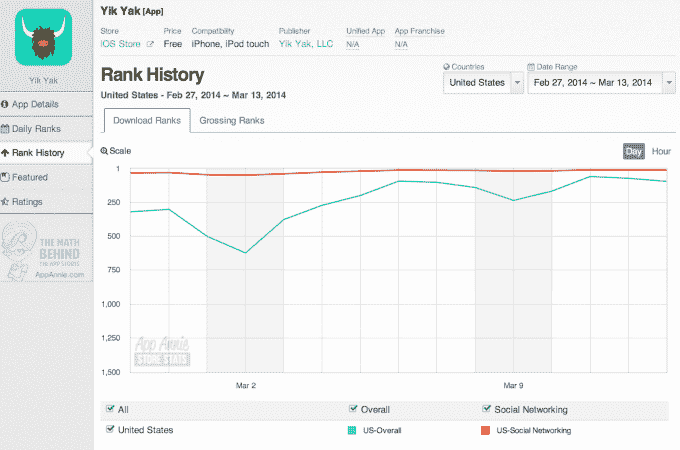
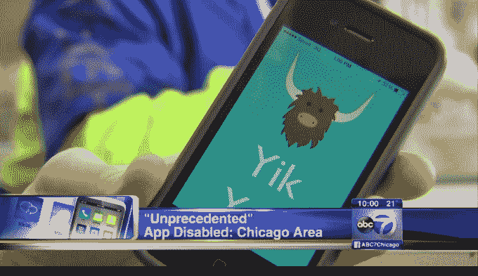

# 在欺凌和暴力威胁中，匿名社交应用 Yik Yak 关闭了美国初中和高中学生的访问 TechCrunch

> 原文：<https://web.archive.org/web/https://techcrunch.com/2014/03/13/amid-vicious-bullying-threats-of-violence-anonymous-social-app-yik-yak-shuts-off-access-to-u-s-middle-high-school-students/>

匿名交流平台和青春期前到青春期前的大脑是两个不能很好融合的东西。例如，看看 ask . FM，社交 Q&这个平台的匿名性导致了网络欺凌，后来被认为是六起自杀事件的促成因素。但不一定要这样。

一款名为 [Yik Yak](https://web.archive.org/web/20221218154017/http://yikyakapp.com/) 的新兴匿名消息应用开始在初中和高中人群中流行，在那里它被与欺凌和威胁联系在一起，该应用的创始人采取了前所未有的措施，实际上阻止年轻用户在校园内访问其应用。

## Yik Yak 是什么？

Yik Yak 是由两位弗曼大学的学生泰勒·德罗尔和布鲁克斯·巴芬顿发起的，作为针对大学生的超本地化 Twitter[。学生们可以发布校园发生的事情和事件，语音投诉，分享新闻，至少在一个案例中，当官方警报系统出现故障时，更新同学们与天气有关的关闭。](https://web.archive.org/web/20221218154017/https://techcrunch.com/2014/02/19/yik-yak-is-an-anonymous-messaging-app-aimed-at-college-campuses/)

该平台自动连接附近的用户，不要求人们通过名字来识别自己，而是允许用户匿名发布或使用化名。

最初，该公司在美国东南部的大学校园推出了这款应用，但后来它通过口碑传播到了全国其他大学，然后延伸到了高中和初中。

## Yik Yak 成为威胁和恶意欺凌的家园

虽然匿名分享的本质为不必要的网络欺凌留下了空间，但这个问题在这些年轻用户的手中恶化了。很快，Yik Yak 在学校引起了麻烦，导致了一些学生认为的恶性欺凌，根据 CNN 的一篇文章，[“用户在虚拟的浴室墙壁上张贴刻薄和仇恨。”](https://web.archive.org/web/20221218154017/http://edition.cnn.com/2014/03/07/tech/yik-yak-app-high-school-problems/)

我要说的是远比那更糟糕，例如，在帖子中，实际上看到一些学生欺负一个女孩 [*被强奸*](https://web.archive.org/web/20221218154017/http://abclocal.go.com/wls/story?section=news/local&id=9457339) 。在另一个案件中，一名阿拉巴马州的青少年在 Yik Yak 上的帖子威胁要开枪打人后被捕。然后还有匿名炸弹威胁，学校被封锁。

该公司开始意识到问题的严重性，因为该应用程序在许多学校被禁止，甚至成为警方调查的对象。

“在少数情况下——可能是三四个——我们根据对 Yik Yak 发出的威胁与地方当局交涉……其中一些实际上导致了逮捕，”Buffington 告诉我们。“匿名是一件很棒的事情——我们这样做的全部原因是因为当你匿名时，没人能评判你。但是你不能在拥挤的剧院里大喊“着火了”。这是有底线的，”他说。

巴芬顿声称，该公司没有准确记录 Yik Yak 被提及多少次，因为它是欺凌、威胁或其他投诉的原因。但这家初创公司很清楚这个普遍问题，只是有点措手不及。“我们绝对没有想到它会像现在这样在高中校园里流行起来，”他说，并指出该应用程序在 App Store 上已经有了 17+的评级，所以父母可以很容易地在孩子的手机上阻止它。

但是用户评级是不够的，全国反欺凌协会的执行董事安娜·门德斯说，她解释说苹果的系统需要父母的参与，并且很难使用。她的组织在圣克莱门特高中受到炸弹威胁后联系了 Yik Yak，要求该公司在初中和高中禁用该应用程序，因为匿名应用程序可能会被滥用。

门德斯告诉 TechCrunch:“某些东西应该永远不要让孩子们接触到。”“孩子和成人处于不同的发展水平。生理上，他们大脑的额叶还没有发育完全。这是他们大脑的一部分，帮助他们认识到当前行为的未来后果。与此同时，他们的荷尔蒙水平也在上升。她说:“初中和高中是最艰难的几年，孩子们开始自我怀疑，欺凌开始变得更加暴力。

她补充说，Yik Yak 成为“他们自由使用的武器，一个可怕的欺凌和严重威胁的巨大平台，为了每个人的利益，我们作为一个成年人社区需要控制它。”

## Yik Yak 阻止美国各地的学生访问。

对于许多初创公司来说，年轻用户的快速增长被认为是一个很大的问题。毕竟，Yik Yak 在 App Store 排行榜上迅速攀升，截至昨日，它在免费应用中排名第 63 位，在社交应用中排名第 12 位。(今天分别是 98 号和 13 号。)

但是 Yik Yak 不希望它的社区变成另一个 Ask.fm，在那里孩子们互相欺负到如此程度，以至于许多学生甚至结束了自己的生命。(更讽刺的是，你还可以指出，与这样一个社区有关联，对于公司的发展将是一个很大的风险——如果 Yik Yak 成为“最受欢迎”的移动欺凌平台和学校禁令的对象，外部投资者可能会犹豫是否向其提供资金。)

因此，Yik Yak 的团队提出了一个颇具创造性的技术解决方案:通过地理围栏的方式阻止年轻学生使用该应用程序。最初，这些都是一次性处理的，就像芝加哥的情况一样，[芝加哥的应用程序在地区学校](https://web.archive.org/web/20221218154017/http://abclocal.go.com/wls/story?section=news/local&id=9457339)被屏蔽了。

Yik Yak 使用他们的 GPS 坐标在初中和高中周围应用地理围栏，这实际上会阻止学生在学校操场上使用该应用程序。当然，学生们仍然可以在家里和校外的其他地方使用这款应用，但它立即打消了所有所谓的“乐趣”

为了在全国范围内实施同样的禁令，该团队联系了第三方数据提供商 [Maponics](https://web.archive.org/web/20221218154017/http://www.maponics.com/) ，以便为全美总共 100，599 所公立学校和 28，111 所私立学校许可 GPS 数据。

“他们拥有美国高中和初中 85%的 GPS 坐标，”巴芬顿说。“这个消息(给被屏蔽应用的学生)大致是这样的，‘看起来你正试图在初中或高中校园里使用 Yik Yak。Yik Yak 是为大学及以上年龄的人设计的。该应用在此区域被禁用。"

Maponics 告诉我们，这是他们的数据第一次被用来帮助一家公司排除如此大范围的流量。通常情况下，他们的 GPS 数据是用于定位目的，而不是封锁。

截至今天早上，Yik Yak 已经在美国各地应用了基于 Maponics 的地理围栏，并表示现在该应用程序在美国大部分高中和初中校园都无法访问。“如果由于某种原因，该应用程序仍然可以在学校的场地上使用，他们需要做的就是在 yikyakapp@gmail.com 给我们发电子邮件，我们会尽快调查，”巴芬顿指出。

至于屏蔽将如何影响 Yik Yak 的用户增长，该公司并不担心，称该应用在大学仍然“非常好”，公开引用的用户数量被严重低估。(作为参考，当 TechCrunch [在 2 月份首次报道 Yik Yak](https://web.archive.org/web/20221218154017/https://techcrunch.com/2014/02/19/yik-yak-is-an-anonymous-messaging-app-aimed-at-college-campuses/) 时，该应用每月有 10 万活跃用户。)

## 不惜一切代价的增长不值得

最终，该公司表示，目标是生产可持续产品。“我们希望确保两年后，当你在一个新的地方时，Yik Yak 是你使用的东西——它是你拉起来看看你周围发生了什么，”Buffington 说。

虽然公平地说，Yik Yak 应该考虑到在后 Ask.fm 时代向野外发布匿名社交应用程序的后果，但很高兴看到他们已经相当快地解决了这个问题，即使它切断了其服务的第二大用户群。(当然是大学生最大)。

“大多数(创业公司)关心的是*成长、成长、成长、成长*。我们希望成长，我们希望变得庞大，但我们也希望确保我们正在创造可持续的、良好的社区。这是我们清单上的第一项。“我们创造 Yik Yak 不是为了让人们可以针对其他人，”巴芬顿说。

现在是时候看看 Yik Yak 新被屏蔽的学生有多沉迷或善变，以及他们是否会转向下一个即将推出的匿名社交应用程序来填补空白。

*形象演职员表:[fox 10 TV](https://web.archive.org/web/20221218154017/http://fox10tv.com/2014/02/21/second-arrest-in-yik-yak-investigation/)；[ABC(WLS-TV)](https://web.archive.org/web/20221218154017/http://abclocal.go.com/wls/story?section=news/local&id=9457339)；Yik Yak*