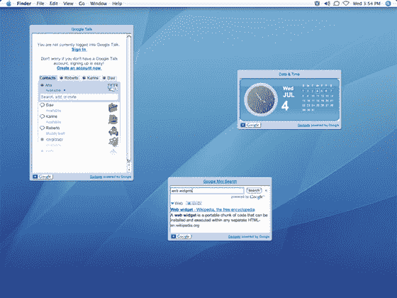

# 大赦国际 Hypercube 将网络小部件带到桌面上

> 原文：<https://web.archive.org/web/http://www.techcrunch.com:80/2007/08/27/amnesty-hypercube-brings-web-widgets-to-the-desktop/>

 Mesa Dynamics 宣布了[大赦超立方体](https://web.archive.org/web/20170707225417/http://www.amnestywidgets.com/HypercubeMac.html)的 alpha 预览版，这是一个网络小工具的桌面平台。

大赦国际 Hypercube 允许用户在他们的桌面上使用网络小工具，如谷歌小工具、Pageflakes、Widgetbox 和其他工具提供的小工具，类似于苹果的 Dashboard、雅虎小工具、谷歌桌面和 Vista 侧栏。

该理论认为，有“成千上万”的公开可用的网络小工具、flash 游戏和视频被设计成在网络上运行；大赦国际 Hypercube 将这种选择和多样性带到了桌面上。

Amnesty Hypercube 包括一个超过 150 个 web 部件提供商的目录，可以按类别浏览，并从应用程序内部进行探索。目录中的小部件可以通过其“NoClick”技术自动导入到 Amnesty Hypercube 中。

桌面小工具往往是人们喜欢或讨厌的东西。如果你是一个严肃的桌面小工具鉴赏家，并且一直在使用 Vista(这是一个相当令人沮丧的小工具系列)这样的东西，那么 Amnesty Hypercube 很适合你。作为一个 Mac 用户，我不认为需要这么多，但是使用这样的东西确实扩展了你的小工具选项。

大赦国际 Hypercube 可用于 Windows 和 Mac，并作为免费软件提供。

