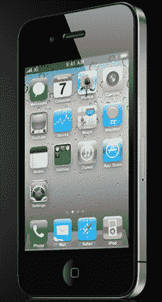
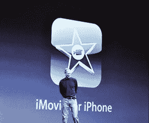

# 一位安卓用户对昨天 iPhone 新闻的看法

> 原文：<https://web.archive.org/web/https://techcrunch.com/2010/06/08/an-android-users-take-on-yesterdays-iphone-news/>

我认为，昨天的苹果主题演讲比以往任何时候都更能证明史蒂夫·乔布斯的演讲技巧。面对已经看过[大结局](https://web.archive.org/web/20230304101010/https://techcrunch.com/2010/04/19/iphone-hd-4g/)的观众，他仍然毫不费力地唤起了大量欢乐的喘息和掌声。他甚至设法让现在臭名昭著的 Wifi 故障变得有趣(如果有点奇怪的话)，而不是令人痛苦的尴尬。但是，尽管他的表演技巧和令人印象深刻的新产品，基调并不完全是我所期望的游戏改变者。我并不是说我觉得 iPhone 4 令人失望——它会非常成功，我的许多朋友都迫不及待地想要一部。不过，尽管我目前对安卓系统很忠诚，但我预计昨天走出旧金山莫斯康中心时，我会渴望下一部 iPhone。那没有发生。

几周前，一名苹果狂热爱好者[给](https://web.archive.org/web/20230304101010/http://www.macrumors.com/2010/05/23/steve-jobs-on-wwdc-announcements-you-wont-be-disappointed/)史蒂夫·乔布斯发了一封电子邮件，询问他苹果是否有任何 WWDC 公告会“把【谷歌】打得落花流水”。乔布斯回应道:“你不会失望的。”对我来说，这听起来像是乔布斯在暗示一些重要的东西——一个比 Android 好得多的功能或服务或设备，这让我感觉像是 G1 与 iPhone 3G 时代的重演，当时 iPhone 远远领先。但是，苹果公司的声明并没有发射核武器，而是对安卓系统发起了一次强有力但却可以生存的攻击；对最近谷歌 I/O 攻击的报复。苹果再次领先，但我认为安卓不会追赶很久。

在我继续说下去之前，我想我应该解释一下我来自哪里，以便消除(或者确认)任何关于我只是一个 Android 粉丝的怀疑。我全职用了一部 iPhone 两年，先是用原版 iPhone，然后是 iPhone 3G。他们两个我都爱，很长一段时间里，我都抱着一种相当天真的观点，认为苹果不会犯太多错误。然后，在 2009 年年中，苹果开始屏蔽谷歌的应用程序，我开始对应用商店产生严重的疑虑。几个月后，我换了一个 Droid，然后又换了一个 Nexus One，我已经用了大约五个月了。尽管我对 App Store 有意见，但我还是在 iPad 上市的当天买了一台，并被《华尔街日报》援引[的话](https://web.archive.org/web/20230304101010/http://online.wsj.com/article/SB10001424052702303912104575164222266106354.html)说它“改变了我们使用电脑的模式”(这是一个可笑的陈词滥调，但我仍然同意他们的说法)。当然，我买 iPad 的决定可能表明我是一个巨大的伪君子，但我喜欢告诉自己，我只是有一个细致入微的视角。

说了这么多，还是言归正传吧。

 **掐**

虽然已经说过很多次了，但还是值得重复一遍:这东西太棒了。它毫无歉意地抛弃了老款 iPhone 的曲线，支持更清晰的边缘，使设备看起来更强大。或许更重要的是，它感觉像岩石一样坚固。

我向驻扎在我的演示装置旁边的苹果哨兵提出的第一个问题是，新型号对刮擦和摔落的抵抗力如何。他的回应:“屏幕比蓝宝石更坚固”。后来，一个古怪的表情(我对宝石一无所知)，他解释说，这意味着它真的很坚固，很难破解。在拿着这个令人满意的沉重装置几分钟后，我真的觉得我可以把它扔到墙上，它会完好无损地保存下来(哨兵不喜欢这个主意)。我真的没有见过感觉如此坚固或如此好看的安卓手机。

除了制造质量，iPhone 4 最引人注目的特点无疑是它的屏幕。比你的电脑显示器还清晰。在上面阅读文本感觉有点超现实，就像它几乎太清晰了，因为你不习惯在手机上看到这种显示(这是一个很好的问题)。这又一次让我在安卓手机上看到的屏幕相形见绌。如果要我猜的话，我会说摩托罗拉 Droid 最接近，但不匹配。

与此相关的一个注意事项是:在 iPhone 4 和原始 iPhone 屏幕之间切换有点不和谐——正如史蒂夫·乔布斯在台上所说，一旦你尝试了“视网膜显示屏”，你就不能真正回去了。不幸的是，iPad 的显示屏显然不是视网膜显示屏(事实上，它的像素密度比老款 iPhone 低)。换句话说，你闪亮的新 iPhone 4 会让你两个月大的 iPad 很快变得过时*真实*。

T5**iOS 4**

在昨天发布的所有消息中，我认为最让我惊讶的是 iOS 4 的新闻缺乏，iOS 4 于 4 月首次亮相，将于本月晚些时候发布。诚然，这是一个巨大的更新，为 iPhone 带来了多任务、邮件、文件夹中的线程对话和大量其他好东西。问题是，Android 已经完成了大部分工作——我本以为会有一两个我们还没听说过的主要功能。

多任务显然是这里的大新闻，是的，有一种说法认为 iPhone 在这方面可能比 Android 获得更好的电池寿命。但我的 Nexus One 通常可以使用一整天，没有电池问题，“流氓应用”现象对我来说根本不是一个主要问题(我认为它已经影响了我两次)。iPhone 仍然有一个糟糕的通知系统，我认为它不如 Android 的滑动托盘有用。简而言之，这似乎只是一个偏好问题。

 ** FaceTime**

这是我的通配符。苹果在这方面的执行很好——你不需要处理用户账户或任何类型的设置，这非常好。但它并不完美。这里最大的问题是，它只有 Wifi，这将是非常有限的。苹果围绕这一功能的营销视频确实令人感动，但确保这些温暖人心的时刻发生在 Wifi 范围内将是很难的(更不用说你需要确保你爱的人都配备了最新的 iPhone)。

当然，这将随着时间的推移而改变——运营商最终将能够适应增加的视频流量，显然 iPhone 4 的市场渗透率将迅速增加。但这也将给 Android 足够的时间来赶上，特别是考虑到苹果正在将 FaceTime 变成一个开放标准(尽管其后勤工作尚未公开)。

我的直觉是，FaceTime 将是苹果公司的一个重大营销胜利，它将通过那些扣人心弦的广告保持强劲势头。但是我不确定人们在不久的将来会不会经常使用这个功能。

  **其他软件**

在昨天的主题演讲中，大量的时间被用来展示 iPhone 的应用程序。我不认为这些会对任何一个平台的成功产生重大影响，但是它们值得一读。

Zynga 的 Farmville

*   这绝对会吸引数百万 Farmville 迷。也就是说，我的直觉是，Zynga 游戏的人口统计数据首先更符合 iPhone，而不是 Android。如果你真的想，你可以使用 Android 的 Flash 支持让 Farmville 工作。

iPhone 版 iMovie

*   这是 Android 根本还没有(或者至少，我找不到)的那种应用:精致而强大。考虑到安卓媒体播放器有多糟糕，我对来自谷歌的这种东西不抱太大希望，所以我们可能不得不等待第三方开发类似的东西。

iBooks

*   乔布斯花了很多时间谈论 iBooks，即它现在可以阅读 pdf 文件和在多种设备之间同步的能力。请注意，亚马逊的 Kindle 应用程序将于今年夏天登陆 Android，并将具有类似的同步功能。这也不是 iOS 平台的新功能——Kindle 的 iPhone 和 iPad 应用程序已经提供了相同的同步功能(也可以在 Kindle 设备上使用)。

**展望**

在使用过新 iPhone 之后，我很少怀疑我的 Nexus One 不再是最先进的。屏幕远不如 iPhone 4 清晰，制作质量也没有 iPhone 4 好，我也没有用于视频聊天的前置摄像头。这些缺点大多适用于其他流行的 Android 设备，如 Incredible 和 Evo 4G(尽管后者确实有前置摄像头)。

尽管我的手机与 iPhone 4 不太匹配，但昨天我从没想过要重新加入 iPhone 的行列。我的 Nexus One 感觉并不比 iPhone 慢多少(尤其是升级到 Froyo 以后)。在不久的将来，我无法想象自己会使用电话视频聊天，特别是考虑到 Wifi 的限制，以及我最初只能与其他技术爱好者一起使用的事实。虽然 iPhone 4 的屏幕相当惊人，但它还不足以克服我对 AT&T 的鄙视。

此外，如果 Android 设备在未来四个月左右的时间内没有超越 iPhone 的硬件能力，我会感到惊讶。我们可能会在下一波设备上看到更清晰的屏幕、更快的处理器，甚至集成陀螺仪(iPhone 4 推出的另一个功能)。从软件的角度来看，Android 实际上似乎准备在某些方面开始*击败*苹果，即它与云服务的联系。尽管谣言导致 WWDC，史蒂夫乔布斯在他的主题演讲中一次也没有提到苹果的 MobileMe 云服务。在 D8 会议上接受采访时，他说苹果正在研究无线共享/同步功能，但似乎谷歌已经领先一步。

简而言之，安卓和苹果比以往任何时候都更加势均力敌。这对我们所有人来说都是一件好事。即使你们这些没读过这么多书的粉丝们。