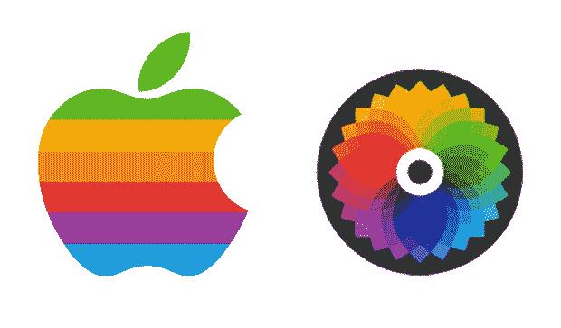

# 任何其他名称的应用程序...

> 原文：<https://web.archive.org/web/http://techcrunch.com/2011/03/27/an-app-by-any-other-name/>

> *“对我来说，最深的谜团之一是我们的标志，欲望和知识的象征，被咬入，以错误的顺序与彩虹的颜色交叉。你不可能想到一个更合适的标志:欲望、知识、希望和无政府状态。”*

——苹果公司高管让·路易·加西在苹果公司的[命名上](https://web.archive.org/web/20230203041645/http://www.theapplemuseum.com/index.php?id=44)

> **颜色为什么取名为“色”？**
> 
> *“Apple II 向苹果彩色标志致敬。这台电脑在我七岁的时候改变了我的生活(这也是我用过的另一家公司的名字。)*
> 
> 我爸爸在休斯顿比利·拉丁经营的 ComputerCraft 买了一台。早在 1977 年，他就是首批电脑经销商之一。奇怪的是，15 年后我在电梯里遇见了他，并为他工作。他向我介绍了网络。
> 
> 在苹果工作是一个梦想。Color 的名字是向苹果致敬。”

— Bill Nguyen，Color 创始人[谈到他为什么选择 Color 这个名字](https://web.archive.org/web/20230203041645/http://www.quora.com/Color-Labs-startup/Why-is-Color-named-Color)

今天早上阅读 Semil Shah 在[群发消息](https://web.archive.org/web/20230203041645/https://techcrunch.com/2011/03/27/mobile-messaging-march-madness/)上的帖子时，我被分散在各处的初创公司名称的数量和多样性所震惊:Yobongo、Disco、SocialCam、SoundCloud、Beluga、GroupMe、Fast Society、乌合之众、Whatsapp、Kik、textPlus、Convore、SMSGupShup、MessageParty、TextSlide、Bump Technologies、Color Labs 等等，所有这些都是饱和的移动社交空间中的竞争者。一些像 MessageParty 或 textPlus 的名字实际上与他们的产品有关，但许多像 Yobongo、Beluga 和 Disco 的名字只有微弱的联系。

现在很明显，应用生态系统已经成为主流:人们谈论应用的方式就像他们过去谈论音乐或药物一样(*“天哪，你们试过 COLOR 吗？Omg 你一定要试试。Omg 我们现在就在上面。给你的创业公司命名已经变得像给你的乐队命名一样——是众多起作用的隐喻和文字因素之间错综复杂的舞蹈。那么，哪种方法更有意义呢，是选择随机的还是与你的工作相关的呢？*

https://twitter.com/#!/chrysb/status/52163873314324480

本周发布的两款著名应用凸显了一款应用的名字是如何影响公众认知的。最明显的例子是推出了 [Color](https://web.archive.org/web/20230203041645/http://www.color.com/) ，这是一个无处不在的名词/动词名称，由比尔·阮(Bill Nguyen)和彼得·范(Peter Pham)为他们的照片共享应用程序选择，获得了 4100 万美元的巨额资金。

虽然最初的投诉认为，由于其通用名称，该应用在 Android 和 iPhone 应用商店以及谷歌上都无法搜索，但这个问题现在似乎已经在谷歌上得到解决。也许所有来自新闻和其他网站的入站链接都是导致这个服务现在成为单词“color”的第八个结果的原因？Color 也不知何故从隐形变成了第一个出现在苹果应用商店“颜色”搜索词下的应用(我听说 Android 仍然有[个问题](https://web.archive.org/web/20230203041645/https://twitter.com/#!/dannysullivan/status/51845684483203072))。

Color 的名字虽然最初给一些人的印象是[稍微有点偏离](https://web.archive.org/web/20230203041645/https://techcrunch.com/2011/03/26/color-me-done/)，但如果仅仅是因为它的所有其他内涵，它是有效的，因为它准确地描述了 Color Labs 产品的核心功能，即人们通过应用程序共享图像(彩色像素的集合)的事实。

色彩专家告诉我(和上面的 Quora ),他们最初想出色彩这个名字是为了向苹果最初的反色标志致敬，然后以 35 万美元买下了[的域名。为了吸引其他地区说英语的人，他们还购买了域名 Colour.com，并将其重定向到 Color.com。是的，这并没有避免抱怨。](https://web.archive.org/web/20230203041645/https://techcrunch.com/2011/03/24/color-com-was-acquired-for-350000-the-domain-name-that-is/)

https://twitter.com/#!/Alison tan/status/52148473738436608

将 Color 的名字与目前另一个热门的五字母应用程序的名字进行对比， [Disco](https://web.archive.org/web/20230203041645/http://www.disco.com/) 。目前还不清楚谷歌以 25.5 万美元购买 Disco.com 域名是出于与幻灯片相关的目的，还是仅仅为了手头上有一个(谷歌没有在我的任何电子邮件中给我一个直接的答复)。如果是后者，那么这就不是谷歌第一次囤积域名了([bayareaburritos.com](https://web.archive.org/web/20230203041645/https://techcrunch.com/2008/04/23/want-gooooooooooooooooooooooooooooooooooooglecom-too-late/)有人知道吗？)以备后用。

不管是不是有意获得的，迪斯科这个名字与其核心产品的直接关系似乎比颜色更少。虽然迪斯科(夜总会)确实在某种意义上把人们聚集在一起，但这个名词与群发信息完全没有关系，我认为用户已经理解了这种区别。总而言之，选择用迪斯科作为一个群发消息应用的名字是不合适的，尤其是当你考虑到谷歌[也拥有](https://web.archive.org/web/20230203041645/http://blogoscoped.com/archive/2008-05-08-n15.html)Hello.com 的时候。

*“这件适合产品[#颜色](https://web.archive.org/web/20230203041645/https://twitter.com/#!/search?q=%23color "#color")，这件根本不适合[#迪斯科](https://web.archive.org/web/20230203041645/https://twitter.com/#!/search?q=%23disco "#disco")，”*贝瑞希里·雷达在推特上说。*“我不知道，当我第一次听说谷歌的产品#disco 时，我以为他们终于发布了他们的音乐流媒体服务……”*

http://twitter.com/#!/mm/status/52215987562479616

虽然 Disco 这个名字可能在 Slide 被谷歌收购之前就已经在绘图板上了，但如果 Disco 的制造商首先选择了一个模糊的名字，然后开发出一款产品来发布，那么他们不会是唯一的一个。私人照片分享服务 Path [还是称自己为 Path](https://web.archive.org/web/20230203041645/http://www.readwriteweb.com/archives/first_peek_at_pathio_the_stealth_startup_from_face.php) (在 Path.io)当它还是一个列表制作工具的时候。我猜他们认为，在决定专注于照片分享后，这条道路仍然有效。

在一篇关于这个主题的开创性文章中，VC Rich Barton 坚持认为，创造一个新词(如 Kleenex 或 Yobongo)比试图借用一个已经存在的字面单词(如 Color 或 Disco)更有力量。但如果你必须用一个现有的词，我会用一个与实际产品有很强联系的词。

不过，总有例外。不管你相信哪个虚构的起源故事，苹果这个词和电脑没有任何关系。“如果有人在 1970 年告诉我，苹果将是顶级科技公司的名字，我会笑死的，”风投 Dani Nofal 说。

是的，如果有人在 1990 年告诉我，有人会为了向顶级电脑公司苹果致敬，把他们的公司命名为 Color，我也会笑的。Color 可能希望它能在 App Store 中占据更大的特色位置。

https://twitter.com/#!/alexia/status/52185316798382080

【YouTube = http://www . YouTube . com/watch？v=mKg50oEdiOk&w=630]