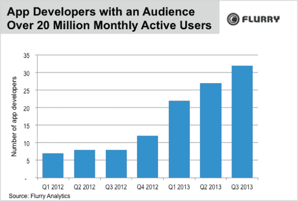
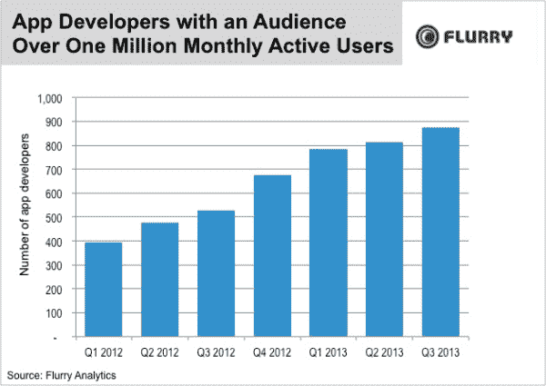
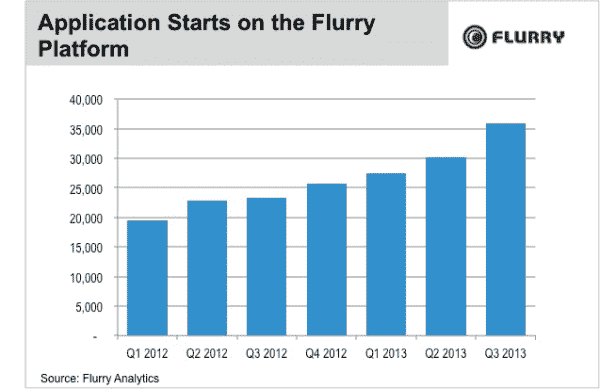

# 一个应用“中产阶级”继续增长:拥有超过 100 万用户的独立应用在过去 18 个月增长了 121% TechCrunch

> 原文：<https://web.archive.org/web/https://techcrunch.com/2013/11/08/an-app-middle-class-continues-to-grow-independently-owned-apps-with-a-million-plus-users-up-121-in-past-18-months/>

根据分析公司 Flurry 今天早上发布的新数据，移动开发者可能越来越难进入各种应用商店的排行榜，但有一个健康且不断增长的“中产阶级”应用经济。该公司报告称，在过去 18 个月中，全球月活跃用户超过 2000 万的独立应用增长了 357%，用户超过 100 万的独立应用增长了 121%。

这些数据是从 2012 年 Q1 到 2013 年第三季度在 Flurry 平台上运行的应用程序中收集的。该平台覆盖范围广泛——现在超过 12 亿台移动设备上有超过 40 万个应用程序使用 Flurry 的应用程序分析。

【T2

虽然这里的增长百分比令人印象深刻，但值得注意的是，在拥有 2000 万活跃用户的独立应用中，应用的实际数量仅从 2012 年 Q1 的 7 个增长到 2013 年第三季度的 32 个。在 iTunes 应用程序商店现在有一百万个移动应用程序可供选择的世界里，这仍然只是一小部分。

但移动应用程序开发者的数量达到 100 万要多得多，在同一时期从不到 400 人增加到 875 人。

“这些数字简直是前所未有的，特别是因为这些应用程序开发者大多是有机增长的，而不是通过整合或并购，”Flurry 首席执行官西蒙·卡拉夫[在公司博客](https://web.archive.org/web/20221210003222/http://blog.flurry.com/bid/102208/The-Mobile-Content-Exlposion)上写道。

他还指出，应用经济的整体健康状况良好，并继续增长，理由是自 2012 年 1 月以来，越来越多的新移动应用程序出现在应用商店。因为 Flurry 的客户倾向于在公开发布之前的测试期间将该公司的分析软件安装在他们的应用程序中，所以 Flurry 已经洞察到应用程序生态系统在不久的将来会是什么样子。今天，该公司表示，在过去的 18 个月里，应用程序的启动(这些新应用程序的外观被称为)几乎翻了一番。

这些数据似乎反驳了许多理论和各种报告，即应用程序商店变得过于拥挤，尽管应用程序商店中的应用程序超过了用户的需求，但这些应用程序中很少有人使用。事实上，Flurry 本身在今年早些时候报告了类似的情况，当时它发现 iOS 和 Android 设备上的脸书应用程序使用时间占总使用时间的 18%，超过了游戏、网页浏览、生产力应用程序、新闻应用程序、实用应用程序和娱乐应用程序等。

此外，Flurry 今天还引用了 comScore 的另一份早期报告，该报告发现脸书和 Instagram 的总使用时间占了手机总使用时间的 26%。脸书·首席运营官[雪莉·桑德伯格后来证实了 comScore 的指标，在最近的收益电话会议上说，脸书在美国的手机分钟数比 YouTube、Pandora、雅虎、Twitter、Pinterest、Tumblr、AOL、Snapchat 和 LinkedIn 的总和还要多。](https://web.archive.org/web/20221210003222/https://beta.techcrunch.com/2013/10/30/nearly-half-48-of-daily-users-of-facebook-are-now-mobile-only-says-ceo-zuckerberg/)

到目前为止，从这些报告中得出的结论是，当用户花太多时间在脸书和其他几个主要应用程序上时，其他移动应用程序没有多少空间。Khalaf 说现在不是这样的了，他补充说“对其他人来说似乎有很多空白。”

公平地说，今天的增长热潮很大一部分是由于新兴市场对移动应用的采用，该公司今天通过引用 LINE、Kakao、Snapchat 和 WhatsApp 等游戏、实用和通讯应用在世界各地的采用来暗示这一点。特别是，该公司在今年夏天早些时候发现，仅中国就占全球联网设备的 24%，包括智能手机和平板电脑。因此，虽然 Flurry 提出了一个很好的观点，即移动应用商店仍有很大的增长空间，但通过像今天这样从高层次上看待数据，它可能掩盖了成熟市场中开发者必须克服的非常真实的斗争，即使是让他们的应用被看到，然后防止它被抛弃。