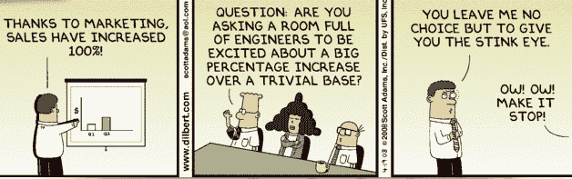

# 致去年收入增长 200%的所有公司的公开信 

> 原文：<https://web.archive.org/web/http://techcrunch.com/2011/01/31/an-open-letter-to-all-companies-who-grew-revenue-by-200-last-year/>

我讨厌像[这种来自](https://web.archive.org/web/20230203003946/http://go.ooyala.com/Ooyala_Grows_Revenue_by_Nearly_200.html) [Ooyala](https://web.archive.org/web/20230203003946/http://www.crunchbase.com/company/ooyala) 的的新闻稿，为了完全公开，我必须说，Ooyala【】是我们信任的[视频平台提供商](https://web.archive.org/web/20230203003946/http://techcrunch.tv/)。我今天挑出这家公司，因为我已经受够了，但这是对每一家喜欢吹捧增长而不说任何实质性内容的公司的真诚请求，请停止这样做。

因此，显然 Ooyala“收入增长了近 200%，客户群增长了 50%，并提供了创纪录数量的视频技术创新”。

听起来令人印象深刻，除了声明对其收入、客户群规模或该公司为创新视频技术所做的一切只字未提。

听着，我们理解，你们是一家私人控股公司，目前不能披露收入。我们明白。但是，如果你不想谈论数字，请停止兜售你的收入增长百分比，以努力获得一些关于你的收入的曝光率。

据我们所知，Ooyala 在 2009 年赚了 1 美元，在 2010 年赚了 2.9 美元。这意味着他们去年的收入增长了近 200%。只是没那么令人印象深刻，对吧？

我们会收到关于这类事情的邮件。的。时间。

嘿，TechCrunch，我们认为你和你的读者会有兴趣知道我们在 2010 年的收入增加了两倍！那么这些收入是什么呢？对不起，我不能说，我们是私有的，我相信你知道，所以我们现在不能透露收入。

等等，你们为什么又联系上了？

原谅我的咆哮，但它让我恼火不已。我们是一个博客，喜欢与读者分享关于技术行业的信息，主要是互联网创业公司的信息，最好比别人先分享。数字非常棒:它们提供了背景，让读者和行业观察人士能够判断趋势和初创公司的估值，让我们能够对不同行业的公司进行诚实的比较，并让我们能够监控它们的增长。

如果你不想报告数字，你可以不报告数字。这很好，不会在任何一端浪费时间，也许有一天你会成为一家上市公司，你将别无选择，只能披露上一季度的收入。相信我们，然后我们会*真正*关注。

但在那一天到来之前，请随意分享我们可以使用的数字——如果您能直截了当，我们将不胜感激。但是如果你选择不，那么，对不起，就不要麻烦了。

不要假装分享你的收入信息，而这根本不是你在做的事情。这对所有相关人员来说都是令人讨厌的、误导性的和巨大的时间浪费。

哦，对了，你听说了吗？2010 年，Ooyala 的视频观看时间增加了 10 倍，活跃独立用户增加了 2 倍！每个人都要香槟！

**更新:**感谢一位评论者，这个相关的[呆伯特带](https://web.archive.org/web/20230203003946/http://dilbert.com/strips/comic/2008-04-19):

