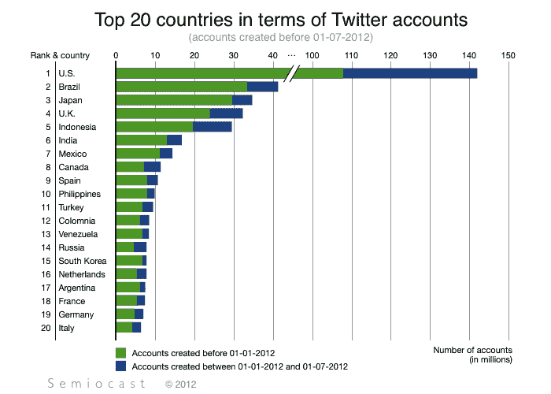

# 分析师:Twitter 在 2012 年 6 月超过了 5 亿用户，其中 1.4 亿在美国；雅加达“最大的推特”城市

> 原文：<https://web.archive.org/web/https://techcrunch.com/2012/07/30/analyst-twitter-passed-500m-users-in-june-2012-140m-of-them-in-us-jakarta-biggest-tweeting-city/>

据总部位于巴黎的分析机构 Semiocast T1 称，这是 Twitter 今天的一个里程碑。该社交网络现已突破 5 亿账户大关——具体来说，截至 2012 年 7 月 1 日，共有 5.17 亿账户，其中 1.418 亿用户在美国，仍是脸书用户数量的一半左右，但它已成为第二大社交网站。

正如 Twitter 的大多数用户来自美国以外，推文也是如此:推文数量排名前三的城市是雅加达、东京和伦敦。

该公司表示，这些数据是基于 6 月份 10.58 亿条公共推文的样本选择。

它还指出，虽然日本是最活跃的推特国家之一，但那里的增长正在成熟和放缓，就像韩国一样。

Semiocast 在报告中没有透露的一件事是不同 Twitter 客户端的手机号码和使用情况，这将是一个有趣的比较点，因为 Twitter 试图鼓励用户采用自己的平台(为了其广告和其他盈利潜力)，而不是那些使用其 API 提供有效类似服务的用户。

它也没有说明这 5 亿多个账户中有多少活跃用户。不过，我们正在询问，当我们了解到更多信息时，我们会及时更新。

**更新**以上两点另文[此处](https://web.archive.org/web/20230305215514/http://t.co/PoMDpczv)。

其他一些值得注意的发现:

地理定位只在 0.77%的时间里被使用。这项功能已经出现了 2.5 年，但似乎即使来自世界各地的用户喜欢表达自己，他们也不太热衷于表达他们在哪里。

美国用户的比例在下降。与 2012 年 1 月的 28.1%相比，现在的用户比例为 27.4%。然而，这仍然使它成为最大的单一 Twitter 国家。从具体的城市来看，美国发推次数最多的城市是纽约，排在第五位，占所有推次数的 0.4%。Twitter 在旧金山的本土市场仅占所有推文的 0.2%。

和社交网站脸书一样，现在都是关于发展中国家的增长。巴西是增长最快的国家，现在有 4120 万用户，高于 1 月份的 3330 万。然而，这只占所有用户的 8%，推特的 6.6%(这意味着他们没有他们的数字显示的那么活跃)。

就个人资料而言，巴西取代日本成为仅次于美国的第二大国家，但它是参与度最高的国家。它代表了所有推文的 10.6%，但只有 6.7%的用户。日语是仅次于英语的第二大流行语言。

其他热门国家包括拥有 2940 万个人资料的印度尼西亚和最活跃的 Twitter 城市雅加达。Semiocast 暗示，印度尼西亚可能很快就会超过英国，成为排名第四的国家:英国目前有 3220 万用户，但增长速度比这个东南亚国家慢。

另一个全球性迹象是:Semiocast 表示，阿拉伯语在 Twitter 上表现强劲，现在是该网站第六大最受欢迎的语言，占所有推文的 2.8%。沙特阿拉伯的用户数量在六个月内增长了 93%，达到 290 万。

