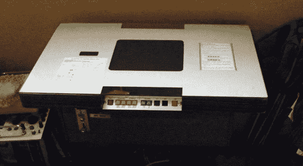
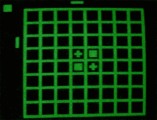

# 古代任天堂奥赛罗鸡尾酒街机柜，没有保留，因为是

> 原文：<https://web.archive.org/web/https://techcrunch.com/2009/09/23/ancient-nintendo-othello-cocktail-arcade-cabinet-no-reserve-as-is/>

# 古代任天堂奥赛罗鸡尾酒街机柜，没有保留，因为是

*你*是稀有电子游戏蜉蝣和怪人硬件的收藏家吗？那么今天是你的幸运日！一段饱经风霜、功能残缺、几乎完全不为人知的任天堂历史已经在易贝浮出水面，现在[的出价很低很低，只有 1250 美元](https://web.archive.org/web/20230224022345/http://cgi.ebay.com/ws/eBayISAPI.dll?ViewItem&item=230378950975&ru=http%3A%2F%2Fshop.ebay.com%3A80%2F%3F_from%3DR40%26_trksid%3Dm38%26_nkw%3D230378950975%26_fvi%3D1&_rdc=1)(外加 400 美元的运费&)。

[电脑奥赛罗](https://web.archive.org/web/20230224022345/http://en.wikipedia.org/wiki/Computer_Othello)是任天堂最早的作品之一，也是他们的第一款街机游戏。就像它说的，这是电脑奥赛罗，但奇怪的是，据说没有这个游戏的美国版本。然而，这一个有一个美国电源适配器安装原来。确实是一只稀有的鸟！可惜不管用。

[通过 [BB 小工具](https://web.archive.org/web/20230224022345/http://gadgets.boingboing.net/2009/09/23/rare-nintendo-othell.html)