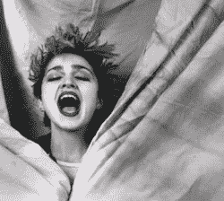

# 墙倒塌了:麦当娜抛弃了唱片业

> 原文：<https://web.archive.org/web/https://techcrunch.com/2007/10/10/and-the-walls-came-tumbling-down-madonna-dumps-record-industry/>

# 围墙倒塌了:麦当娜抛弃了唱片业

自从[周一](https://web.archive.org/web/20230302073003/https://techcrunch.com/2007/10/08/nine-inch-nails-help-seal-record-industrys-coffin)报道九寸钉乐队已经抛弃了它的唱片厂牌，并将直接向公众提供未来的专辑以来，绿洲乐队和杰米罗奎尔[也加入了](https://web.archive.org/web/20230302073003/http://crunchgear.com/2007/10/10/other-uk-bands-to-copy-radiohead/)离开唱片行业的行列，但是今天最大的消息是麦当娜已经抛弃了唱片行业。

据报道称，麦当娜已经与洛杉矶的演唱会推广公司 [Live Nation](https://web.archive.org/web/20230302073003/http://www.livenation.com/) 签署了一份价值 1 . 2 亿美元的协议，以发行三张录音室专辑、推广巡回演唱会、销售商品以及授权麦当娜的名字。

虽然这笔交易与九寸钉乐队的不同之处在于麦当娜不提供直接面向公众的专辑，但 Live Nation 不是一家唱片公司。这笔交易表明，在数字下载和 P2P 音乐共享的时代，即使是一个世界闻名的行为，也不再需要唱片公司了。

现在唯一真正的问题是音乐产业模式会以多快的速度崩溃。当电台司令带头直接向粉丝提供他们的音乐时，许多人预测这一举动是结束的开始；麦当娜很可能是一个引爆点，从这里我们将看到一大批唱片艺术家抛弃唱片公司，而今天的模式将很快成为维基百科的一个脚注。