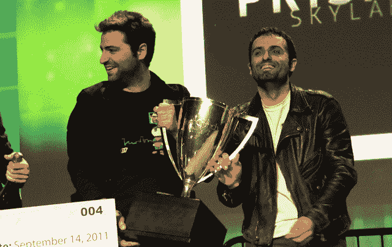

# TechCrunch Disrupt 的赢家是...shaker TechCrunch

> 原文：<https://web.archive.org/web/https://techcrunch.com/2011/09/14/and-the-winner-of-techcrunch-disrupt-is-shaker/>

经过三天 31 次创业推介，2011 年 TechCrunch Disrupt 旧金山站的获胜者已经确定。从 29 家初创公司和两个观众选择的获胜者中，我们将名单削减到了[七个决赛选手，](https://web.archive.org/web/20230205023040/https://techcrunch.com/2011/09/14/techcrunch-disrupt-sf-battlefield-semifinals-the-judges-react/)其中包括[比特卡萨](https://web.archive.org/web/20230205023040/http://www.bitcasa.com/)、[蛋糕健康](https://web.archive.org/web/20230205023040/https://cakehealth.com/)、[法米戈](https://web.archive.org/web/20230205023040/http://www.farmigo.com/)、[棱镜天空实验室](https://web.archive.org/web/20230205023040/http://prismskylabs.com/)、 [Shaker](https://web.archive.org/web/20230205023040/http://www.atshaker.com/) 、 [TalkTo](https://web.archive.org/web/20230205023040/http://talkto.com/) 和 [Trello](https://web.archive.org/web/20230205023040/https://trello.com/) 。该组的获胜者将获得 Disrupt Cup 和$50，000，从 Disrupt New York 获胜者 [Getaround 手中接管所有权。](https://web.archive.org/web/20230205023040/https://techcrunch.com/2011/05/25/and-the-winner-of-techcrunch-disrupt-nyc-is-getaround/)事不宜迟，亚军是 [Prism Skylabs。获胜者是……Shaker！*披露:* TechCrunch 创始人迈克尔·阿灵顿是 Prism Skylabs 的投资者，也是 Shaker 的待定投资者。](https://web.archive.org/web/20230205023040/https://techcrunch.com/2011/09/13/prism-skylabs-refocuses-security-cams-into-productive-video-assets/)

以色列初创公司 Shaker 的基本目标是通过社交游戏将脸书变成一个酒吧。正如我们在对这家初创公司的评论中所写的,“Shaker”是“第二人生”、“模拟人生”和“转盘”( Turntable.fm)的混合体，它们都使用你在脸书的数据和关系。你的脸书个人资料变成了一个移动的化身，你的照片被放在一面虚拟的墙上，你可以选择房间里播放什么音乐让每个人都听到，你甚至可以给人们买饮料。

Shaker 将基本的社交游戏向前推进了一步，允许用户结识新朋友(而不是与现有的朋友一起玩游戏)，这复制了在实际酒吧中的体验。Shaker 查看个人资料信息来显示你和房间里看似随机的人还有什么共同之处。比如，你可能和某人同一天生日。或者你们都喜欢同一部电影或乐队。其他元素包括基于邻近度的聊天、推特墙和“智能手机”社交发现工具，用于查找房间中人的信息。

这家初创公司已经筹集了 300 万美元的资金，已经看到了相当好的牵引力。这款游戏在几周内获得了 8 万 mau，不得不屏蔽邀请。人们抱怨酒吧太拥挤，用户花在应用程序上的时间令人印象深刻。在没有任何公关的情况下，这款游戏能够吸引注意力，而这家初创公司不得不关闭对 540 人的邀请。

亚军 Prism Skylabs 是一项基于云的服务，它允许企业主将视频内容放到网上，从这些内容中捕捉图像，并与消费者和公众分享这些数据。这家初创公司允许企业下载一个免费软件，该软件可以检测网络上的摄像头或视频，向企业展示一些空间图像。与您使用视频编辑软件从视频中提取图像的方式类似，Prism Skylabs 提取您的机构的相关图像，并从这些照片中构建有洞察力的可视化效果，同时保护客户隐私。该公司得到了 SV Angel、尤里·米尔纳、埃里克·施米特、亚伦·帕兹、布拉德·加林豪斯、克朗彻基金和其他人的支持。

获奖者介绍

除了 Disrupt Cup，还颁发了一些特殊奖项:

由 NEA 合伙人 Patrick Chung 颁发的观众选择获奖者是 [Vocre](https://web.archive.org/web/20230205023040/https://techcrunch.com/2011/09/13/vocre-lets-you-instantly-converse-in-foreign-languages/) ，这是一款翻译应用。Vocre 允许你在 iPhone 垂直时对着应用说话，水平翻转手机，手机的加速度计会提示应用将你所说的话翻译成你与之交谈的人的语言，然后他们可以回应、冲洗和重复。

[Sibblingz](https://web.archive.org/web/20230205023040/http://www.crunchbase.com/company/sibblingz) 董事长彼得·雷兰(Peter Relan)为几天前在黑客马拉松上创立的项目《财富星球》(Fortune Planet)颁发了最佳手机游戏奖。

MicroStrategy 颁发了两个奖项:Vocre 获得了最佳移动应用，Wondershake 获得了最佳社交数据应用。

**Shaker 的演示:**

**后台面试:**