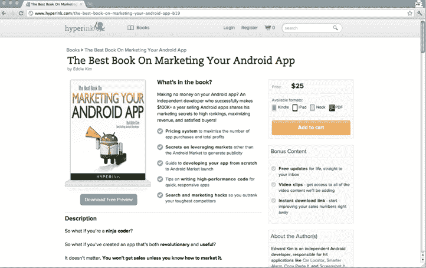

# Andreessen Horowitz，SV Angel Back 下一代数字图书出版商 Hyperink TechCrunch

> 原文：<https://web.archive.org/web/https://techcrunch.com/2011/10/27/andreessen-horowitz-sv-angel-back-next-generation-digital-book-publisher-hyperink/>

下一代数字图书出版平台 Hyperink 已经从安德森·霍洛维茨、Y Combinator、SV Angel、Lerer Ventures、Launch Capital、西里亚克·罗丁、杰克·亚伯拉罕等人那里筹集了 120 万美元。

简单地说，Hyperink 是 Y Combinator 2011 年冬季班的毕业生，它想颠覆图书出版界。这家初创公司是一个数字图书出版平台和全方位服务机构，将帮助任何有抱负的作者写作、设计、出版、营销和销售一本书，而无需任何前期费用。Hyperink 希望代表图书需求的长尾。

正如联合创始人凯文·高(Kevin Gao)解释的那样，传统上，出版业非常受点击量驱动，发展缓慢。他解释说，有了 Hyperink，人们可以创作出更加小众和有针对性的书籍，而且速度比传统出版商快十倍，因此信息是最新和最相关的。

例如，Hyperink 不是出版一本关于“如何进入大学”的书，而是旨在出版关于“如何进入斯坦福”、“如何进入哈佛”、“如何进入麻省理工学院”的特定标题。

Hyperink 寻求颠覆该行业的另一种方式是纯粹的成本。对于大出版社来说，书籍的生产和营销需要数万美元，出版需要 16-18 个月。Hyperink 图书的平均制作成本不到 1000 美元，并且在不到一个月的时间内出版。

Hyperink 还提供更高的版税，给作者高达 50%的收入(许多出版商给作者 25%左右)

例如，一个超链接的畅销书籍是“营销你的 Android 应用程序”。这位专家兼作者是 Eddie Kim，他已经成功开发并销售了 6 位数的 Android 应用程序。他花了不到 10 个小时与 Hyperink 的记者团队一起工作来制作一本书，这本书已经盈利了。

作者可以自己写书，在这种情况下，Hyperink 利用其出版平台从手稿到“出售”，提供编辑支持、封面设计、布局、内容建议等。Hyperink 还提供自己的营销渠道，并将发布到 Kindle、iBooks 和 Nook 等平台，并通过搜索优化、社交媒体和电子邮件提供营销支持。

如果你没有时间或兴趣写自己的书，Hyperink 会给你找一个代笔人，他会采访你，然后在你的参与和编辑下写整本书。

当然，Hyperink 正在与亚马逊竞争，后者已经推出了自己的印刷出版大军和 T2 的自助出版服务。但图书出版界已经出现了一波颠覆性的浪潮，如果 Hyperink 能够吸引高质量的利基内容，它可能会成为这一领域引人注目的参与者。

