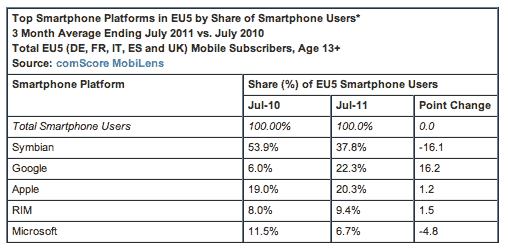

# Android 在欧洲智能手机市场份额上击败 iOS，仍落后于 Symbian TechCrunch

> 原文：<https://web.archive.org/web/http://techcrunch.com/2011/09/13/android-beats-ios-in-european-market-share-still-behind-symbian/>

# Android 在欧洲智能手机市场份额上击败 iOS，仍落后于 Symbian

根据市场研究公司 ComScore 的数据，欧洲越来越喜欢谷歌的 Android 操作系统。Android 设备现在占法国、德国、意大利、西班牙和英国使用的所有智能手机的近四分之一——比谷歌操作系统去年的表现有了戏剧性的飞跃。

2010 年 7 月，Android 仅占这五个欧洲市场智能手机使用量的 6%，远远落后于 Symbian、苹果、微软和 RIM。一年后，Android 在 Cupertino 已经超过了他们的竞争对手，现在在市场份额方面仅次于 Symbian。

现在，22.3%的 EU5 智能手机运行安卓系统，比去年增长了 16 个百分点。最受欢迎的 Android 手机由 HTC 制造，占所有设备的 34.6%，三星紧随其后，占 31.7%。

目前，Symbian 的领先地位充其量也是脆弱的:尽管去年它为欧盟五国超过一半的智能手机提供动力，但使用率已下滑至 37.8%，无论如何这都是一个巨大的转变。鉴于 Android 的火爆，这可能是 Symbian 最后一次登上榜首。

与此同时，苹果下滑至第三位，市场份额为 20.3%。他们受益于去年市场份额的微小增长，但这一切可能很快就会改变。当苹果期待已久的 iPhone 5(或 4S，或任何它最终被称为)发布时，它可能会从各方窃取一点市场份额，也许会确保他们下次获得第二名。

整个景观都在变化，下面的图表可能看起来不像 ComScore 的下一份报告出现时的样子。得益于 HTC 和三星广泛的产品线，Android 可能会继续加速发展，而苹果(如前所述)将得益于新硬件的发展。同样，RIM 即将推出的 QNX 黑莓手机可以帮助他们获得一些动力，微软的 WP7 芒果更新也是如此。

